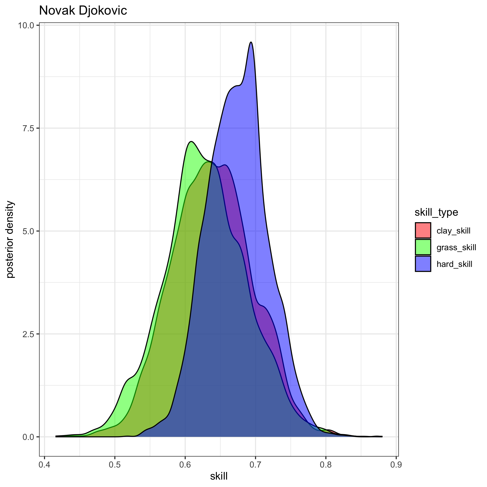
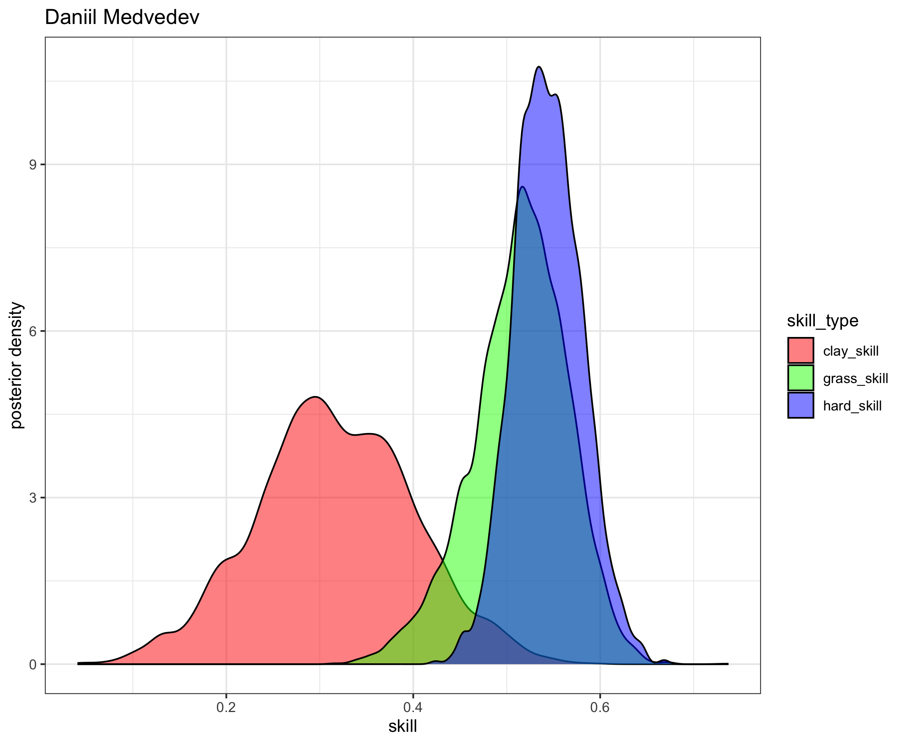
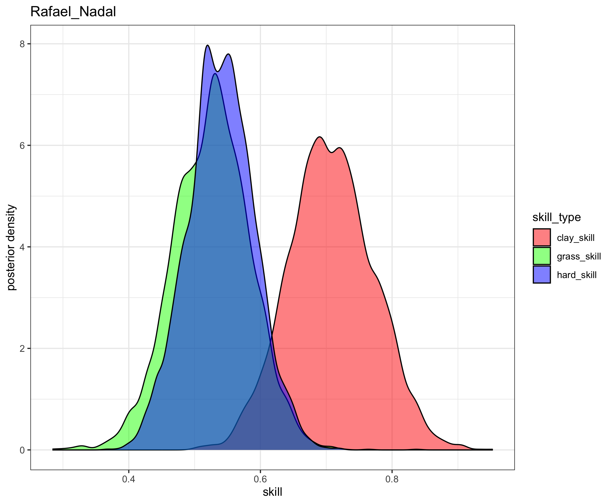
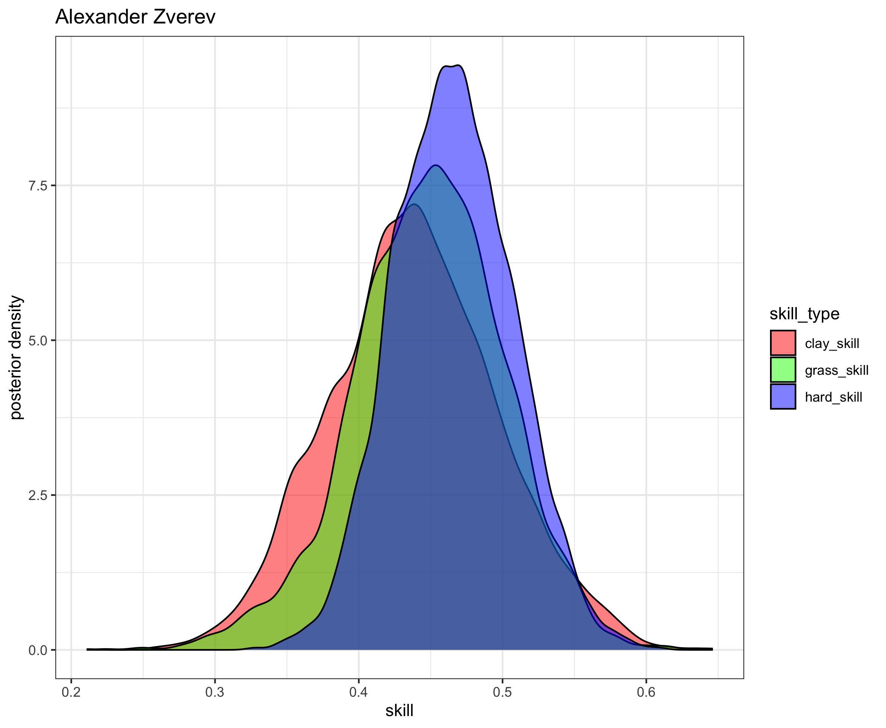
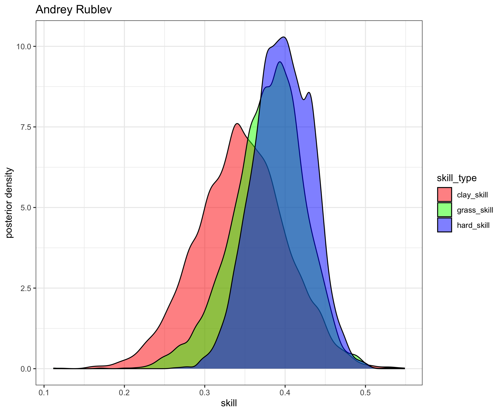
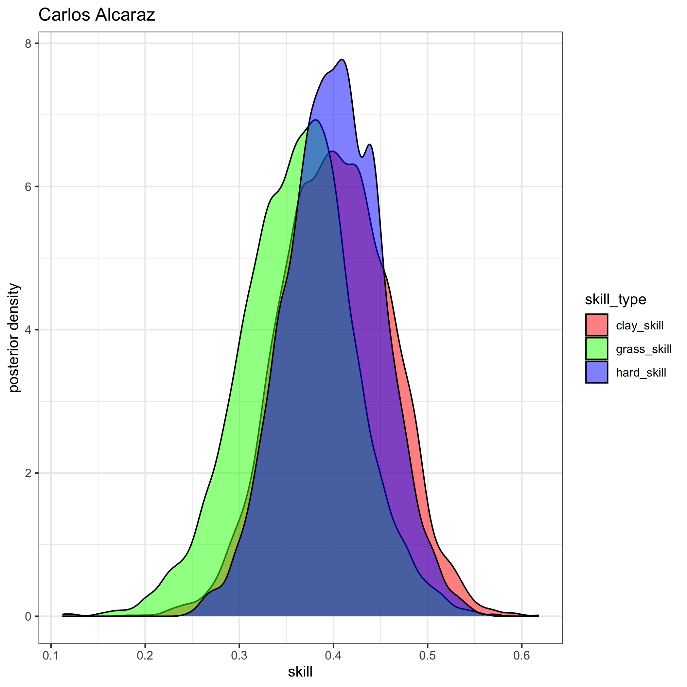
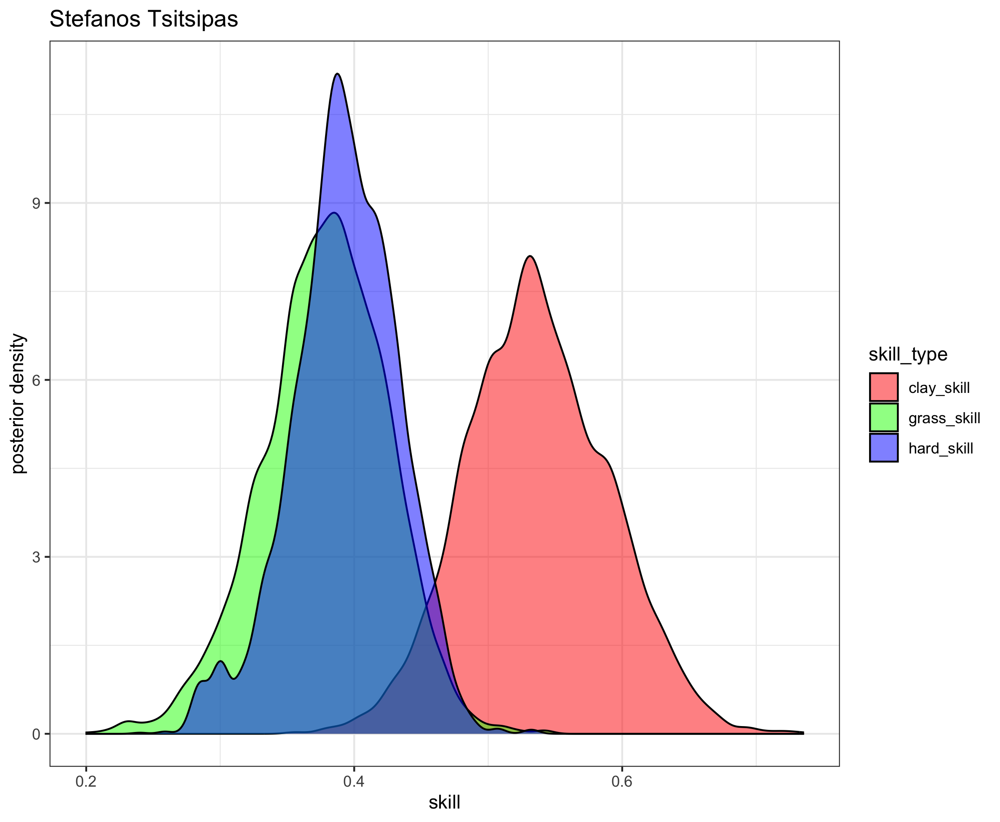
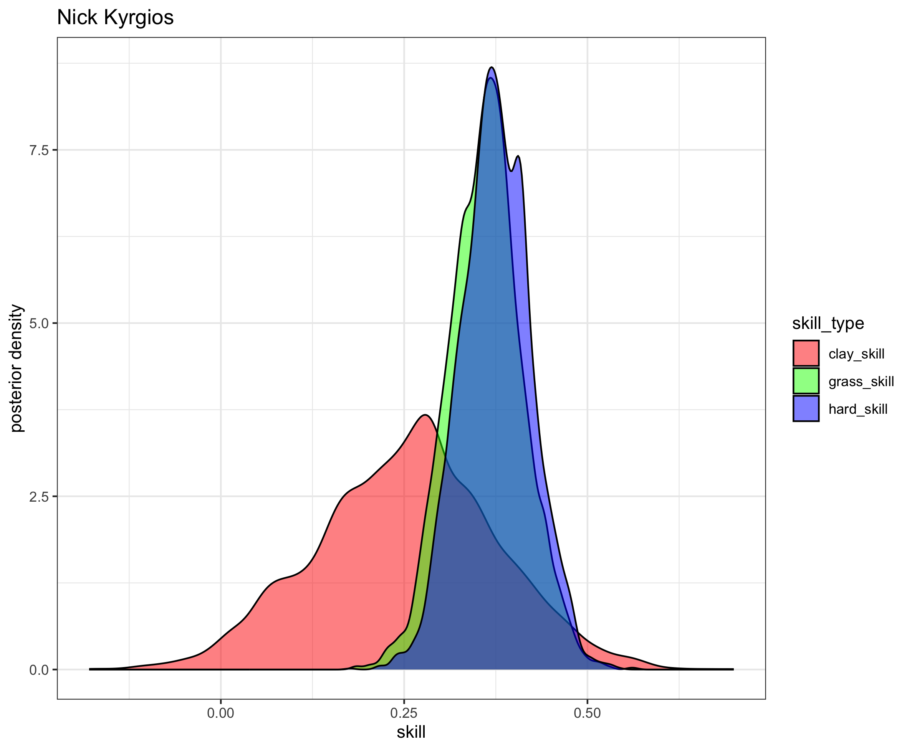
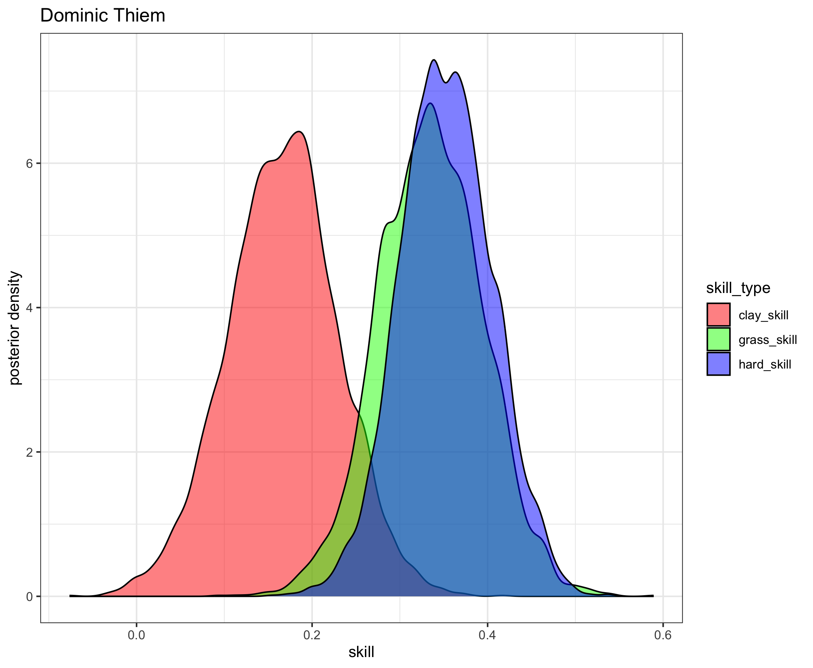
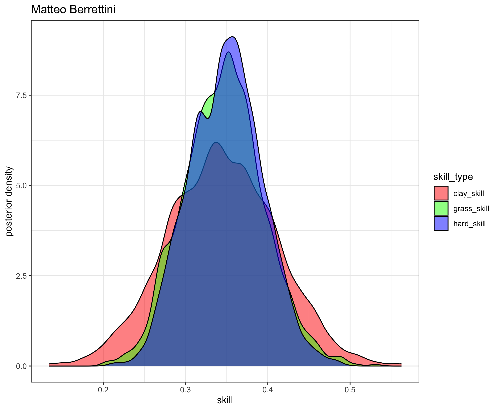

# Tennis Ratings

## Version 1: ATP Men's Singles Ratings and Rankings
* The ratings below are the work of my master's thesis and are based on a fully-[Bayesian](https://en.wikipedia.org/wiki/Bayesian_statistics) [Bradley-Terry model](https://en.wikipedia.org/wiki/Bradley%E2%80%93Terry_model). They are similar to [Elo ratings](https://en.wikipedia.org/wiki/Elo_rating_system), but I'd argue they resemble [Glicko ratings](https://en.wikipedia.org/wiki/Glicko_rating_system) even more closely. I show in my work that these ratings outperform Glicko (more to come on this later). 
* Only players with 5 or more ATP-level matches played in the last 365 days are listed.
* **Interpretation**: There are 3 "skill" columns, one for each surface. Unfortunately they are not sortable at the moment, but as a first step, I've sorted the table by "hard_skill" (players' skills on hard court), as this is the most popular surface.

### Updated through the 2022 season. Updated monthly(ish)

| rank | full_name                   | hard_skill  | clay_skill  | grass_skill |
| ---- | --------------------------- | ----------- | ----------- | ----------- |
| 1    | Novak Djokovic              | 0.66669434  | 0.63378274  | 0.64396317  |
| 2    | Daniil Medvedev             | 0.54381566  | 0.31591835  | 0.51411068  |
| 3    | Rafael Nadal                | 0.53976736  | 0.70794137  | 0.52584813  |
| 4    | Alexander Zverev            | 0.4659605   | 0.43812775  | 0.44849657  |
| 5    | Andrey Rublev               | 0.39654585  | 0.34540309  | 0.37862982  |
| 6    | Carlos Alcaraz              | 0.39414859  | 0.40198112  | 0.37692632  |
| 7    | Stefanos Tsitsipas          | 0.39285786  | 0.53680978  | 0.37828591  |
| 8    | Nick Kyrgios                | 0.3749712   | 0.25302559  | 0.36120967  |
| 9    | Dominic Thiem               | 0.35305991  | 0.16645601  | 0.3352914   |
| 10   | Matteo Berrettini           | 0.34907966  | 0.34426294  | 0.34647659  |
| 11   | Jannik Sinner               | 0.33958763  | 0.39140998  | 0.32965957  |
| 12   | Jack Draper                 | 0.33216436  | 0.27085738  | 0.31721649  |
| 13   | Roberto Bautista Agut       | 0.32760164  | 0.28020849  | 0.31467973  |
| 14   | Casper Ruud                 | 0.31838623  | 0.38407597  | 0.30489003  |
| 15   | Gael Monfils                | 0.31468249  | 0.06076348  | 0.29002137  |
| 16   | Felix Auger Aliassime       | 0.30332746  | 0.22649348  | 0.29270131  |
| 17   | Taylor Fritz                | 0.30121723  | 0.09411598  | 0.28801849  |
| 18   | Hubert Hurkacz              | 0.29827227  | 0.17142202  | 0.28832828  |
| 19   | Cameron Norrie              | 0.28859264  | 0.24385049  | 0.28212128  |
| 20   | Sebastian Korda             | 0.28062921  | 0.23238414  | 0.26820138  |
| 21   | Holger Rune                 | 0.26078169  | 0.18289378  | 0.24459689  |
| 22   | Denis Shapovalov            | 0.2595205   | 0.21960792  | 0.25128418  |
| 23   | Pablo Carreno Busta         | 0.25878102  | 0.31170688  | 0.24819072  |
| 24   | Jenson Brooksby             | 0.25223333  | 0.01838961  | 0.23211031  |
| 25   | Ilya Ivashka                | 0.24901859  | 0.17525599  | 0.2382063   |
| 26   | Karen Khachanov             | 0.24881116  | 0.13612194  | 0.23656858  |
| 27   | Alex De Minaur              | 0.24872845  | 0.13877465  | 0.23776911  |
| 28   | Grigor Dimitrov             | 0.24253276  | 0.28903543  | 0.2348862   |
| 29   | Antoine Bellier             | 0.23849754  | 0.16518509  | 0.23089529  |
| 30   | Diego Schwartzman           | 0.23414528  | 0.30152194  | 0.22672351  |
| 31   | Borna Coric                 | 0.22815648  | 0.06791782  | 0.21538154  |
| 32   | Marin Cilic                 | 0.223624    | 0.25987683  | 0.22050338  |
| 33   | Roman Safiullin             | 0.21724981  | 0.2317519   | 0.21019049  |
| 34   | Tommy Paul                  | 0.21282765  | 0.07277964  | 0.20592229  |
| 35   | Maxime Cressy               | 0.20955994  | 0.01722033  | 0.20061734  |
| 36   | Daniel Evans                | 0.20833214  | 0.09698277  | 0.19574256  |
| 37   | Frances Tiafoe              | 0.20382992  | 0.09120803  | 0.19279879  |
| 38   | Botic Van De Zandschulp     | 0.20119372  | 0.24251647  | 0.19566354  |
| 39   | Brandon Nakashima           | 0.2009816   | 0.10019534  | 0.19292153  |
| 40   | Aslan Karatsev              | 0.19230442  | 0.11268624  | 0.17974082  |
| 41   | Dominic Stricker            | 0.19214988  | 0.16836264  | 0.18448989  |
| 42   | Emil Ruusuvuori             | 0.18746622  | 0.0061071   | 0.17412249  |
| 43   | Tim Van Rijthoven           | 0.1850341   | 0.13717431  | 0.18584155  |
| 44   | Stan Wawrinka               | 0.18343525  | 0.09812408  | 0.17297534  |
| 45   | Benjamin Bonzi              | 0.18295888  | 0.0525063   | 0.17780092  |
| 46   | Mikael Ymer                 | 0.17923668  | 0.04489692  | 0.16672942  |
| 47   | Reilly Opelka               | 0.16740731  | 0.13445046  | 0.15510906  |
| 48   | Andy Murray                 | 0.16561561  | 0.12643254  | 0.16549216  |
| 49   | Vasek Pospisil              | 0.16065592  | 0.04469404  | 0.14807283  |
| 50   | Gijs Brouwer                | 0.15887335  | 0.19401838  | 0.15319934  |
| 51   | Lorenzo Sonego              | 0.15844178  | 0.13747393  | 0.15467876  |
| 52   | Tomas Machac                | 0.15827961  | 0.15367194  | 0.15301718  |
| 53   | Alexander Ritschard         | 0.15625488  | 0.08808332  | 0.14969821  |
| 54   | Ugo Humbert                 | 0.15455096  | 0.01290084  | 0.14713277  |
| 55   | Alexander Bublik            | 0.15280097  | 0.01845275  | 0.15156262  |
| 56   | John Isner                  | 0.15053114  | 0.16500095  | 0.14476102  |
| 57   | Lloyd Harris                | 0.14937128  | \-0.0001168 | 0.13777584  |
| 58   | Marton Fucsovics            | 0.14857861  | 0.15908484  | 0.14429373  |
| 59   | David Goffin                | 0.14451311  | 0.15055763  | 0.14374898  |
| 60   | Pierre Hugues Herbert       | 0.14244447  | 0.11366983  | 0.1353669   |
| 61   | Arthur Rinderknech          | 0.14105398  | 0.12881816  | 0.13314145  |
| 62   | Constant Lestienne          | 0.13333237  | 0.08880522  | 0.12775907  |
| 63   | Thanasi Kokkinakis          | 0.13239231  | 0.1031922   | 0.12710509  |
| 64   | Mackenzie Mcdonald          | 0.13177999  | 0.06728252  | 0.12153522  |
| 65   | J J Wolf                    | 0.12857273  | 0.03319422  | 0.12020769  |
| 66   | Marc Andrea Huesler         | 0.12820518  | 0.108587    | 0.12048729  |
| 67   | Filip Krajinovic            | 0.12131791  | 0.17599388  | 0.11848739  |
| 68   | Francisco Cerundolo         | 0.12072614  | 0.14075266  | 0.11840481  |
| 69   | Jason Kubler                | 0.12003884  | 0.08476049  | 0.11939643  |
| 70   | Richard Gasquet             | 0.11992945  | 0.06562314  | 0.11443797  |
| 71   | Zizou Bergs                 | 0.11792972  | 0.06830749  | 0.11277134  |
| 72   | Jan Lennard Struff          | 0.11684837  | 0.08298064  | 0.11370054  |
| 73   | Miomir Kecmanovic           | 0.11651084  | 0.12561044  | 0.11046972  |
| 74   | Adrian Mannarino            | 0.11390894  | \-0.2071274 | 0.09766098  |
| 75   | Kyle Edmund                 | 0.11378338  | 0.06052563  | 0.10905543  |
| 76   | Franco Agamenone            | 0.11157314  | 0.14950908  | 0.10934327  |
| 77   | Corentin Moutet             | 0.1068151   | 0.01255112  | 0.09799694  |
| 78   | Ryan Peniston               | 0.10184934  | 0.07587266  | 0.10136343  |
| 79   | Soon Woo Kwon               | 0.10083331  | 0.01286895  | 0.09329791  |
| 80   | Alejandro Davidovich Fokina | 0.10047729  | 0.16047677  | 0.09831893  |
| 81   | Lorenzo Musetti             | 0.10015743  | 0.21691044  | 0.09641112  |
| 82   | Jack Sock                   | 0.09843925  | 0.06604489  | 0.09785313  |
| 83   | Yosuke Watanuki             | 0.09417961  | 0.15867394  | 0.09491348  |
| 84   | Juan Pablo Varillas         | 0.09227386  | 0.1484604   | 0.09096836  |
| 85   | Ben Shelton                 | 0.09220518  | 0.06249813  | 0.08849336  |
| 86   | Jiri Vesely                 | 0.08710744  | \-0.0149985 | 0.08371104  |
| 87   | Vit Kopriva                 | 0.08528461  | 0.11664868  | 0.08464434  |
| 88   | Oscar Otte                  | 0.08435933  | 0.14374275  | 0.08767274  |
| 89   | Christopher Oconnell        | 0.08346227  | \-0.018251  | 0.0762314   |
| 90   | Kevin Anderson              | 0.07939228  | 0.09718529  | 0.07914691  |
| 91   | Kamil Majchrzak             | 0.0760513   | \-0.0305428 | 0.0700743   |
| 92   | Aljaz Bedene                | 0.07540965  | \-0.0202363 | 0.0721591   |
| 93   | Gilles Simon                | 0.07371647  | \-0.1396634 | 0.06255804  |
| 94   | Elias Ymer                  | 0.07136254  | 0.08251319  | 0.06707153  |
| 95   | Marcos Giron                | 0.07092041  | \-0.1001116 | 0.06378384  |
| 96   | Borna Gojo                  | 0.06878338  | 0.04378428  | 0.06627963  |
| 97   | Pedro Cachin                | 0.06824707  | 0.0932823   | 0.06560895  |
| 98   | John Millman                | 0.06697539  | \-0.0583944 | 0.05848363  |
| 99   | Filip Misolic               | 0.06009118  | 0.13896237  | 0.06051027  |
| 100  | Alexei Popyrin              | 0.05965154  | 0.01904762  | 0.05270245  |
| 101  | Jurij Rodionov              | 0.0566212   | 0.09718147  | 0.05607808  |
| 102  | Nuno Borges                 | 0.05356159  | 0.0901179   | 0.05115903  |
| 103  | Alejandro Tabilo            | 0.05287906  | 0.17191946  | 0.05262212  |
| 104  | James Duckworth             | 0.04932274  | \-0.1090682 | 0.04363897  |
| 105  | Steve Johnson               | 0.0490634   | \-0.0217122 | 0.04793037  |
| 106  | Liam Broady                 | 0.0475608   | 0.01283359  | 0.04488645  |
| 107  | Fabio Fognini               | 0.04748747  | 0.04524402  | 0.04498897  |
| 108  | Laslo Djere                 | 0.04714171  | 0.18311156  | 0.05058565  |
| 109  | Daniel Elahi Galan          | 0.04674562  | 0.11352808  | 0.04561471  |
| 110  | Jordan Thompson             | 0.04651973  | \-0.1521908 | 0.04360417  |
| 111  | Egor Gerasimov              | 0.04388043  | \-0.0211421 | 0.03884981  |
| 112  | Altug Celikbilek            | 0.04249596  | 0.00614011  | 0.03668305  |
| 113  | Christopher Eubanks         | 0.04138294  | 0.0285785   | 0.04027896  |
| 114  | Aleksandar Vukic            | 0.04113624  | \-0.0142231 | 0.03797648  |
| 115  | Yoshihito Nishioka          | 0.03941479  | \-0.0513229 | 0.02752542  |
| 116  | Ricardas Berankis           | 0.03712344  | \-0.0439129 | 0.03408773  |
| 117  | Hugo Grenier                | 0.03539704  | \-0.0027191 | 0.03137908  |
| 118  | Alex Molcan                 | 0.03444596  | 0.24992858  | 0.04279708  |
| 119  | Zhizhen Zhang               | 0.02483199  | 0.07555948  | 0.02375764  |
| 120  | Quentin Halys               | 0.0242128   | 0.03744179  | 0.02579036  |
| 121  | Thiago Monteiro             | 0.0216105   | 0.06752267  | 0.02078989  |
| 122  | Hugo Gaston                 | 0.01710121  | 0.09145461  | 0.01978488  |
| 123  | Tallon Griekspoor           | 0.01668835  | \-0.0106564 | 0.01701617  |
| 124  | Dusan Lajovic               | 0.01017674  | 0.02769106  | 0.00703918  |
| 125  | Pedro Martinez              | 0.00809413  | 0.12468989  | 0.00940954  |
| 126  | Denis Kudla                 | 0.00691393  | \-0.0415208 | 0.01216526  |
| 127  | Jiri Lehecka                | 0.00077187  | 0.02589945  | 0.00216182  |
| 128  | Luca Nardi                  | \-9.15E-05  | \-0.0438312 | \-0.0010302 |
| 129  | Giulio Zeppieri             | \-0.0013656 | 0.06870842  | 0.00158601  |
| 130  | Manuel Guinard              | \-0.003144  | \-0.0322133 | \-0.0041272 |
| 131  | Dominik Koepfer             | \-0.0069249 | 0.04503415  | \-0.0055357 |
| 132  | Carlos Taberner             | \-0.0075482 | \-0.0003411 | \-0.0078089 |
| 133  | Jaume Munar                 | \-0.009624  | 0.10934362  | \-0.0054864 |
| 134  | Stefano Travaglia           | \-0.0105575 | \-0.0343366 | \-0.0108194 |
| 135  | Cristian Garin              | \-0.0128819 | 0.1654694   | \-0.0007398 |
| 136  | Maximilian Marterer         | \-0.0131109 | 0.01917698  | \-0.0101016 |
| 137  | Andreas Seppi               | \-0.0173384 | \-0.0281605 | \-0.0148367 |
| 138  | Radu Albot                  | \-0.0192658 | \-0.1364832 | \-0.025386  |
| 139  | Albert Ramos                | \-0.0223163 | 0.11368001  | \-0.0197177 |
| 140  | Sam Querrey                 | \-0.0232148 | \-0.0493954 | \-0.0149152 |
| 141  | Taro Daniel                 | \-0.0233822 | \-0.0036481 | \-0.0242725 |
| 142  | Nikoloz Basilashvili        | \-0.0250979 | \-0.0861918 | \-0.0225321 |
| 143  | Max Purcell                 | \-0.0258742 | \-0.0323128 | \-0.0209624 |
| 144  | Facundo Bagnis              | \-0.0279292 | 0.05455618  | \-0.0253826 |
| 145  | Juan Manuel Cerundolo       | \-0.0293566 | 0.06678615  | \-0.0255833 |
| 146  | Norbert Gombos              | \-0.03475   | \-0.0166987 | \-0.0366693 |
| 147  | Peter Gojowczyk             | \-0.0349643 | \-0.1073154 | \-0.0331741 |
| 148  | Lucas Pouille               | \-0.0379572 | \-0.1183588 | \-0.0372791 |
| 149  | Fernando Verdasco           | \-0.0396369 | \-0.0707792 | \-0.0396109 |
| 150  | Yannick Hanfmann            | \-0.0516266 | 0.1320734   | \-0.0453724 |
| 151  | Gregoire Barrere            | \-0.0547222 | \-0.1134339 | \-0.0551669 |
| 152  | Pablo Andujar               | \-0.055552  | \-0.0252221 | \-0.0526964 |
| 153  | Stefan Kozlov               | \-0.0638168 | \-0.0443754 | \-0.0636863 |
| 154  | Benoit Paire                | \-0.0639541 | \-0.1414813 | \-0.0701259 |
| 155  | Mitchell Krueger            | \-0.0668285 | \-0.0511822 | \-0.0637631 |
| 156  | Feliciano Lopez             | \-0.0733833 | \-0.1321462 | \-0.0723908 |
| 157  | Flavio Cobolli              | \-0.074154  | \-0.0310529 | \-0.0701303 |
| 158  | Jo-Wilfried Tsonga          | \-0.0756604 | \-0.1356934 | \-0.0750025 |
| 159  | Roberto Carballes Baena     | \-0.0761862 | 0.04734714  | \-0.0742404 |
| 160  | Michael Mmoh                | \-0.0784639 | \-0.0873578 | \-0.0757586 |
| 161  | Pavel Kotov                 | \-0.0794885 | \-0.0365614 | \-0.0749457 |
| 162  | Sebastian Baez              | \-0.0806801 | 0.21661967  | \-0.0689755 |
| 163  | Dennis Novak                | \-0.0900471 | \-0.1745346 | \-0.0912624 |
| 164  | Emilio Gomez                | \-0.0901988 | \-0.0692758 | \-0.0864552 |
| 165  | Pablo Cuevas                | \-0.0906649 | 0.06243976  | \-0.0832244 |
| 166  | Nicolas Jarry               | \-0.1122699 | \-0.0001524 | \-0.1041198 |
| 167  | Ramkumar Ramanathan         | \-0.1153832 | \-0.0752913 | \-0.1069314 |
| 168  | Bernabe Zapata Miralles     | \-0.116458  | 0.01863663  | \-0.1108351 |
| 169  | Joao Sousa                  | \-0.1175947 | \-0.1402016 | \-0.1174165 |
| 170  | Daniel Altmaier             | \-0.1277004 | 0.03507783  | \-0.118235  |
| 171  | Henri Laaksonen             | \-0.1281683 | 0.01043355  | \-0.1202345 |
| 172  | Juan Ignacio Londero        | \-0.1333526 | \-0.0820873 | \-0.1276281 |
| 173  | Cem Ilkel                   | \-0.1380063 | \-0.2000584 | \-0.1368534 |
| 174  | Mikhail Kukushkin           | \-0.1397916 | \-0.1564953 | \-0.1400514 |
| 175  | Damir Dzumhur               | \-0.1416371 | \-0.0373072 | \-0.1337782 |
| 176  | Tomas Martin Etcheverry     | \-0.1654305 | \-0.1899442 | \-0.1588621 |
| 177  | Federico Coria              | \-0.1856111 | 0.04437638  | \-0.1719616 |
| 178  | Emilio Nava                 | \-0.1875726 | \-0.1336464 | \-0.1796659 |
| 179  | Marco Cecchinato            | \-0.1959676 | 0.02854807  | \-0.1836335 |
| 180  | Federico Delbonis           | \-0.2223754 | 0.07855828  | \-0.2061077 |
| 181  | Chun Hsin Tseng             | \-0.2358689 | \-0.2076213 | \-0.2289772 |
| 182  | Hugo Dellien                | \-0.2625301 | \-0.1307836 | \-0.2495527 |

## Images
* For brevity, here are visuals of the posterior distributions for each of the top 10 players listed
1. 
2. 
3. 
4. 
5. 
6. 
7. 
8. 
9. 
10. 

## Future additions
* Add master's paper with mathematical details and performance of ratings
* Add women's ratings and rankings later, and potentially doubles
* Move the site away from markdown and toward something cleaner and more aesthetically-pleasing
