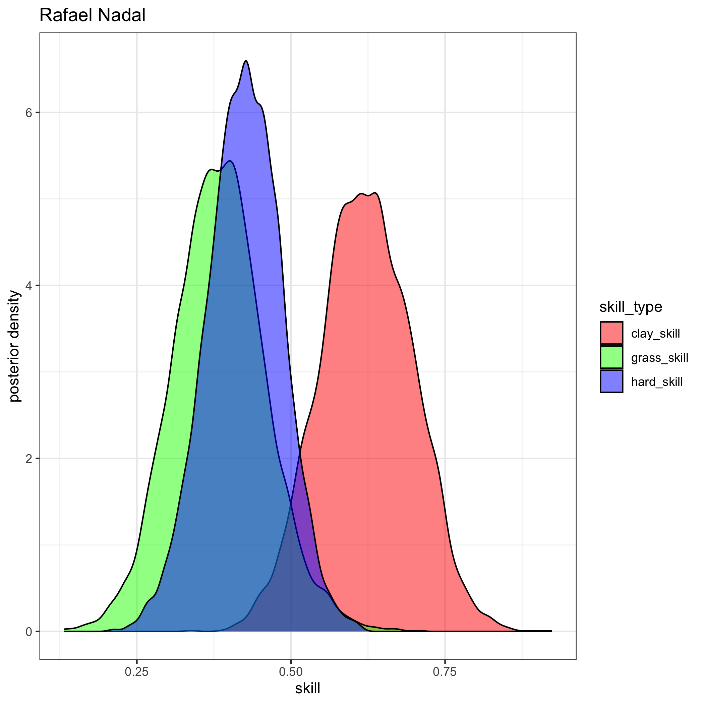
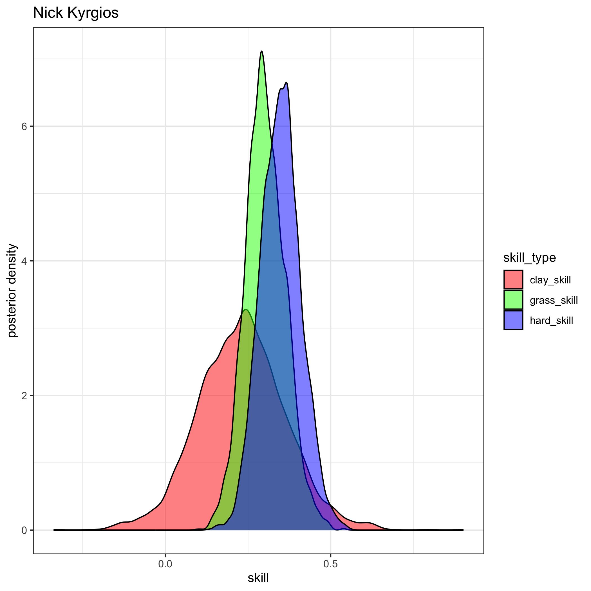

# Tennis Ratings
#### Author: [Jake Singleton](https://twitter.com/jakesingi)

## Version 2: April 2023 ATP Men's Singles Ratings and Rankings
* The ratings below are based on a fully-[Bayesian](https://en.wikipedia.org/wiki/Bayesian_statistics) [Bradley-Terry model](https://en.wikipedia.org/wiki/Bradley%E2%80%93Terry_model). They are similar to [Elo ratings](https://en.wikipedia.org/wiki/Elo_rating_system), but I'd argue they resemble [Glicko ratings](https://en.wikipedia.org/wiki/Glicko_rating_system) even more closely. I show in my work that these ratings outperform Glicko (more to come on this later). 
* The ratings are derived from matches played in the last 2 years, though only players with 5 or more ATP-level matches played in the last 365 days are listed.
* **Interpretation**: There are 3 "skill" columns, one for each surface. Unfortunately they are not sortable at the moment, but as a first step, I've sorted the table by "hard_skill" (players' skills on hard court), as this is the most popular surface.

### Updated through the end of Miami Open 2023. Updated approximately monthly.

|rank|full_name                  |hard_skill  |clay_skill  |grass_skill |
|----|---------------------------|------------|------------|------------|
|1   |Novak Djokovic             |0.659013109 |0.59167553  |0.581502863 |
|2   |Daniil Medvedev            |0.539178449 |0.324886933 |0.434781209 |
|3   |Rafael Nadal               |0.423981581 |0.622421358 |0.384109578 |
|4   |Carlos Alcaraz             |0.407318339 |0.386026399 |0.334721705 |
|5   |Alexander Zverev           |0.399136953 |0.424699673 |0.344969687 |
|6   |Jannik Sinner              |0.367389825 |0.306426068 |0.309675935 |
|7   |Nick Kyrgios               |0.348840904 |0.231378342 |0.302287346 |
|8   |Stefanos Tsitsipas         |0.331851978 |0.514326072 |0.27291276  |
|9   |Jack Draper                |0.310726349 |0.259166841 |0.259457955 |
|10  |Cameron Norrie             |0.300766858 |0.241298227 |0.265323071 |
|11  |Casper Ruud                |0.287850794 |0.367621232 |0.23962093  |
|12  |Matteo Berrettini          |0.287241023 |0.327710427 |0.2831253   |
|13  |Andrey Rublev              |0.286710726 |0.269023885 |0.244606002 |
|14  |Taylor Fritz               |0.27959577  |0.098036982 |0.240581427 |
|15  |Felix Auger Aliassime      |0.268867503 |0.218262454 |0.233479431 |
|16  |Hubert Hurkacz             |0.258615399 |0.188068286 |0.229584201 |
|17  |Sebastian Korda            |0.250581197 |0.180748396 |0.212872797 |
|18  |Marin Cilic                |0.2377441   |0.232663709 |0.206490007 |
|19  |Roberto Bautista Agut      |0.230659568 |0.210044999 |0.20102532  |
|20  |Gael Monfils               |0.229784373 |0.071657633 |0.17425795  |
|21  |Holger Rune                |0.229350402 |0.145139926 |0.179838155 |
|22  |Karen Khachanov            |0.224579088 |0.101234202 |0.185122227 |
|23  |Pablo Carreno Busta        |0.224167547 |0.256191342 |0.187995128 |
|24  |Alex De Minaur             |0.222493328 |0.119893447 |0.1946133   |
|25  |Tommy Paul                 |0.207093201 |0.03233332  |0.176445607 |
|26  |Grigor Dimitrov            |0.205515703 |0.201194229 |0.17588041  |
|27  |Ilya Ivashka               |0.202615843 |0.143051069 |0.170433435 |
|28  |Jenson Brooksby            |0.196189578 |-0.012837761|0.148968664 |
|29  |Denis Shapovalov           |0.184320558 |0.156949651 |0.16384111  |
|30  |Frances Tiafoe             |0.177997515 |0.065875582 |0.144031555 |
|31  |Arthur Fils                |0.166522055 |0.110825632 |0.139449569 |
|32  |Andy Murray                |0.159296605 |0.179445651 |0.149191222 |
|33  |Maxime Cressy              |0.151206388 |0.010255615 |0.136482547 |
|34  |Botic Van De Zandschulp    |0.142808811 |0.189224243 |0.129744009 |
|35  |Emil Ruusuvuori            |0.136224329 |0.000669998 |0.105358087 |
|36  |Alexander Ritschard        |0.129508608 |0.076701005 |0.112714521 |
|37  |Dominic Stricker           |0.128541347 |0.096238555 |0.107365504 |
|38  |Reilly Opelka              |0.125469454 |0.106300923 |0.093827695 |
|39  |Lloyd Harris               |0.123986106 |-0.007255337|0.094209296 |
|40  |Borna Coric                |0.122707943 |0.054855791 |0.101185189 |
|41  |Lorenzo Sonego             |0.117744932 |0.119432881 |0.107280703 |
|42  |Diego Schwartzman          |0.116076477 |0.119585133 |0.100938556 |
|43  |Jiri Lehecka               |0.110715863 |0.077108946 |0.089929409 |
|44  |Benjamin Bonzi             |0.108574084 |-0.035439452|0.091303869 |
|45  |Thanasi Kokkinakis         |0.108554574 |0.080325419 |0.092821117 |
|46  |Mikael Ymer                |0.108384742 |0.036947948 |0.085567476 |
|47  |Stan Wawrinka              |0.106590072 |0.034856888 |0.08377722  |
|48  |Yibing Wu                  |0.106024981 |0.076369351 |0.090061166 |
|49  |Mackenzie Mcdonald         |0.10600642  |0.055328649 |0.081234695 |
|50  |J J Wolf                   |0.105165666 |0.031068037 |0.086857669 |
|51  |Tomas Machac               |0.105034939 |0.053260922 |0.087622382 |
|52  |Brandon Nakashima          |0.103543921 |0.055500249 |0.094803356 |
|53  |Daniel Evans               |0.099650628 |0.054896096 |0.081624316 |
|54  |Tung Lin Wu                |0.096235914 |0.063777926 |0.080515905 |
|55  |Roman Safiullin            |0.094434769 |0.148684229 |0.085202599 |
|56  |Alexander Bublik           |0.08568927  |-0.043557398|0.09139307  |
|57  |Juan Pablo Varillas        |0.083731853 |0.108365415 |0.074292356 |
|58  |Quentin Halys              |0.078836003 |0.08078407  |0.068920032 |
|59  |Antoine Bellier            |0.0780086   |0.061739648 |0.071929472 |
|60  |Gijs Brouwer               |0.076293598 |0.1193894   |0.069408566 |
|61  |Franco Agamenone           |0.076027496 |0.107880048 |0.067808185 |
|62  |Yosuke Watanuki            |0.075838481 |0.112788963 |0.068974875 |
|63  |John Isner                 |0.075253042 |0.102612319 |0.065024037 |
|64  |Jack Sock                  |0.073044174 |0.035896518 |0.064784327 |
|65  |Soon Woo Kwon              |0.072065109 |0.009906419 |0.055633291 |
|66  |Alejandro Davidovich Fokina|0.071249549 |0.151716326 |0.06419177  |
|67  |Marton Fucsovics           |0.067637985 |0.04786347  |0.063744258 |
|68  |Jurij Rodionov             |0.066688386 |0.091247041 |0.056231628 |
|69  |Ben Shelton                |0.064903842 |0.041602743 |0.055277516 |
|70  |Ugo Humbert                |0.064378807 |-0.049559821|0.055645518 |
|71  |Miomir Kecmanovic          |0.062487442 |0.10198248  |0.051144499 |
|72  |Corentin Moutet            |0.060104316 |0.00011038  |0.042806826 |
|73  |Tim Van Rijthoven          |0.059773468 |0.054369955 |0.066847123 |
|74  |Arthur Rinderknech         |0.057574377 |0.078646894 |0.045108125 |
|75  |Kamil Majchrzak            |0.056651807 |0.010132872 |0.045605948 |
|76  |Christopher Oconnell       |0.054574498 |-0.022839456|0.039439005 |
|77  |Jason Kubler               |0.051759566 |0.048660665 |0.055283922 |
|78  |Francisco Cerundolo        |0.051120799 |0.068927272 |0.045507167 |
|79  |Aslan Karatsev             |0.04921762  |0.040122331 |0.037930941 |
|80  |Richard Gasquet            |0.049118945 |0.040465809 |0.041855744 |
|81  |Michael Mmoh               |0.048951125 |0.038792138 |0.041981913 |
|82  |Alejandro Tabilo           |0.048071835 |0.094653467 |0.040362265 |
|83  |Lorenzo Musetti            |0.04741499  |0.124986146 |0.039024757 |
|84  |Adrian Mannarino           |0.047383998 |-0.20820239 |0.016833713 |
|85  |Borna Gojo                 |0.046782115 |0.002765795 |0.035832911 |
|86  |Nicolas Jarry              |0.042971574 |0.12293784  |0.041661416 |
|87  |Ryan Peniston              |0.04263201  |0.032610331 |0.040660088 |
|88  |Christopher Eubanks        |0.041291207 |0.029629366 |0.037165784 |
|89  |Marc Andrea Huesler        |0.038399291 |-0.001992379|0.02759168  |
|90  |Dominic Thiem              |0.035172721 |0.007139354 |0.027919655 |
|91  |Elias Ymer                 |0.034789879 |0.019987202 |0.026314994 |
|92  |Brandon Holt               |0.032820313 |0.024564085 |0.027828654 |
|93  |Jan Lennard Struff         |0.031914633 |0.069829605 |0.033506672 |
|94  |Liam Broady                |0.030984499 |0.015434799 |0.021123246 |
|95  |Aleksandar Kovacevic       |0.030983203 |0.021258109 |0.02668566  |
|96  |Vasek Pospisil             |0.026224769 |0.013252976 |0.017660966 |
|97  |Ricardas Berankis          |0.02464978  |-0.056795547|0.015522316 |
|98  |Marcos Giron               |0.021634826 |-0.12002117 |0.009898727 |
|99  |Hugo Grenier               |0.019797403 |0.001465127 |0.011534175 |
|100 |Gregoire Barrere           |0.017695461 |-0.04616557 |0.006939738 |
|101 |Cristian Garin             |0.015531109 |0.070499279 |0.025552893 |
|102 |James Duckworth            |0.0135207   |-0.062220452|0.01140895  |
|103 |Tallon Griekspoor          |0.012736365 |-0.02406666 |0.008583914 |
|104 |Aleksandar Vukic           |0.011637296 |0.007190912 |0.011598687 |
|105 |Constant Lestienne         |0.009135654 |0.004002382 |0.00736718  |
|106 |Luca Nardi                 |0.008111766 |-0.022194817|0.004765853 |
|107 |Steve Johnson              |0.007639333 |-0.003565986|0.010943316 |
|108 |Zhizhen Zhang              |0.00440011  |0.046167767 |0.00377073  |
|109 |David Goffin               |0.00376124  |0.122317607 |0.027435246 |
|110 |Oscar Otte                 |0.003691691 |0.07661636  |0.017231712 |
|111 |Jiri Vesely                |-0.000362815|-0.101632834|0.000854081 |
|112 |Taro Daniel                |-0.0010814  |-0.003372279|-0.004765268|
|113 |Giulio Zeppieri            |-0.001872923|0.050660925 |0.002440712 |
|114 |Alex Molcan                |-0.002046649|0.164061614 |0.016091685 |
|115 |Laslo Djere                |-0.003298737|0.135422823 |0.009768913 |
|116 |Filip Misolic              |-0.009247767|0.03075333  |-0.005145555|
|117 |Hugo Gaston                |-0.010386074|-0.0330065  |-0.008137028|
|118 |John Millman               |-0.013443557|-0.087163217|-0.019267295|
|119 |Yoshihito Nishioka         |-0.01674202 |-0.065821406|-0.033080938|
|120 |Jordan Thompson            |-0.019247733|-0.135866337|-0.013111995|
|121 |Maximilian Marterer        |-0.022139701|-0.027932543|-0.017369918|
|122 |Aljaz Bedene               |-0.02856074 |-0.083994471|-0.021876038|
|123 |Dusan Lajovic              |-0.029844665|-0.00203712 |-0.031062539|
|124 |Filip Krajinovic           |-0.031690002|0.096501541 |-0.018020789|
|125 |Fabio Fognini              |-0.032987059|0.020319644 |-0.022991282|
|126 |Camilo Ugo Carabelli       |-0.03362374 |-0.04966965 |-0.029537681|
|127 |Daniel Elahi Galan         |-0.033643375|-0.048668967|-0.032133984|
|128 |Nuno Borges                |-0.036746054|-0.003855778|-0.029828087|
|129 |Carlos Taberner            |-0.036752078|-0.023618789|-0.031219505|
|130 |Gilles Simon               |-0.03742345 |-0.155766615|-0.042519637|
|131 |Yannick Hanfmann           |-0.044041569|0.041315799 |-0.038475815|
|132 |Manuel Guinard             |-0.045286515|-0.036868672|-0.038721723|
|133 |Flavio Cobolli             |-0.046382722|-0.01739931 |-0.038797686|
|134 |Mitchell Krueger           |-0.048614169|-0.040471205|-0.043971601|
|135 |Pablo Andujar              |-0.048959822|-0.047745791|-0.043307722|
|136 |Alexei Popyrin             |-0.050800426|-0.028898799|-0.04561785 |
|137 |Zizou Bergs                |-0.050985678|-0.039296516|-0.040658924|
|138 |Radu Albot                 |-0.05217236 |-0.169367905|-0.061026558|
|139 |Sam Querrey                |-0.05275202 |-0.082200466|-0.034426842|
|140 |Albert Ramos               |-0.05409117 |0.078197833 |-0.044380115|
|141 |Nikoloz Basilashvili       |-0.05493147 |-0.043277629|-0.044697643|
|142 |Stefan Kozlov              |-0.055016877|-0.043974048|-0.053727863|
|143 |Max Purcell                |-0.05698291 |-0.045774723|-0.044649531|
|144 |Geoffrey Blancaneaux       |-0.057483436|-0.057756864|-0.049709529|
|145 |Pedro Cachin               |-0.06117878 |-0.059100756|-0.052360914|
|146 |Norbert Gombos             |-0.062186271|-0.077325458|-0.062446748|
|147 |Denis Kudla                |-0.063044125|-0.082454783|-0.039603279|
|148 |Francesco Passaro          |-0.065733641|-0.065355812|-0.058651085|
|149 |Dominik Koepfer            |-0.067451896|-0.040443447|-0.059430959|
|150 |Guido Pella                |-0.071005823|-0.125275191|-0.075221535|
|151 |Pedro Martinez             |-0.072940068|0.042521187 |-0.0575086  |
|152 |Jaume Munar                |-0.07794018 |0.075765507 |-0.059104324|
|153 |Facundo Bagnis             |-0.083492244|-0.065844721|-0.073890151|
|154 |Tomas Martin Etcheverry    |-0.083551974|-0.056596365|-0.070449518|
|155 |Thiago Monteiro            |-0.083762866|0.006409248 |-0.069670253|
|156 |Rinky Hijikata             |-0.085486782|-0.054921925|-0.073199819|
|157 |Emilio Gomez               |-0.092729609|-0.063805173|-0.078691021|
|158 |Roberto Carballes Baena    |-0.09458655 |-0.018669987|-0.086060588|
|159 |Marco Cecchinato           |-0.099241406|-0.010748522|-0.083403082|
|160 |Hugo Dellien               |-0.105405228|-0.046061509|-0.089047292|
|161 |Damir Dzumhur              |-0.106756835|-0.04680779 |-0.087725684|
|162 |Joao Sousa                 |-0.11100182 |-0.099852367|-0.10302103 |
|163 |Benoit Paire               |-0.113403215|-0.131323632|-0.113388285|
|164 |Edan Leshem                |-0.115439488|-0.08185473 |-0.097377329|
|165 |Henri Laaksonen            |-0.122159057|-0.020313752|-0.102673573|
|166 |Pablo Cuevas               |-0.123430743|-0.001221279|-0.099336226|
|167 |Peter Gojowczyk            |-0.124463066|-0.130941994|-0.103836238|
|168 |Juan Manuel Cerundolo      |-0.125085378|-0.094943663|-0.105959092|
|169 |Kyle Edmund                |-0.125119608|-0.088906462|-0.105908321|
|170 |Daniel Altmaier            |-0.12808396 |-0.084051898|-0.111410339|
|171 |Pavel Kotov                |-0.134213388|-0.069695635|-0.111419499|
|172 |Emilio Nava                |-0.154799629|-0.107167203|-0.130303573|
|173 |Seong Chan Hong            |-0.154837395|-0.106767475|-0.130842459|
|174 |Fernando Verdasco          |-0.161018604|-0.079369869|-0.135951885|
|175 |Sebastian Baez             |-0.16428552 |0.191912233 |-0.115027414|
|176 |Feliciano Lopez            |-0.171039387|-0.178020656|-0.147855846|
|177 |Bernabe Zapata Miralles    |-0.172493076|0.044572343 |-0.144486271|
|178 |Mikhail Kukushkin          |-0.177567986|-0.168471955|-0.164091212|
|179 |Federico Delbonis          |-0.233267451|0.04677259  |-0.190821693|
|180 |Federico Coria             |-0.248134178|0.021357414 |-0.201698562|
|181 |Chun Hsin Tseng            |-0.271148106|-0.199854182|-0.23491793 |

## Images
* For brevity, here are visuals of the posterior distributions for each of the top 10 players listed
* **Interpretation**: Higher values of skill are good. The tighter the colorful blobs (aka distributions) are, the more confident we are about that player's skill on that particular surface. Note the blue blobs will tend to be tighter, since more matches are played on hard courts than clay and grass. 
* For example, we know Nadal is incredibly dominant on clay, and you can see his red blob is quite far to the right, reaffirming our belief he is uniquely good on clay courts.

 

## Future additions
* Add paper with mathematical details and performance of ratings
* Add women's ratings and rankings later, and potentially doubles
* Move the site away from markdown and toward something cleaner and more aesthetically-pleasing
