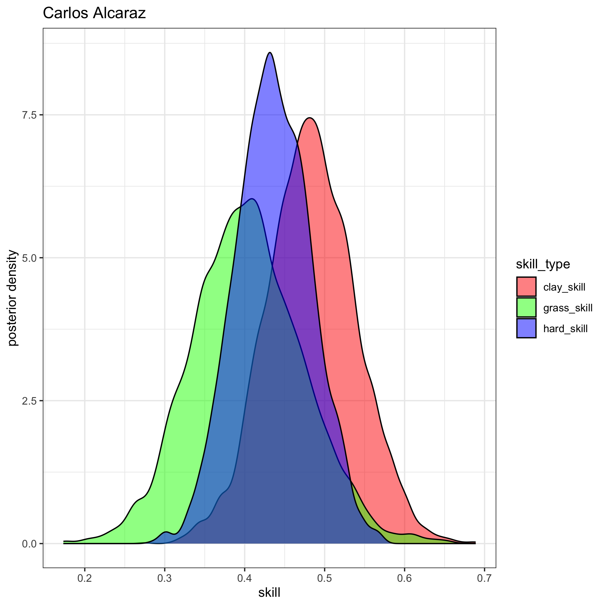

# Tennis Ratings
#### Author: [Jake Singleton](https://twitter.com/jakesingi)

## August 2023 ATP Men's Singles Ratings and Rankings (pre US Open)
* The ratings below are based on a fully-[Bayesian](https://en.wikipedia.org/wiki/Bayesian_statistics) [Bradley-Terry model](https://en.wikipedia.org/wiki/Bradley%E2%80%93Terry_model). They are similar to [Elo ratings](https://en.wikipedia.org/wiki/Elo_rating_system), but I'd argue they resemble [Glicko ratings](https://en.wikipedia.org/wiki/Glicko_rating_system) even more closely. I show in my work that these ratings outperform Glicko (more to come on this later). 
* The ratings are derived from matches played in the last 2 years, though only players with 5 or more ATP-level matches played in the last 365 days are listed.
* **Interpretation**: There are 3 "skill" columns, one for each surface. Unfortunately they are not sortable at the moment, but as a first step, I've sorted the table by "hard_skill" (players' skills on hard court), as this is the most popular surface.

### Updated through the end of Cincinnati 2023, i.e. before US Open. Updated monthly.

| rank | full_name                   | hard_skill  | clay_skill  | grass_skill |
| ---- | --------------------------- | ----------- | ----------- | ----------- |
| 1    | Novak Djokovic              | 0.65042901  | 0.48095241  | 0.55026711  |
| 2    | Daniil Medvedev             | 0.51093099  | 0.31075447  | 0.33623069  |
| 3    | Carlos Alcaraz              | 0.43575817  | 0.4837519   | 0.40364077  |
| 4    | Rafael Nadal                | 0.41578835  | 0.48888317  | 0.36044838  |
| 5    | Jannik Sinner               | 0.39642858  | 0.35441272  | 0.35458887  |
| 6    | Nick Kyrgios                | 0.3630251   | 0.20352735  | 0.29678783  |
| 7    | Alexander Zverev            | 0.34330501  | 0.33855564  | 0.28901922  |
| 8    | Jack Draper                 | 0.31931701  | 0.27158166  | 0.2590756   |
| 9    | Stefanos Tsitsipas          | 0.30106706  | 0.37178646  | 0.21465832  |
| 10   | Taylor Fritz                | 0.28521067  | 0.17650314  | 0.23811462  |
| 11   | Andrey Rublev               | 0.28237818  | 0.2912535   | 0.24091222  |
| 12   | Gael Monfils                | 0.27341536  | 0.1435629   | 0.22361979  |
| 13   | Casper Ruud                 | 0.26855165  | 0.29593482  | 0.20059554  |
| 14   | Cameron Norrie              | 0.25294587  | 0.19871367  | 0.212679    |
| 15   | Marin Cilic                 | 0.25087775  | 0.27026932  | 0.20415743  |
| 16   | Alex De Minaur              | 0.2501294   | 0.14635253  | 0.20894231  |
| 17   | Felix Auger Aliassime       | 0.24986961  | 0.17516764  | 0.19474535  |
| 18   | Hubert Hurkacz              | 0.24772184  | 0.16266231  | 0.21500602  |
| 19   | Matteo Berrettini           | 0.23849537  | 0.21295271  | 0.21416892  |
| 20   | Roberto Bautista Agut       | 0.23434284  | 0.16666698  | 0.2080526   |
| 21   | Grigor Dimitrov             | 0.22898055  | 0.2278723   | 0.21970586  |
| 22   | Holger Rune                 | 0.2275739   | 0.22753756  | 0.17886885  |
| 23   | Tommy Paul                  | 0.21926867  | \-0.0190574 | 0.17686823  |
| 24   | Sebastian Korda             | 0.21384277  | 0.13656536  | 0.17158776  |
| 25   | Karen Khachanov             | 0.21167284  | 0.14656898  | 0.17543129  |
| 26   | Dimitar Kuzmanov            | 0.19369662  | 0.17676457  | 0.16081781  |
| 27   | Pablo Carreno Busta         | 0.18912932  | 0.15602396  | 0.14985603  |
| 28   | Jenson Brooksby             | 0.17000134  | \-0.0221222 | 0.11425311  |
| 29   | Frances Tiafoe              | 0.16840659  | 0.10528701  | 0.14337463  |
| 30   | Ilya Ivashka                | 0.1655915   | \-0.0343938 | 0.12963908  |
| 31   | Denis Shapovalov            | 0.16217739  | 0.06738306  | 0.12015754  |
| 32   | Andy Murray                 | 0.14554514  | 0.06805068  | 0.14282     |
| 33   | Emil Ruusuvuori             | 0.1342563   | 0.06828991  | 0.10528292  |
| 34   | Stan Wawrinka               | 0.12386613  | 0.05852894  | 0.10248255  |
| 35   | Jiri Lehecka                | 0.11554329  | 0.05231575  | 0.10452903  |
| 36   | Alexander Ritschard         | 0.11338792  | 0.05038314  | 0.09883239  |
| 37   | Mikael Ymer                 | 0.11272999  | 0.0323875   | 0.09430874  |
| 38   | Maxime Cressy               | 0.11045955  | \-0.109221  | 0.09684841  |
| 39   | Alejandro Davidovich Fokina | 0.10924691  | 0.14133119  | 0.0967135   |
| 40   | Quentin Halys               | 0.10891443  | 0.1357918   | 0.10365055  |
| 41   | Botic Van De Zandschulp     | 0.10777726  | 0.07596503  | 0.08262396  |
| 42   | J J Wolf                    | 0.1059547   | 0.07058803  | 0.08573988  |
| 43   | Nicolas Jarry               | 0.10530548  | 0.16374953  | 0.09989534  |
| 44   | Roman Safiullin             | 0.09962221  | 0.10786013  | 0.09674664  |
| 45   | Mackenzie Mcdonald          | 0.09826103  | \-0.015253  | 0.06285911  |
| 46   | Tomas Machac                | 0.09734285  | 0.05281557  | 0.07793277  |
| 47   | Thanasi Kokkinakis          | 0.09602292  | 0.0601252   | 0.08147212  |
| 48   | Arthur Fils                 | 0.09576339  | 0.0887148   | 0.06864417  |
| 49   | Daniel Evans                | 0.09304614  | 0.0102148   | 0.05398873  |
| 50   | Borna Coric                 | 0.09288602  | 0.06141807  | 0.06212754  |
| 51   | Benjamin Bonzi              | 0.08882653  | \-0.0110542 | 0.0725361   |
| 52   | Lloyd Harris                | 0.0863085   | \-0.0329669 | 0.06584561  |
| 53   | Lorenzo Musetti             | 0.08564874  | 0.20597198  | 0.08176779  |
| 54   | Alexander Bublik            | 0.08419763  | \-0.0840223 | 0.13653862  |
| 55   | Tung Lin Wu                 | 0.08391028  | 0.05153582  | 0.06895864  |
| 56   | Dominic Stricker            | 0.078541    | 0.00022098  | 0.06138596  |
| 57   | Lorenzo Sonego              | 0.07723718  | 0.08356815  | 0.06293021  |
| 58   | Brandon Nakashima           | 0.07619393  | 0.02580028  | 0.06915133  |
| 59   | Gijs Brouwer                | 0.07329888  | 0.08868483  | 0.05788517  |
| 60   | Soon Woo Kwon               | 0.07075332  | 0.00943032  | 0.05379446  |
| 61   | Jan Lennard Struff          | 0.06874723  | 0.14226064  | 0.082992    |
| 62   | Kamil Majchrzak             | 0.06747245  | 0.03843731  | 0.05280738  |
| 63   | Adrian Mannarino            | 0.06735771  | \-0.0926227 | 0.07135293  |
| 64   | Diego Schwartzman           | 0.06465096  | 0.06322588  | 0.05223015  |
| 65   | Marton Fucsovics            | 0.06440634  | 0.05557868  | 0.0645025   |
| 66   | Francisco Cerundolo         | 0.06324969  | 0.18885214  | 0.06046328  |
| 67   | Juan Pablo Varillas         | 0.06207537  | 0.08023885  | 0.04584846  |
| 68   | Miomir Kecmanovic           | 0.06047308  | 0.13025446  | 0.03231244  |
| 69   | Christopher Eubanks         | 0.05737725  | 0.03658823  | 0.0653498   |
| 70   | Milos Raonic                | 0.05705822  | 0.03478634  | 0.04645039  |
| 71   | Yibing Wu                   | 0.05590698  | \-0.038195  | 0.03780708  |
| 72   | Jack Sock                   | 0.0530502   | \-0.0048746 | 0.04613322  |
| 73   | Yosuke Watanuki             | 0.05017077  | 0.06899627  | 0.04608115  |
| 74   | Tallon Griekspoor           | 0.04679434  | \-0.0201216 | 0.04991778  |
| 75   | Ricardas Berankis           | 0.0467581   | \-0.0137083 | 0.03560981  |
| 76   | Jurij Rodionov              | 0.0447417   | 0.00731089  | 0.03580587  |
| 77   | Arthur Rinderknech          | 0.04403452  | 0.01713662  | 0.029433    |
| 78   | Michael Mmoh                | 0.04400111  | \-0.0031175 | 0.0365083   |
| 79   | Yannick Hanfmann            | 0.04354516  | 0.07392638  | 0.04810555  |
| 80   | Vasek Pospisil              | 0.04302515  | 0.02545907  | 0.03520265  |
| 81   | Alexandre Muller            | 0.04194183  | \-0.0116798 | 0.03550572  |
| 82   | Christopher Oconnell        | 0.0417784   | \-0.0289282 | 0.03601513  |
| 83   | Tim Van Rijthoven           | 0.04145904  | 0.03256174  | 0.05726119  |
| 84   | Gilles Simon                | 0.0409602   | 0.00381951  | 0.03348636  |
| 85   | Alex Michelsen              | 0.04065207  | 0.03225288  | 0.04469795  |
| 86   | Aslan Karatsev              | 0.03903253  | 0.02711346  | 0.02897291  |
| 87   | Felipe Meligeni Alves       | 0.03793304  | 0.0286201   | 0.0309106   |
| 88   | Ugo Humbert                 | 0.03540611  | \-0.0019957 | 0.01305048  |
| 89   | Brandon Holt                | 0.03381113  | 0.0223536   | 0.02797419  |
| 90   | Thiago Seyboth Wild         | 0.03170739  | 0.04103287  | 0.02664655  |
| 91   | Dominic Thiem               | 0.0289865   | \-0.0046026 | 0.0235755   |
| 92   | Ben Shelton                 | 0.02692217  | \-0.0231672 | 0.01702694  |
| 93   | Aleksandar Vukic            | 0.02579233  | \-0.00609   | 0.01187935  |
| 94   | Richard Gasquet             | 0.02568279  | \-0.0110815 | 0.01788613  |
| 95   | Marcos Giron                | 0.02422718  | 0.00425117  | 0.01743577  |
| 96   | Alejandro Tabilo            | 0.0239625   | 0.06181301  | 0.0159116   |
| 97   | Gregoire Barrere            | 0.02285082  | \-0.0151841 | 0.02265888  |
| 98   | Corentin Moutet             | 0.02157936  | \-0.0351402 | 0.01395259  |
| 99   | Marc Andrea Huesler         | 0.02068298  | \-0.0902134 | 0.01642934  |
| 100  | Maximilian Marterer         | 0.01645096  | 0.00388894  | 0.02304269  |
| 101  | Jason Kubler                | 0.01631813  | \-0.0209504 | 0.02286204  |
| 102  | Juncheng Shang              | 0.01499611  | \-0.0004997 | 0.01139847  |
| 103  | Matteo Arnaldi              | 0.01450255  | 0.03989057  | 0.00974328  |
| 104  | Elias Ymer                  | 0.01369127  | \-0.0529704 | 0.00616109  |
| 105  | Fabian Marozsan             | 0.0133238   | 0.10874626  | 0.00319786  |
| 106  | Borna Gojo                  | 0.01111855  | \-0.0332284 | \-0.0031843 |
| 107  | Liam Broady                 | 0.01045495  | \-0.032     | 0.01049367  |
| 108  | David Goffin                | 0.00907752  | 0.06015968  | 0.03892163  |
| 109  | Sebastian Ofner             | 0.00892608  | 0.03380202  | 0.00580331  |
| 110  | Zhizhen Zhang               | 0.00862022  | 0.0430743   | 0.00626484  |
| 111  | John Isner                  | 0.00377907  | 0.01576671  | 0.0036355   |
| 112  | Giulio Zeppieri             | 0.00345005  | 0.04284235  | 0.00493258  |
| 113  | Yoshihito Nishioka          | 0.00199924  | \-0.0222169 | \-0.0074741 |
| 114  | Laslo Djere                 | 0.00113212  | 0.1074969   | 0.01747137  |
| 115  | Andrea Vavassori            | \-0.0007352 | 0.01273539  | \-0.0019774 |
| 116  | Aleksandar Kovacevic        | \-0.0030899 | \-0.013529  | \-0.0112547 |
| 117  | Hugo Grenier                | \-0.0044404 | \-0.0686285 | \-0.0125062 |
| 118  | Cristian Garin              | \-0.0050957 | 0.01094545  | 0.0064132   |
| 119  | Jordan Thompson             | \-0.005247  | \-0.0762422 | 0.00504112  |
| 120  | James Duckworth             | \-0.0093173 | \-0.0460984 | \-0.0078988 |
| 121  | Taro Daniel                 | \-0.0105817 | \-0.0006558 | \-0.0142822 |
| 122  | Guido Pella                 | \-0.0116665 | \-0.0407215 | \-0.0071598 |
| 123  | Dusan Lajovic               | \-0.0144006 | 0.03095766  | \-0.0201084 |
| 124  | Alexander Shevchenko        | \-0.0155186 | 0.00037646  | \-0.0178844 |
| 125  | Max Purcell                 | \-0.0157716 | \-0.0630675 | \-0.0271414 |
| 126  | Ryan Peniston               | \-0.0170587 | \-0.0097506 | \-0.0152258 |
| 127  | Daniel Elahi Galan          | \-0.0171009 | \-0.0469741 | \-0.0051665 |
| 128  | Alex Molcan                 | \-0.023362  | 0.07536514  | \-0.0078484 |
| 129  | Oscar Otte                  | \-0.0245059 | 0.04646449  | \-0.0129168 |
| 130  | Flavio Cobolli              | \-0.0288446 | 0.0014117   | \-0.0231369 |
| 131  | Abedallah Shelbayh          | \-0.0305093 | \-0.0202003 | \-0.0341826 |
| 132  | Hamad Medjedovic            | \-0.0310642 | \-0.029796  | \-0.0261596 |
| 133  | Hugo Gaston                 | \-0.0318914 | \-0.0620157 | \-0.0241018 |
| 134  | Radu Albot                  | \-0.032471  | \-0.067279  | \-0.0379872 |
| 135  | Steve Johnson               | \-0.0346153 | \-0.0286488 | \-0.0231013 |
| 136  | Zizou Bergs                 | \-0.0358244 | \-0.0101539 | \-0.0257671 |
| 137  | Alexei Popyrin              | \-0.0370241 | 0.04049717  | \-0.0349492 |
| 138  | Rinky Hijikata              | \-0.0386003 | \-0.022745  | \-0.0180836 |
| 139  | Filip Misolic               | \-0.0389659 | \-0.0223815 | \-0.0322404 |
| 140  | John Millman                | \-0.0397973 | \-0.1174999 | \-0.0378807 |
| 141  | Jan Choinski                | \-0.041796  | \-0.0442755 | \-0.0362078 |
| 142  | Constant Lestienne          | \-0.0433356 | \-0.0381421 | \-0.047394  |
| 143  | Pedro Cachin                | \-0.0488878 | 0.06846458  | \-0.0429784 |
| 144  | Luca Nardi                  | \-0.0523421 | \-0.1190021 | \-0.0469855 |
| 145  | Francesco Passaro           | \-0.0537583 | \-0.0549408 | \-0.045022  |
| 146  | Filip Krajinovic            | \-0.0538319 | \-0.0254115 | \-0.0345905 |
| 147  | Jeremy Chardy               | \-0.0541438 | \-0.0936007 | \-0.0518487 |
| 148  | Pablo Andujar               | \-0.0563266 | \-0.0806846 | \-0.0531922 |
| 149  | Fabio Fognini               | \-0.0578797 | 0.02844493  | \-0.0462764 |
| 150  | Roberto Carballes Baena     | \-0.0638056 | \-0.0058235 | \-0.0600346 |
| 151  | Gabriel Diallo              | \-0.068216  | \-0.0417361 | \-0.0609391 |
| 152  | Albert Ramos                | \-0.0719564 | 0.03945597  | \-0.0635043 |
| 153  | Jozef Kovalik               | \-0.0780978 | \-0.0163257 | \-0.0643861 |
| 154  | Nuno Borges                 | \-0.0811203 | \-0.0618891 | \-0.0746967 |
| 155  | Thiago Monteiro             | \-0.0817326 | \-0.0093974 | \-0.066729  |
| 156  | Jaume Munar                 | \-0.0832832 | 0.03494283  | \-0.0631591 |
| 157  | Tomas Martin Etcheverry     | \-0.0864389 | 0.05211776  | \-0.069933  |
| 158  | Facundo Bagnis              | \-0.0893725 | \-0.0843069 | \-0.0786761 |
| 159  | Pavel Kotov                 | \-0.095657  | \-0.0191631 | \-0.0779191 |
| 160  | Joao Sousa                  | \-0.0961326 | \-0.0822878 | \-0.0888927 |
| 161  | Tomas Barrios Vera          | \-0.0972041 | \-0.0425033 | \-0.078453  |
| 162  | Dominik Koepfer             | \-0.0972564 | \-0.0640048 | \-0.0893053 |
| 163  | Sho Shimabukuro             | \-0.0990195 | \-0.0628261 | \-0.0890334 |
| 164  | Pedro Martinez              | \-0.1044692 | \-0.0376579 | \-0.0940835 |
| 165  | Edan Leshem                 | \-0.1056569 | \-0.067755  | \-0.0876018 |
| 166  | Damir Dzumhur               | \-0.1082477 | \-0.0343191 | \-0.0877244 |
| 167  | Luca Van Assche             | \-0.1120415 | \-0.0523556 | \-0.1042813 |
| 168  | Emilio Gomez                | \-0.1219507 | \-0.1404078 | \-0.1037561 |
| 169  | Denis Kudla                 | \-0.122587  | \-0.130694  | \-0.0968981 |
| 170  | Nikoloz Basilashvili        | \-0.1264273 | \-0.1348835 | \-0.1019584 |
| 171  | Daniel Altmaier             | \-0.126509  | \-0.0257171 | \-0.1109167 |
| 172  | Seong Chan Hong             | \-0.1390588 | \-0.0898973 | \-0.11469   |
| 173  | Marco Cecchinato            | \-0.142614  | \-0.0824039 | \-0.1249308 |
| 174  | Hugo Dellien                | \-0.1460189 | \-0.1135267 | \-0.124415  |
| 175  | Bernabe Zapata Miralles     | \-0.1515464 | 0.04377905  | \-0.1262727 |
| 176  | Shintaro Mochizuki          | \-0.1591529 | \-0.100787  | \-0.1371525 |
| 177  | Emilio Nava                 | \-0.1597257 | \-0.1248236 | \-0.1314674 |
| 178  | Benoit Paire                | \-0.1654068 | \-0.142895  | \-0.1455278 |
| 179  | Juan Manuel Cerundolo       | \-0.1673474 | \-0.1359589 | \-0.144143  |
| 180  | Kyle Edmund                 | \-0.1769392 | \-0.1890959 | \-0.1485906 |
| 181  | Fernando Verdasco           | \-0.1780277 | \-0.1020522 | \-0.1487928 |
| 182  | Feliciano Lopez             | \-0.1789099 | \-0.1904376 | \-0.160654  |
| 183  | Sebastian Baez              | \-0.1821359 | 0.15627829  | \-0.1366106 |
| 184  | Federico Coria              | \-0.2389847 | \-0.0064376 | \-0.1981666 |
| 185  | Chun Hsin Tseng             | \-0.2836543 | \-0.181104  | \-0.2437495 |

## Images
* For brevity, here are visuals of the posterior distributions for each of the top 10 players listed
* **Interpretation**: Higher values of skill are good. The tighter the colorful blobs (aka distributions) are, the more confident we are about that player's skill on that particular surface. Note the blue blobs will tend to be tighter, since more matches are played on hard courts than clay and grass. 
* For example, we know Nadal is incredibly dominant on clay, and you can see his red blob is quite far to the right, reaffirming our belief he is uniquely good on clay courts.

 

## Future additions
* Add master's paper with mathematical details and performance of ratings
* Add women's ratings and rankings later, and potentially doubles
* Move the site away from markdown and toward something cleaner and more aesthetically-pleasing
