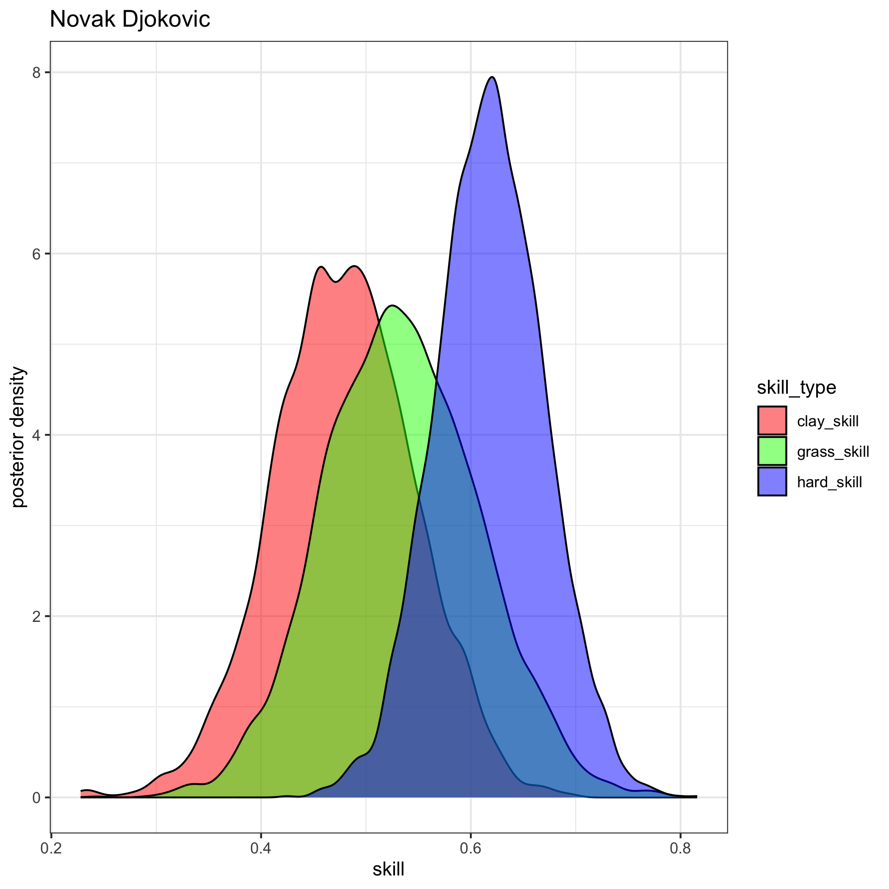
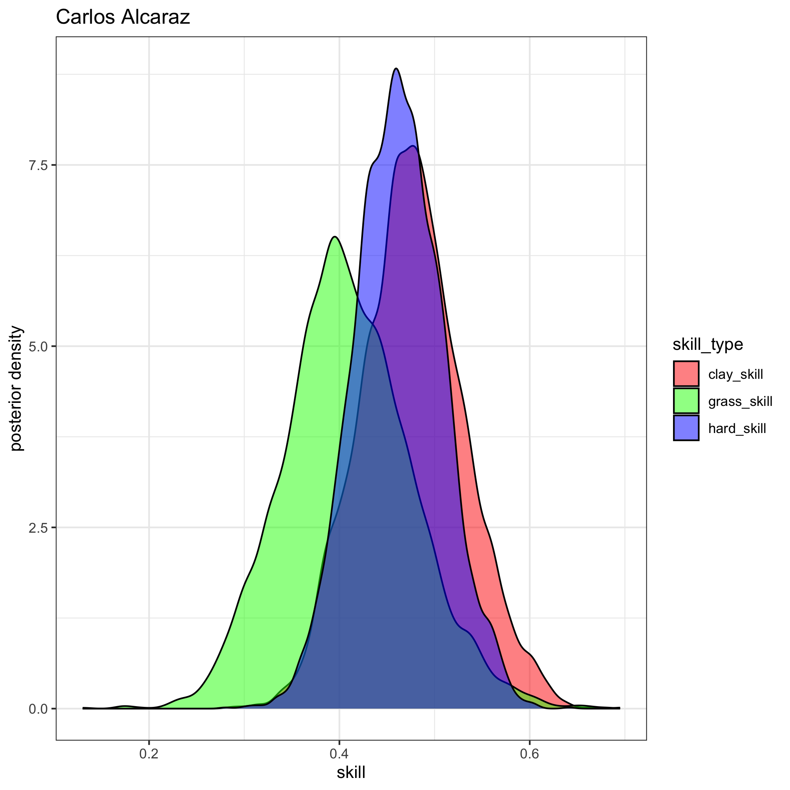
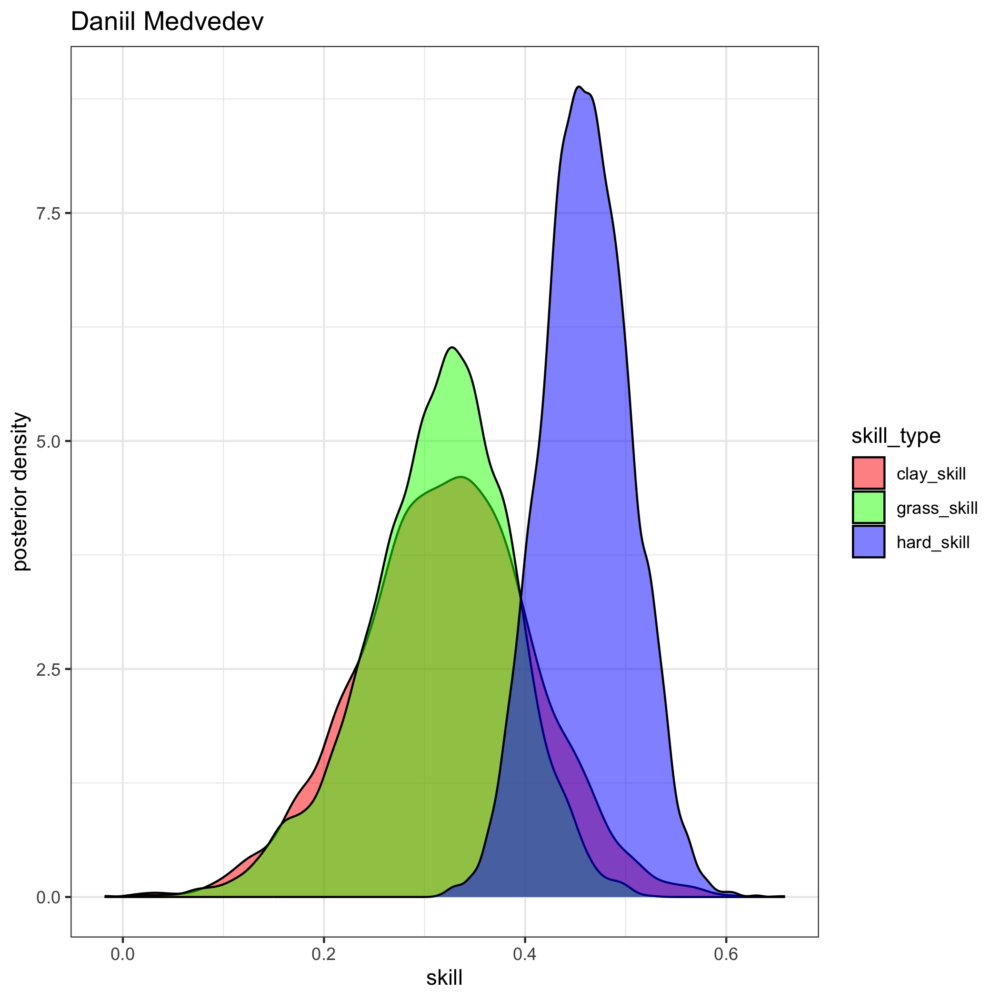
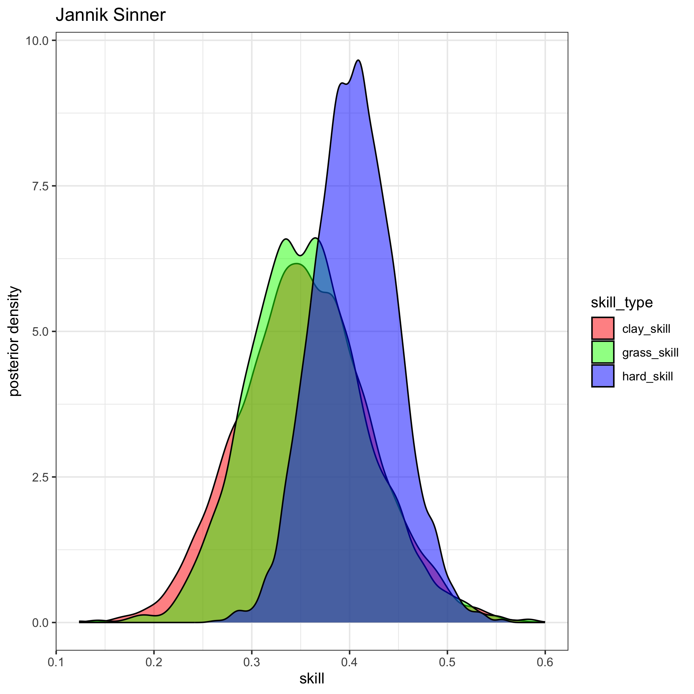
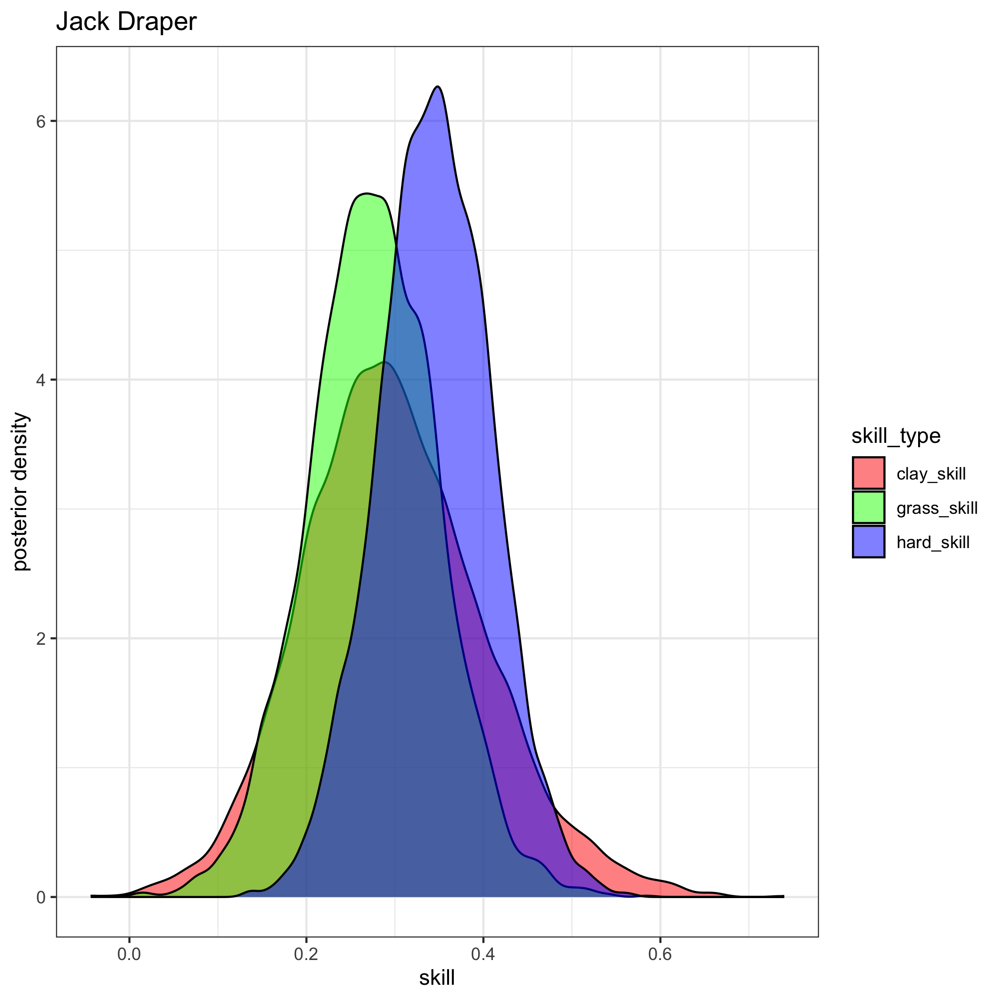
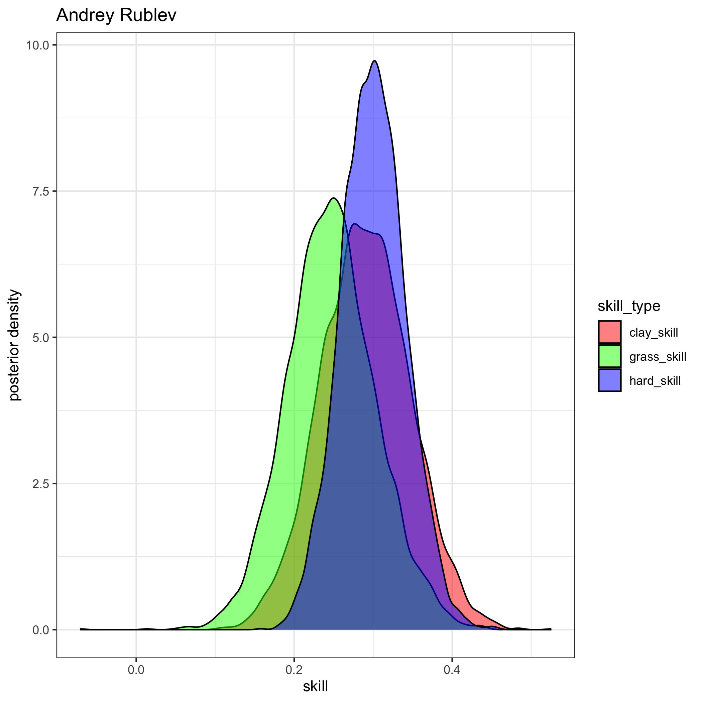
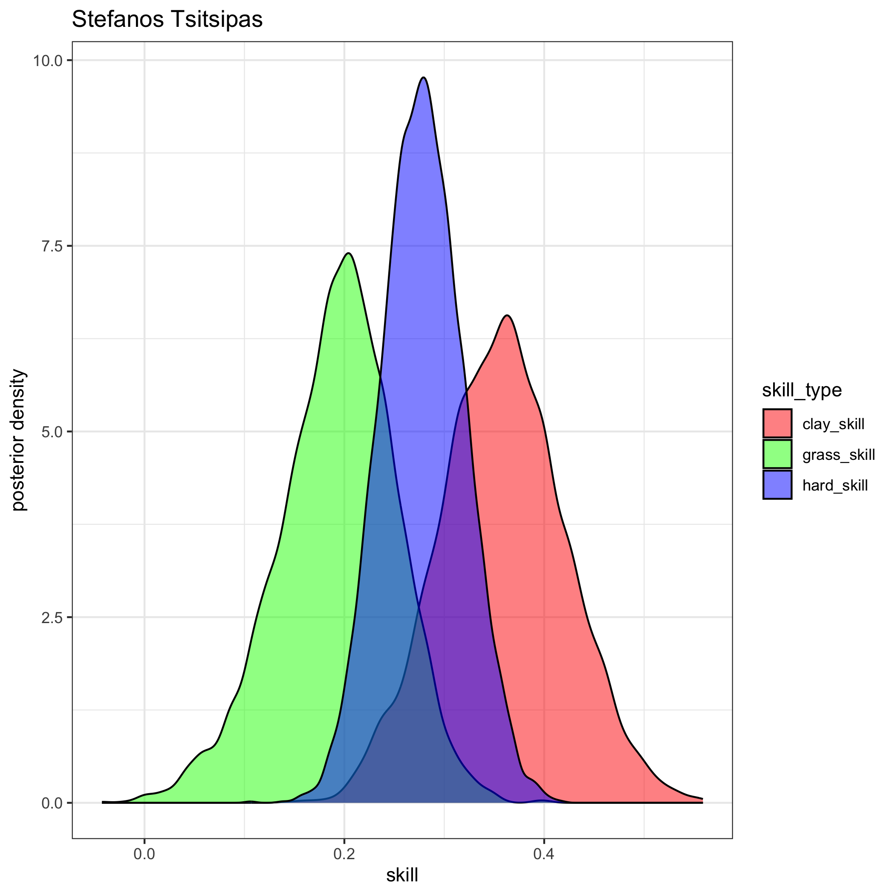
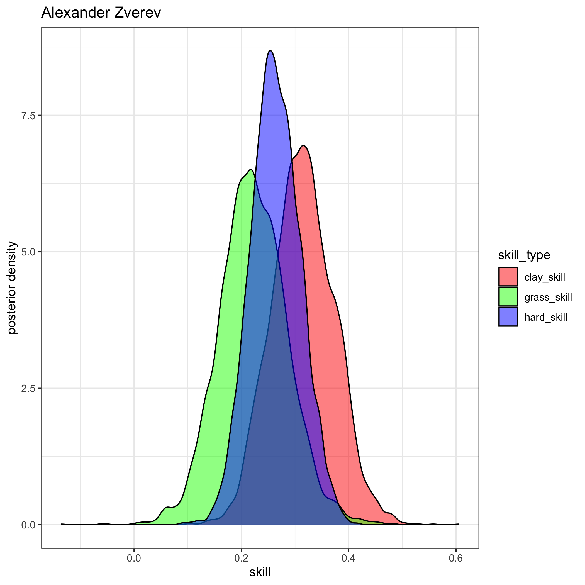

# Tennis Ratings
#### Author: [Jake Singleton](https://twitter.com/jakesingi)

## December 2023 ATP Men's Singles Ratings and Rankings (end of season)
* The ratings below are based on a fully-[Bayesian](https://en.wikipedia.org/wiki/Bayesian_statistics) [Bradley-Terry model](https://en.wikipedia.org/wiki/Bradley%E2%80%93Terry_model). They are similar to [Elo ratings](https://en.wikipedia.org/wiki/Elo_rating_system), but I'd argue they resemble [Glicko ratings](https://en.wikipedia.org/wiki/Glicko_rating_system) even more closely. I show in my work that these ratings outperform Glicko. 
* The ratings are derived from matches played in the last 2 years, though only players with 5 or more ATP-level matches played in the last 365 days are listed.
* **Interpretation**: There are 3 "skill" columns, one for each surface. Unfortunately they are not sortable at the moment, but as a first step, I've sorted the table by "hard_skill" (players' skills on hard court), as this is the most popular surface.

### Updated through the end of the 2023 season.

|rank|full_name                  |hard_skill  |clay_skill  |grass_skill |
|----|---------------------------|------------|------------|------------|
|1   |Novak Djokovic             |0.618368198 |0.478938503 |0.533796886 |
|2   |Carlos Alcaraz             |0.462007452 |0.476513783 |0.408713133 |
|3   |Daniil Medvedev            |0.460768665 |0.321081138 |0.313548347 |
|4   |Jannik Sinner              |0.405550416 |0.354405895 |0.356778548 |
|5   |Jack Draper                |0.344928996 |0.298342072 |0.275502417 |
|6   |Andrey Rublev              |0.300183105 |0.290549252 |0.247180666 |
|7   |Stefanos Tsitsipas         |0.278387138 |0.358563491 |0.192799053 |
|8   |Taylor Fritz               |0.272170369 |0.180681183 |0.232039084 |
|9   |Alexander Zverev           |0.263328497 |0.314904488 |0.222197398 |
|10  |Alex De Minaur             |0.256470229 |0.159284669 |0.216135088 |
|11  |Hubert Hurkacz             |0.239883148 |0.165883965 |0.210722518 |
|12  |Grigor Dimitrov            |0.238588319 |0.225737193 |0.21921704  |
|13  |Felix Auger Aliassime      |0.235278775 |0.174029025 |0.187644259 |
|14  |Gael Monfils               |0.23506536  |0.14672398  |0.198867891 |
|15  |Matteo Berrettini          |0.234111098 |0.2110751   |0.207720307 |
|16  |Casper Ruud                |0.208453115 |0.277607898 |0.151726118 |
|17  |Karen Khachanov            |0.199287835 |0.145835411 |0.168299165 |
|18  |Sebastian Korda            |0.196587145 |0.142141197 |0.160666221 |
|19  |Tommy Paul                 |0.193092842 |0.007890099 |0.169034636 |
|20  |Cameron Norrie             |0.190145948 |0.176852778 |0.168168121 |
|21  |Holger Rune                |0.181151721 |0.204953079 |0.143180321 |
|22  |Roberto Bautista Agut      |0.180843649 |0.144943269 |0.166366663 |
|23  |Sumit Nagal                |0.179950862 |0.132398835 |0.151036252 |
|24  |Denis Shapovalov           |0.142264367 |0.077136892 |0.107910713 |
|25  |Roman Safiullin            |0.138572513 |0.125962701 |0.121794632 |
|26  |Emil Ruusuvuori            |0.135873548 |0.081636866 |0.107651741 |
|27  |Fabian Marozsan            |0.133459558 |0.155506512 |0.097787392 |
|28  |Frances Tiafoe             |0.13256438  |0.097898504 |0.116141049 |
|29  |Nicolas Jarry              |0.130773626 |0.155614408 |0.110911581 |
|30  |Adrian Mannarino           |0.111165315 |-0.048061127|0.106664981 |
|31  |Alejandro Davidovich Fokina|0.106190064 |0.130143351 |0.089239909 |
|32  |Dimitar Kuzmanov           |0.10408161  |0.108897122 |0.086248113 |
|33  |Stan Wawrinka              |0.102654783 |0.059450047 |0.088553303 |
|34  |Mikael Ymer                |0.096738906 |0.044081694 |0.085824906 |
|35  |Alexander Ritschard        |0.094119784 |0.052747748 |0.084923673 |
|36  |Ugo Humbert                |0.092031085 |0.037565784 |0.056777204 |
|37  |Tomas Machac               |0.091882119 |0.057917815 |0.075406908 |
|38  |Jenson Brooksby            |0.091794506 |-0.002100991|0.069581227 |
|39  |Daniel Evans               |0.089754618 |0.021146297 |0.056957787 |
|40  |Mackenzie Mcdonald         |0.08895972  |0.006214628 |0.060944038 |
|41  |Arthur Fils                |0.088896291 |0.089513964 |0.064590113 |
|42  |Lorenzo Musetti            |0.087817682 |0.185265278 |0.072672217 |
|43  |Ben Shelton                |0.087263426 |0.018670624 |0.068508478 |
|44  |Maxime Cressy              |0.082488637 |-0.092500422|0.088761367 |
|45  |Thanasi Kokkinakis         |0.074096479 |0.054735088 |0.063505677 |
|46  |Dominic Stricker           |0.072711831 |0.018834154 |0.060521531 |
|47  |Andy Murray                |0.07217117  |0.038145164 |0.085126277 |
|48  |Miomir Kecmanovic          |0.071927234 |0.120004576 |0.038107159 |
|49  |Quentin Halys              |0.067646308 |0.099333625 |0.065413603 |
|50  |Gijs Brouwer               |0.067514417 |0.082604951 |0.051086839 |
|51  |Laslo Djere                |0.067024372 |0.103949072 |0.05734057  |
|52  |Brandon Nakashima          |0.066809325 |0.029420875 |0.064055301 |
|53  |Benjamin Bonzi             |0.066233637 |0.002861339 |0.058981543 |
|54  |Yu Hsiou Hsu               |0.065717495 |0.050514288 |0.055369633 |
|55  |J J Wolf                   |0.065071339 |0.056266647 |0.054294863 |
|56  |Matteo Arnaldi             |0.06490256  |0.055886569 |0.049911562 |
|57  |Borna Coric                |0.064853142 |0.055012675 |0.043076598 |
|58  |Borna Gojo                 |0.06443634  |0.012813382 |0.04597685  |
|59  |Tallon Griekspoor          |0.064118044 |-0.000949456|0.064113123 |
|60  |Botic Van De Zandschulp    |0.063576824 |0.053590178 |0.050998166 |
|61  |Francisco Cerundolo        |0.061022711 |0.170266808 |0.047027489 |
|62  |Jiri Lehecka               |0.057924507 |0.035867548 |0.059889078 |
|63  |Lorenzo Sonego             |0.055901236 |0.071379926 |0.045197018 |
|64  |Alex Michelsen             |0.055338798 |0.042963313 |0.052752363 |
|65  |Zhizhen Zhang              |0.05176635  |0.054879806 |0.038849025 |
|66  |Alexander Bublik           |0.050371024 |-0.073388273|0.115512563 |
|67  |Jan Lennard Struff         |0.04585647  |0.111253422 |0.054919167 |
|68  |Michael Mmoh               |0.045235041 |0.010159859 |0.039021377 |
|69  |Maximilian Marterer        |0.041351782 |0.027121908 |0.042483767 |
|70  |Ilya Ivashka               |0.03984615  |-0.040198065|0.042845849 |
|71  |Yosuke Watanuki            |0.033323169 |0.049366426 |0.029278503 |
|72  |Harold Mayot               |0.030898241 |0.022262929 |0.036259132 |
|73  |Marton Fucsovics           |0.029053188 |0.033372973 |0.033332253 |
|74  |Richard Gasquet            |0.026974021 |9.16E-05    |0.020726982 |
|75  |Felipe Meligeni Alves      |0.026889841 |-0.00076513 |0.022909858 |
|76  |Leandro Riedi              |0.026578955 |0.038387814 |0.020993617 |
|77  |David Goffin               |0.024913611 |0.049660165 |0.04266911  |
|78  |Dominic Thiem              |0.021659761 |-0.008027675|0.018659238 |
|79  |Facundo Diaz Acosta        |0.02131578  |0.065220657 |0.015666173 |
|80  |Hamad Medjedovic           |0.020746874 |-0.002794747|0.015107269 |
|81  |Christopher Eubanks        |0.020273683 |0.009592037 |0.035512025 |
|82  |Milos Raonic               |0.019189756 |0.013028626 |0.017401654 |
|83  |Oleksii Krutykh            |0.018093463 |-0.001701495|0.016536485 |
|84  |Aslan Karatsev             |0.018016016 |0.014781524 |0.012599598 |
|85  |Soon Woo Kwon              |0.016953775 |-0.007397829|0.009926417 |
|86  |Jordan Thompson            |0.014928858 |-0.049723609|0.022543301 |
|87  |Jason Kubler               |0.014823436 |-0.019059821|0.021615232 |
|88  |Arthur Rinderknech         |0.014421894 |0.006326132 |0.007883416 |
|89  |Yannick Hanfmann           |0.013483687 |0.060922354 |0.019583887 |
|90  |Jack Sock                  |0.012825801 |-0.016349649|0.016312664 |
|91  |Gregoire Barrere           |0.011519518 |-0.010375033|0.013821506 |
|92  |John Isner                 |0.010824274 |0.01215004  |0.004697283 |
|93  |Thiago Seyboth Wild        |0.009327518 |0.026666658 |0.006588247 |
|94  |Yibing Wu                  |0.009127148 |-0.041119481|0.004968861 |
|95  |Alex Molcan                |0.007354518 |0.059854564 |0.008735571 |
|96  |Alejandro Tabilo           |0.0057019   |0.041944122 |0.000487625 |
|97  |Cristian Garin             |0.000564775 |0.005718372 |0.008145693 |
|98  |Dino Prizmic               |0.000406383 |0.019922883 |-0.00180166 |
|99  |Marcos Giron               |-0.000305962|-0.0056004  |-0.002340059|
|100 |Andrea Vavassori           |-0.002457204|0.009061068 |-0.003182327|
|101 |Liam Broady                |-0.002723661|-0.030734407|0.002155639 |
|102 |Marc Andrea Huesler        |-0.003417778|-0.081536987|0.002805009 |
|103 |Yoshihito Nishioka         |-0.004788873|-0.019779174|-0.00965485 |
|104 |Elias Ymer                 |-0.005710379|-0.050691709|-0.005609084|
|105 |Gabriel Diallo             |-0.005820892|-0.000538268|-0.008144737|
|106 |Juncheng Shang             |-0.006631179|-0.010588941|-0.005108355|
|107 |Zizou Bergs                |-0.008971415|0.016347943 |-0.006425945|
|108 |Jiri Vesely                |-0.01056    |-0.022971539|0.001196118 |
|109 |Abedallah Shelbayh         |-0.011200336|-0.006894225|-0.016478741|
|110 |Filip Misolic              |-0.012203477|-0.013014085|-0.010361125|
|111 |Christopher Oconnell       |-0.013379862|-0.04275763 |-0.005575186|
|112 |Jurij Rodionov             |-0.014292981|-0.013111804|-0.010457337|
|113 |Hugo Grenier               |-0.014534773|-0.058736526|-0.014532732|
|114 |Juan Pablo Varillas        |-0.015682596|0.045441581 |-0.021359659|
|115 |Aleksandar Vukic           |-0.015746591|-0.021029079|-0.019484345|
|116 |Dalibor Svrcina            |-0.016272825|-0.013054303|-0.013636135|
|117 |Taro Daniel                |-0.017347251|-0.013493748|-0.017513616|
|118 |Diego Schwartzman          |-0.018025555|0.036654549 |-0.015616232|
|119 |Alexander Shevchenko       |-0.018221605|-0.006584792|-0.019534871|
|120 |Benjamin Hassan            |-0.018361102|0.00222847  |-0.015625883|
|121 |Dusan Lajovic              |-0.019833633|0.018344548 |-0.026352428|
|122 |Timofey Skatov             |-0.020152569|-0.011682331|-0.017372094|
|123 |Rinky Hijikata             |-0.02129098 |-0.01763849 |-0.005789129|
|124 |Pavel Kotov                |-0.02242014 |-0.004576128|-0.021290939|
|125 |Aleksandar Kovacevic       |-0.023454089|-0.019169308|-0.026488006|
|126 |Otto Virtanen              |-0.024075982|-0.030544278|-0.019494325|
|127 |Giovanni Mpetshi Perricard |-0.026152545|-0.031095639|-0.022993796|
|128 |Flavio Cobolli             |-0.026274192|-0.005189336|-0.0232614  |
|129 |Max Purcell                |-0.026404695|-0.052826961|-0.029547321|
|130 |Corentin Moutet            |-0.031310484|-0.051278378|-0.024490075|
|131 |Lloyd Harris               |-0.032067308|-0.067422999|-0.021551701|
|132 |Guido Pella                |-0.033393167|-0.062253361|-0.020703475|
|133 |Fabio Fognini              |-0.039185363|0.013788014 |-0.034629808|
|134 |Jan Choinski               |-0.040659098|-0.041680831|-0.034477265|
|135 |Tomas Martin Etcheverry    |-0.042132735|0.04195248  |-0.042256002|
|136 |Radu Albot                 |-0.043336622|-0.061274744|-0.041895793|
|137 |Jaume Munar                |-0.044602755|0.024267677 |-0.040634785|
|138 |Pedro Cachin               |-0.04587066 |0.048112633 |-0.048112326|
|139 |James Duckworth            |-0.046658077|-0.060905957|-0.034965206|
|140 |Oscar Otte                 |-0.04777961 |0.016540585 |-0.036386315|
|141 |Leo Borg                   |-0.048263212|-0.03479018 |-0.04137507 |
|142 |Sebastian Ofner            |-0.048935311|-0.002329719|-0.043617041|
|143 |Daniel Elahi Galan         |-0.050689213|-0.058870478|-0.03145998 |
|144 |Steve Johnson              |-0.050797693|-0.040382412|-0.037446253|
|145 |Luca Nardi                 |-0.050849035|-0.104625963|-0.039149781|
|146 |Alexei Popyrin             |-0.051148148|0.019014757 |-0.05117282 |
|147 |Jozef Kovalik              |-0.05211205 |-0.017065338|-0.044394557|
|148 |Alexandre Muller           |-0.053498792|-0.052498342|-0.039840596|
|149 |Francesco Passaro          |-0.053793858|-0.056659257|-0.043948538|
|150 |Thiago Monteiro            |-0.054895726|-0.018167191|-0.048721397|
|151 |Dominik Koepfer            |-0.055579033|-0.036839434|-0.055732275|
|152 |Filip Krajinovic           |-0.061796651|-0.037541531|-0.045075536|
|153 |Sebastian Baez             |-0.062914636|0.124555641 |-0.065575871|
|154 |Roberto Carballes Baena    |-0.063695087|-0.019539332|-0.063126331|
|155 |Constant Lestienne         |-0.064133918|-0.051108657|-0.063322071|
|156 |Albert Ramos               |-0.066116874|0.021449391 |-0.065036984|
|157 |Tomas Barrios Vera         |-0.069817677|-0.043684845|-0.057119989|
|158 |Jeremy Chardy              |-0.07831843 |-0.100387679|-0.067456639|
|159 |Damir Dzumhur              |-0.079233003|-0.038307443|-0.066706526|
|160 |Joao Sousa                 |-0.082166628|-0.082083819|-0.076011749|
|161 |Denis Kudla                |-0.091272943|-0.113463831|-0.071401875|
|162 |Facundo Bagnis             |-0.098266421|-0.091784477|-0.085088949|
|163 |Daniel Altmaier            |-0.100563111|-0.031567006|-0.09545602 |
|164 |Pedro Martinez             |-0.106360738|-0.052041006|-0.097146309|
|165 |Nuno Borges                |-0.109079874|-0.082345905|-0.096589016|
|166 |Hugo Gaston                |-0.113572757|-0.099446826|-0.088911517|
|167 |Seong Chan Hong            |-0.119470702|-0.089732358|-0.098359943|
|168 |Juan Manuel Cerundolo      |-0.12129693 |-0.117513276|-0.103513521|
|169 |Luca Van Assche            |-0.122149826|-0.071392088|-0.115585783|
|170 |Sho Shimabukuro            |-0.125713712|-0.09298345 |-0.111486051|
|171 |Shintaro Mochizuki         |-0.129111817|-0.096597382|-0.113415314|
|172 |Emilio Gomez               |-0.132932576|-0.137270999|-0.110107145|
|173 |Bernabe Zapata Miralles    |-0.139364491|0.023895312 |-0.129550652|
|174 |Marco Cecchinato           |-0.151212882|-0.09327458 |-0.134759641|
|175 |Viktor Durasovic           |-0.161872404|-0.132933259|-0.135506254|
|176 |Fernando Verdasco          |-0.166189699|-0.112832874|-0.141952056|
|177 |Hugo Dellien               |-0.170591179|-0.123591173|-0.145570035|
|178 |Federico Coria             |-0.179107559|-0.033102921|-0.162515424|
|179 |Kyle Edmund                |-0.183739514|-0.196575715|-0.150333837|
|180 |Feliciano Lopez            |-0.196181265|-0.201552982|-0.171763407|
|181 |Nikoloz Basilashvili       |-0.234869077|-0.191797642|-0.18147223 |
|182 |Chun Hsin Tseng            |-0.25614659 |-0.186566342|-0.225558327|

## Images
* For brevity, here are visuals of the posterior distributions for each of the top 10 players listed
* **Interpretation**: Higher values of skill are good. The tighter the colorful blobs (aka distributions) are, the more confident we are about that player's skill on that particular surface. Note the blue blobs will tend to be tighter, since more matches are played on hard courts than clay and grass. 

 

## Future additions
* Add women's ratings and rankings later, and potentially doubles
