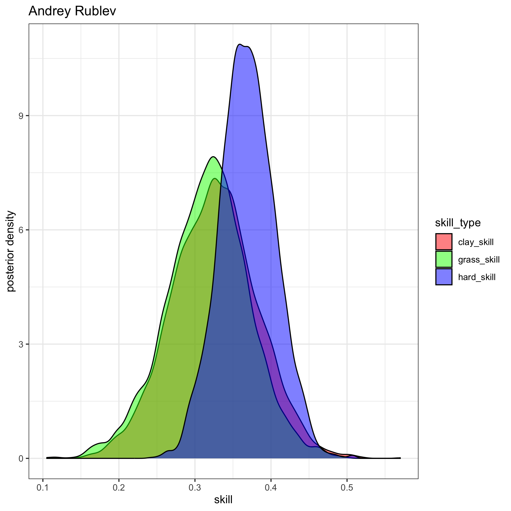

# Tennis Ratings
#### Author: [Jake Singleton](https://twitter.com/jakesingi)

## Version 2: February 2023 ATP Men's Singles Ratings and Rankings
* These are now "Version 2" since last month's  Version 1 had a bug that is now fixed.
* The ratings below are the work of my master's thesis and are based on a fully-[Bayesian](https://en.wikipedia.org/wiki/Bayesian_statistics) [Bradley-Terry model](https://en.wikipedia.org/wiki/Bradley%E2%80%93Terry_model). They are similar to [Elo ratings](https://en.wikipedia.org/wiki/Elo_rating_system), but I'd argue they resemble [Glicko ratings](https://en.wikipedia.org/wiki/Glicko_rating_system) even more closely. I show in my work that these ratings outperform Glicko (more to come on this later). 
* The ratings are derived from matches played in the last 3 years, though only players with 5 or more ATP-level matches played in the last 365 days are listed.
* **Interpretation**: There are 3 "skill" columns, one for each surface. Unfortunately they are not sortable at the moment, but as a first step, I've sorted the table by "hard_skill" (players' skills on hard court), as this is the most popular surface.

### Updated through the end of the 2023 Australian Open. Updated monthly.

| rank | full_name                   | hard_skill  | clay_skill  | grass_skill |
| ---- | --------------------------- | ----------- | ----------- | ----------- |
| 1    | Novak Djokovic              | 0.64186304  | 0.61921708  | 0.58034321  |
| 2    | Daniil Medvedev             | 0.52623424  | 0.30187864  | 0.44400548  |
| 3    | Rafael Nadal                | 0.48577934  | 0.67862031  | 0.438439    |
| 4    | Alexander Zverev            | 0.43616068  | 0.41596023  | 0.38406708  |
| 5    | Stefanos Tsitsipas          | 0.38061937  | 0.52181158  | 0.3195897   |
| 6    | Andrey Rublev               | 0.36905092  | 0.32595114  | 0.31678044  |
| 7    | Carlos Alcaraz              | 0.36356503  | 0.36963128  | 0.30881337  |
| 8    | Jannik Sinner               | 0.33851449  | 0.37101731  | 0.30040331  |
| 9    | Nick Kyrgios                | 0.33541609  | 0.22826276  | 0.30905224  |
| 10   | Matteo Berrettini           | 0.31280864  | 0.32829575  | 0.31438399  |
| 11   | Gael Monfils                | 0.29937973  | 0.04976194  | 0.23332983  |
| 12   | Jack Draper                 | 0.29670817  | 0.25365982  | 0.25775718  |
| 13   | Casper Ruud                 | 0.2943565   | 0.36285261  | 0.24781983  |
| 14   | Felix Auger Aliassime       | 0.28057134  | 0.21073216  | 0.25438847  |
| 15   | Cameron Norrie              | 0.27903355  | 0.22274191  | 0.26295948  |
| 16   | Roberto Bautista Agut       | 0.27888904  | 0.26236562  | 0.25145198  |
| 17   | Taylor Fritz                | 0.27815396  | 0.06179594  | 0.2560982   |
| 18   | Hubert Hurkacz              | 0.27582738  | 0.15710366  | 0.2557532   |
| 19   | Sebastian Korda             | 0.27430463  | 0.21382861  | 0.24158382  |
| 20   | Dominic Thiem               | 0.26723663  | 0.13993965  | 0.23096819  |
| 21   | Holger Rune                 | 0.25533287  | 0.17152196  | 0.20522304  |
| 22   | Pablo Carreno Busta         | 0.24355054  | 0.30255057  | 0.20781573  |
| 23   | Denis Shapovalov            | 0.23874029  | 0.20336657  | 0.21582464  |
| 24   | Karen Khachanov             | 0.23812798  | 0.11391033  | 0.20666837  |
| 25   | Grigor Dimitrov             | 0.23759522  | 0.27443474  | 0.20850456  |
| 26   | Alex De Minaur              | 0.2287751   | 0.12273718  | 0.2094426   |
| 27   | Jenson Brooksby             | 0.22618825  | 0.01821421  | 0.18173401  |
| 28   | Borna Coric                 | 0.21942     | 0.04791039  | 0.18749779  |
| 29   | Ilya Ivashka                | 0.21671398  | 0.15630726  | 0.18932143  |
| 30   | Tommy Paul                  | 0.19998389  | 0.05598989  | 0.18787939  |
| 31   | Marin Cilic                 | 0.19093602  | 0.23834852  | 0.18271165  |
| 32   | Frances Tiafoe              | 0.18349098  | 0.07106334  | 0.1581262   |
| 33   | Diego Schwartzman           | 0.17472903  | 0.27330713  | 0.15538531  |
| 34   | Daniel Evans                | 0.16321317  | 0.07964681  | 0.13664505  |
| 35   | Maxime Cressy               | 0.16151238  | \-0.0009251 | 0.15721431  |
| 36   | Brandon Nakashima           | 0.15817962  | 0.07369449  | 0.14786517  |
| 37   | Alexander Ritschard         | 0.15702558  | 0.09213288  | 0.14279964  |
| 38   | Dominic Stricker            | 0.1562518   | 0.12655476  | 0.13473831  |
| 39   | Aslan Karatsev              | 0.15577613  | 0.08532953  | 0.1213824   |
| 40   | Roman Safiullin             | 0.15496063  | 0.1954838   | 0.13959556  |
| 41   | Botic Van De Zandschulp     | 0.15271674  | 0.20885158  | 0.14396602  |
| 42   | Antoine Bellier             | 0.14752404  | 0.10647759  | 0.13629584  |
| 43   | Reilly Opelka               | 0.14530309  | 0.11023943  | 0.10604086  |
| 44   | Thanasi Kokkinakis          | 0.14501871  | 0.10267283  | 0.12803387  |
| 45   | Stan Wawrinka               | 0.14433464  | 0.09357142  | 0.1191798   |
| 46   | Benjamin Bonzi              | 0.1437959   | 0.02956935  | 0.13647045  |
| 47   | Lorenzo Sonego              | 0.14115922  | 0.1129515   | 0.13315458  |
| 48   | Emil Ruusuvuori             | 0.13709381  | \-0.0198637 | 0.11068243  |
| 49   | Lloyd Harris                | 0.1360947   | \-0.0205117 | 0.10866202  |
| 50   | Vasek Pospisil              | 0.13584672  | 0.03236529  | 0.10585666  |
| 51   | Andy Murray                 | 0.13329305  | 0.10489799  | 0.13833688  |
| 52   | Mikael Ymer                 | 0.13123237  | 0.02467807  | 0.10319851  |
| 53   | Juan Pablo Varillas         | 0.13063036  | 0.14071356  | 0.11601545  |
| 54   | Yosuke Watanuki             | 0.13018212  | 0.16554446  | 0.12339777  |
| 55   | Ugo Humbert                 | 0.12512652  | \-0.0063184 | 0.1114387   |
| 56   | Brandon Holt                | 0.12508024  | 0.08452749  | 0.10872836  |
| 57   | Alexander Bublik            | 0.12177859  | \-0.0006891 | 0.13570048  |
| 58   | Jiri Lehecka                | 0.12047395  | 0.0568049   | 0.1007449   |
| 59   | J J Wolf                    | 0.11932482  | 0.03831796  | 0.10211031  |
| 60   | Gijs Brouwer                | 0.11844465  | 0.16046871  | 0.10646116  |
| 61   | Tomas Machac                | 0.11822993  | 0.14393254  | 0.10659421  |
| 62   | Ben Shelton                 | 0.11352023  | 0.07880962  | 0.09923106  |
| 63   | John Isner                  | 0.10863505  | 0.14069031  | 0.09386511  |
| 64   | Arthur Rinderknech          | 0.10835845  | 0.10662036  | 0.08379286  |
| 65   | Mackenzie Mcdonald          | 0.10747392  | 0.03257674  | 0.08032757  |
| 66   | Adrian Mannarino            | 0.10125781  | \-0.2270438 | 0.06463215  |
| 67   | Constant Lestienne          | 0.09959608  | 0.06940141  | 0.08815521  |
| 68   | Marton Fucsovics            | 0.09769594  | 0.13868269  | 0.09405527  |
| 69   | Tim Van Rijthoven           | 0.09762644  | 0.07621604  | 0.11054748  |
| 70   | Filip Krajinovic            | 0.0974001   | 0.15648762  | 0.08435766  |
| 71   | Jason Kubler                | 0.09635115  | 0.06798509  | 0.10029739  |
| 72   | Pierre Hugues Herbert       | 0.08989522  | 0.09719046  | 0.07622261  |
| 73   | Marc Andrea Huesler         | 0.08932678  | 0.06927532  | 0.073951    |
| 74   | Richard Gasquet             | 0.08896347  | 0.04652746  | 0.0733794   |
| 75   | Franco Agamenone            | 0.08777265  | 0.12434042  | 0.0786493   |
| 76   | Alejandro Davidovich Fokina | 0.08735066  | 0.14352118  | 0.0775473   |
| 77   | Lorenzo Musetti             | 0.08673008  | 0.19235602  | 0.06605552  |
| 78   | Francisco Cerundolo         | 0.08401621  | 0.1158474   | 0.07798396  |
| 79   | Soon Woo Kwon               | 0.07991619  | \-0.0084463 | 0.06277829  |
| 80   | David Goffin                | 0.07893864  | 0.12984841  | 0.09406683  |
| 81   | Miomir Kecmanovic           | 0.07529874  | 0.09413565  | 0.05956883  |
| 82   | Borna Gojo                  | 0.07525304  | 0.02659795  | 0.06434762  |
| 83   | Corentin Moutet             | 0.07126647  | \-0.0213568 | 0.05014097  |
| 84   | Christopher Eubanks         | 0.06841121  | 0.04787887  | 0.06278742  |
| 85   | Jurij Rodionov              | 0.06613403  | 0.09499515  | 0.05472225  |
| 86   | Kyle Edmund                 | 0.06547356  | 0.02620824  | 0.05519712  |
| 87   | Jan Lennard Struff          | 0.06440431  | 0.07614289  | 0.06256937  |
| 88   | Quentin Halys               | 0.06059524  | 0.07754032  | 0.0577861   |
| 89   | Jack Sock                   | 0.06015504  | 0.03915344  | 0.06268394  |
| 90   | Kamil Majchrzak             | 0.05685951  | \-0.0372368 | 0.04683251  |
| 91   | Jiri Vesely                 | 0.05664951  | \-0.0478898 | 0.0556909   |
| 92   | Ryan Peniston               | 0.05428626  | 0.04147543  | 0.05551536  |
| 93   | Zhizhen Zhang               | 0.04485382  | 0.08545722  | 0.03505772  |
| 94   | Hugo Grenier                | 0.04237091  | 0.00746512  | 0.02925425  |
| 95   | Nuno Borges                 | 0.04139697  | 0.07343514  | 0.03569156  |
| 96   | Elias Ymer                  | 0.03880938  | 0.05912679  | 0.03150202  |
| 97   | Aljaz Bedene                | 0.03695406  | \-0.0483083 | 0.03812287  |
| 98   | Oscar Otte                  | 0.03622133  | 0.11008765  | 0.04915661  |
| 99   | Vit Kopriva                 | 0.03452479  | 0.05596317  | 0.03142868  |
| 100  | Ricardas Berankis           | 0.03315693  | \-0.05338   | 0.02704812  |
| 101  | Gilles Simon                | 0.03132488  | \-0.1545368 | 0.01262351  |
| 102  | Aleksandar Vukic            | 0.0312756   | \-0.0003626 | 0.028766    |
| 103  | Marcos Giron                | 0.03052575  | \-0.1309193 | 0.02259342  |
| 104  | Steve Johnson               | 0.03007009  | \-0.0415389 | 0.03321854  |
| 105  | Alejandro Tabilo            | 0.02580607  | 0.13466771  | 0.01832747  |
| 106  | Liam Broady                 | 0.02541088  | 0.00656412  | 0.01695872  |
| 107  | Laslo Djere                 | 0.02460035  | 0.16651528  | 0.03370955  |
| 108  | Alexei Popyrin              | 0.02351501  | 0.00411739  | 0.01035695  |
| 109  | Tallon Griekspoor           | 0.02343512  | \-0.0213453 | 0.02194912  |
| 110  | Christopher Oconnell        | 0.01970733  | \-0.0485845 | 0.01273978  |
| 111  | Daniel Elahi Galan          | 0.0183306   | 0.08047249  | 0.01386684  |
| 112  | Maximilian Marterer         | 0.0142905   | 0.03074451  | 0.01487926  |
| 113  | Zizou Bergs                 | 0.01390585  | \-0.0010064 | 0.01368783  |
| 114  | John Millman                | 0.01364515  | \-0.0893962 | 0.00145532  |
| 115  | Luca Nardi                  | 0.01184759  | \-0.0233029 | 0.00844312  |
| 116  | Altug Celikbilek            | 0.00963728  | \-0.0126287 | 0.00167487  |
| 117  | James Duckworth             | 0.00899113  | \-0.1220646 | 0.01154713  |
| 118  | Jordan Thompson             | 0.00794636  | \-0.1788132 | 0.01585787  |
| 119  | Fabio Fognini               | 0.00675794  | 0.02685204  | 0.00778344  |
| 120  | Yoshihito Nishioka          | 0.00354883  | \-0.0664975 | \-0.024908  |
| 121  | Egor Gerasimov              | 0.0033016   | \-0.0673691 | \-0.0066502 |
| 122  | Hugo Gaston                 | 0.00108605  | 0.04903204  | 0.00990798  |
| 123  | Filip Misolic               | \-0.0006839 | 0.05415082  | 0.00087295  |
| 124  | Giulio Zeppieri             | \-0.0007799 | 0.06106545  | 0.00103079  |
| 125  | Nicolas Jarry               | \-0.0034395 | 0.01017024  | \-0.0017558 |
| 126  | Manuel Guinard              | \-0.0050593 | \-0.0309879 | \-0.005472  |
| 127  | Pedro Cachin                | \-0.0053143 | 0.05613054  | \-0.0025037 |
| 128  | Denis Kudla                 | \-0.0072616 | \-0.0604298 | 0.01433305  |
| 129  | Cristian Garin              | \-0.0140195 | 0.15071703  | 0.01381893  |
| 130  | Alex Molcan                 | \-0.0165265 | 0.21065067  | 0.00717528  |
| 131  | Gregoire Barrere            | \-0.0165438 | \-0.1013089 | \-0.0232642 |
| 132  | Pablo Cuevas                | \-0.0171368 | 0.06070948  | \-0.0154622 |
| 133  | Carlos Taberner             | \-0.0179322 | \-0.0067511 | \-0.0176226 |
| 134  | Dominik Koepfer             | \-0.0226003 | 0.00074072  | \-0.0240104 |
| 135  | Facundo Bagnis              | \-0.0280477 | 0.03161343  | \-0.0272392 |
| 136  | Thiago Monteiro             | \-0.0300149 | 0.04956747  | \-0.0302871 |
| 137  | Radu Albot                  | \-0.0313414 | \-0.1373159 | \-0.0438662 |
| 138  | Taro Daniel                 | \-0.0371318 | \-0.0113083 | \-0.0380821 |
| 139  | Dusan Lajovic               | \-0.0380559 | 0.01052092  | \-0.0437559 |
| 140  | Pedro Martinez              | \-0.0401662 | 0.10105803  | \-0.0328443 |
| 141  | Rinky Hijikata              | \-0.0424801 | \-0.0301271 | \-0.0369502 |
| 142  | Max Purcell                 | \-0.0452574 | \-0.0407848 | \-0.03423   |
| 143  | Stefano Travaglia           | \-0.0496138 | \-0.0462458 | \-0.0432293 |
| 144  | Nikoloz Basilashvili        | \-0.0507206 | \-0.1086679 | \-0.0403697 |
| 145  | Andreas Seppi               | \-0.0507687 | \-0.0483417 | \-0.0354672 |
| 146  | Stefan Kozlov               | \-0.0516319 | \-0.0391729 | \-0.0554112 |
| 147  | Albert Ramos                | \-0.0518646 | 0.09245627  | \-0.0504869 |
| 148  | Jaume Munar                 | \-0.0571923 | 0.08529385  | \-0.0476049 |
| 149  | Flavio Cobolli              | \-0.0575553 | \-0.0268788 | \-0.0503564 |
| 150  | Yannick Hanfmann            | \-0.0583248 | 0.10033097  | \-0.0525574 |
| 151  | Lucas Pouille               | \-0.0599644 | \-0.1502516 | \-0.0525981 |
| 152  | Pablo Andujar               | \-0.0622122 | \-0.0399935 | \-0.0557535 |
| 153  | Norbert Gombos              | \-0.0639661 | \-0.0393924 | \-0.0686169 |
| 154  | Ramkumar Ramanathan         | \-0.0697015 | \-0.0460697 | \-0.0551953 |
| 155  | Roberto Carballes Baena     | \-0.072841  | 0.03591926  | \-0.0760131 |
| 156  | Jo-Wilfried Tsonga          | \-0.0730637 | \-0.137756  | \-0.0707976 |
| 157  | Mitchell Krueger            | \-0.0800041 | \-0.0632836 | \-0.0727652 |
| 158  | Juan Manuel Cerundolo       | \-0.0820049 | \-0.0087609 | \-0.0697706 |
| 159  | Peter Gojowczyk             | \-0.0854948 | \-0.1220872 | \-0.0716304 |
| 160  | Sam Querrey                 | \-0.0858564 | \-0.079263  | \-0.0466581 |
| 161  | Michael Mmoh                | \-0.0865015 | \-0.0851822 | \-0.0772667 |
| 162  | Emilio Gomez                | \-0.0935477 | \-0.0559027 | \-0.081403  |
| 163  | Pavel Kotov                 | \-0.0937229 | \-0.0495752 | \-0.0815619 |
| 164  | Feliciano Lopez             | \-0.1072975 | \-0.161207  | \-0.0993194 |
| 165  | Dennis Novak                | \-0.1133643 | \-0.1835008 | \-0.1042791 |
| 166  | Juan Ignacio Londero        | \-0.120894  | \-0.0987468 | \-0.1116479 |
| 167  | Sebastian Baez              | \-0.1215035 | 0.19446437  | \-0.0925263 |
| 168  | Fernando Verdasco           | \-0.1240541 | \-0.0976478 | \-0.1133354 |
| 169  | Daniel Altmaier             | \-0.1330269 | 0.00434857  | \-0.1175014 |
| 170  | Joao Sousa                  | \-0.1419552 | \-0.1634616 | \-0.1389179 |
| 171  | Benoit Paire                | \-0.143373  | \-0.1636009 | \-0.1478864 |
| 172  | Henri Laaksonen             | \-0.1494867 | \-0.0008718 | \-0.1318361 |
| 173  | Cem Ilkel                   | \-0.1513927 | \-0.2073547 | \-0.137027  |
| 174  | Tomas Martin Etcheverry     | \-0.1542126 | \-0.1959208 | \-0.1345887 |
| 175  | Bernabe Zapata Miralles     | \-0.1616054 | \-0.0112941 | \-0.1500591 |
| 176  | Emilio Nava                 | \-0.1665307 | \-0.1160272 | \-0.1458216 |
| 177  | Damir Dzumhur               | \-0.1686434 | \-0.0753752 | \-0.1463257 |
| 178  | Mikhail Kukushkin           | \-0.1717553 | \-0.1725377 | \-0.1677146 |
| 179  | Marco Cecchinato            | \-0.1758584 | 0.00967716  | \-0.1571771 |
| 180  | Federico Coria              | \-0.2085087 | 0.02949659  | \-0.1791839 |
| 181  | Chun Hsin Tseng             | \-0.2388963 | \-0.1994061 | \-0.2180188 |
| 182  | Federico Delbonis           | \-0.2420892 | 0.06063095  | \-0.207777  |
| 183  | Hugo Dellien                | \-0.2461223 | \-0.1432392 | \-0.2172971 |

## Images
* For brevity, here are visuals of the posterior distributions for each of the top 10 players listed
* If you want to see plots for other players, I've uploaded them all [here](https://drive.google.com/drive/folders/1FPIqMj5Dm8t5D6z58C4bLfM7g8dWGFbl?usp=sharing).
* **Interpretation**: Higher values of skill are good. The tighter the colorful blobs (aka distributions) are, the more confident we are about that player's skill on that particular surface. Note the blue blobs will tend to be tighter, since more matches are played on hard courts than clay and grass. 
* For example, we know Nadal is incredibly dominant on clay, and you can see his red blob is quite far to the right, reaffirming our belief he is uniquely good on clay courts.

 

## Future additions
* Add master's paper with mathematical details and performance of ratings
* Add women's ratings and rankings later, and potentially doubles
* Move the site away from markdown and toward something cleaner and more aesthetically-pleasing
* Consider basing ratings only on past year's worth of play
