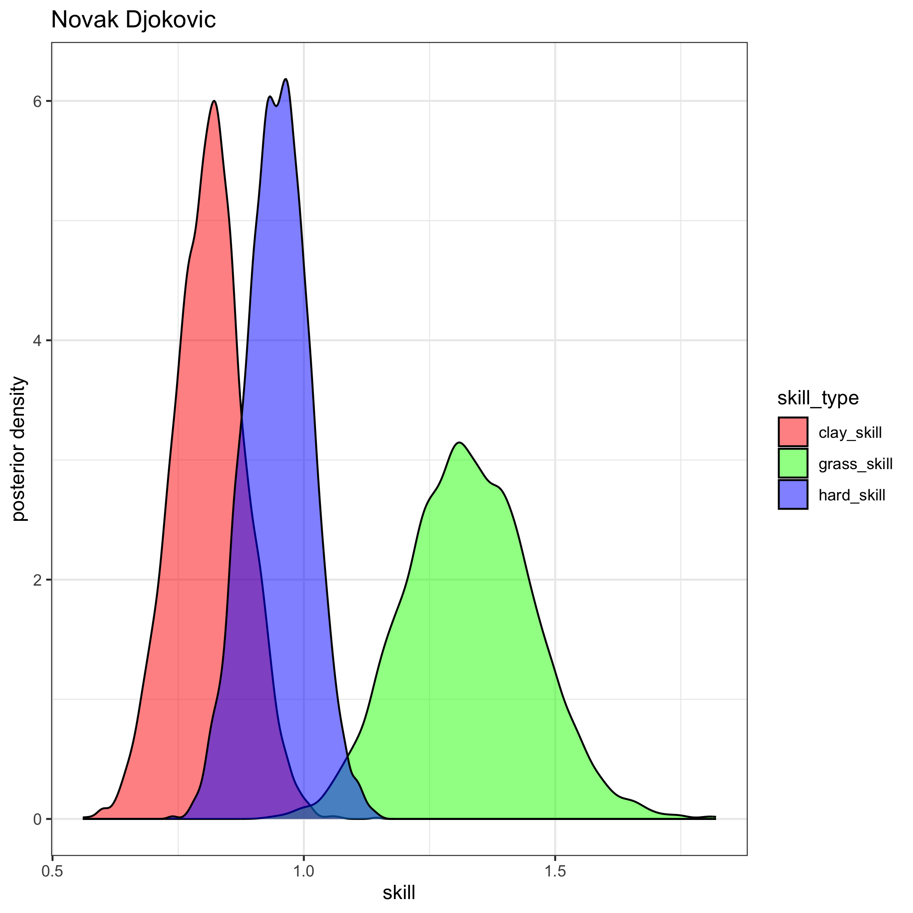
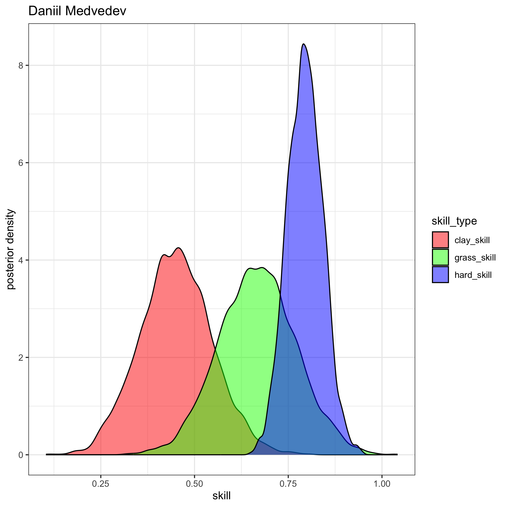
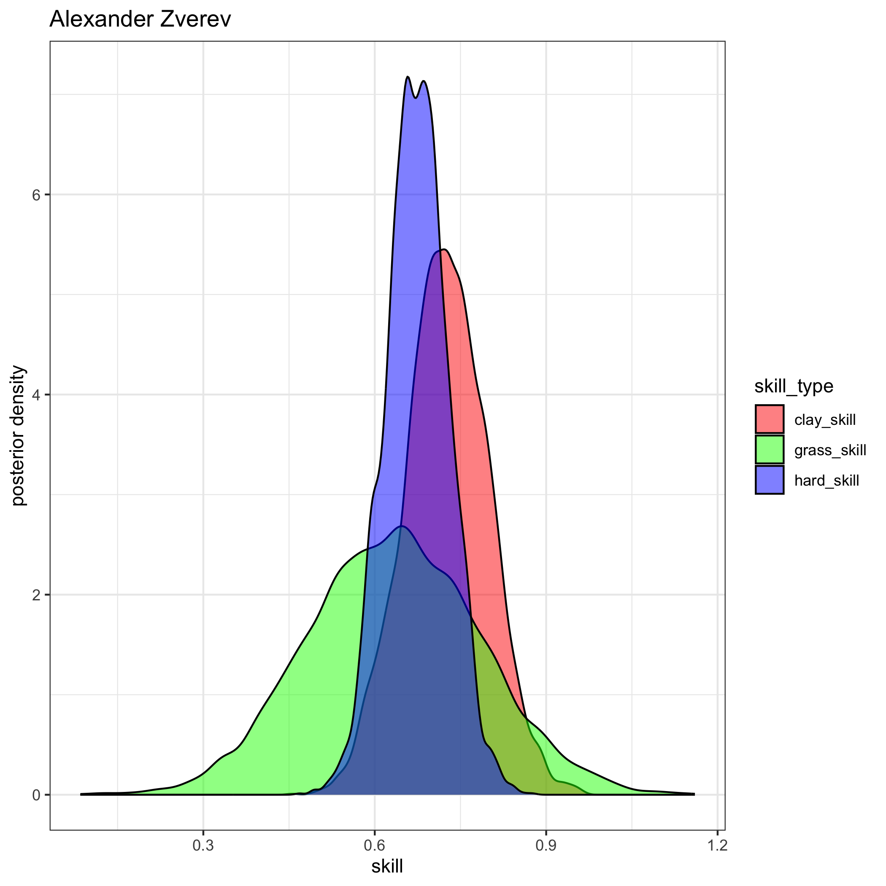
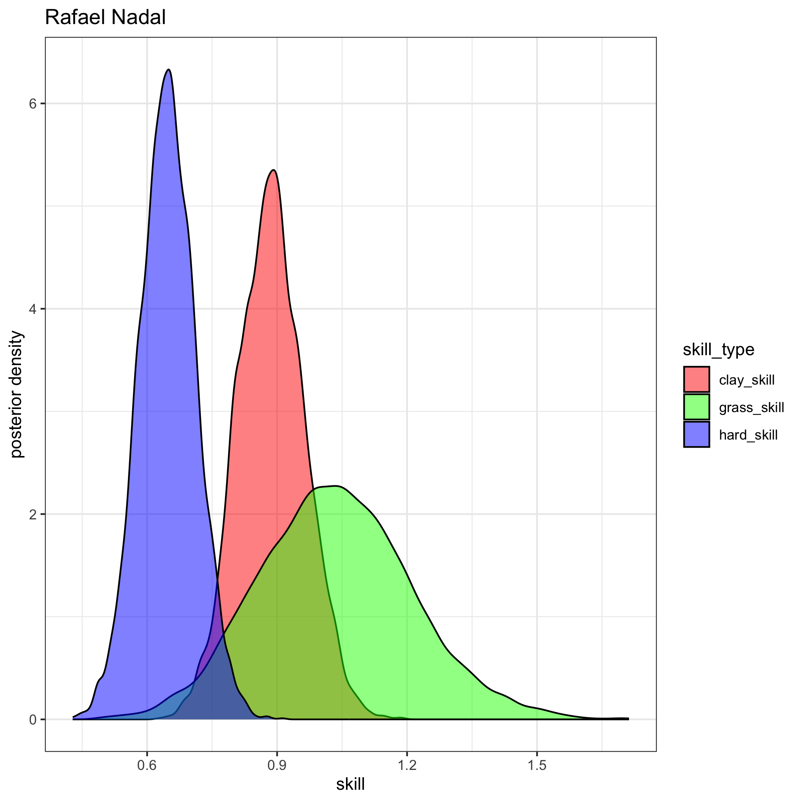
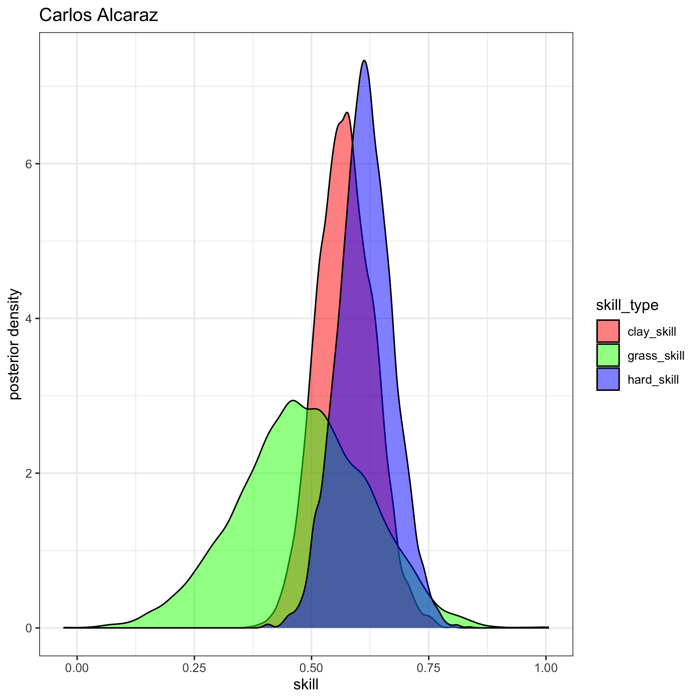
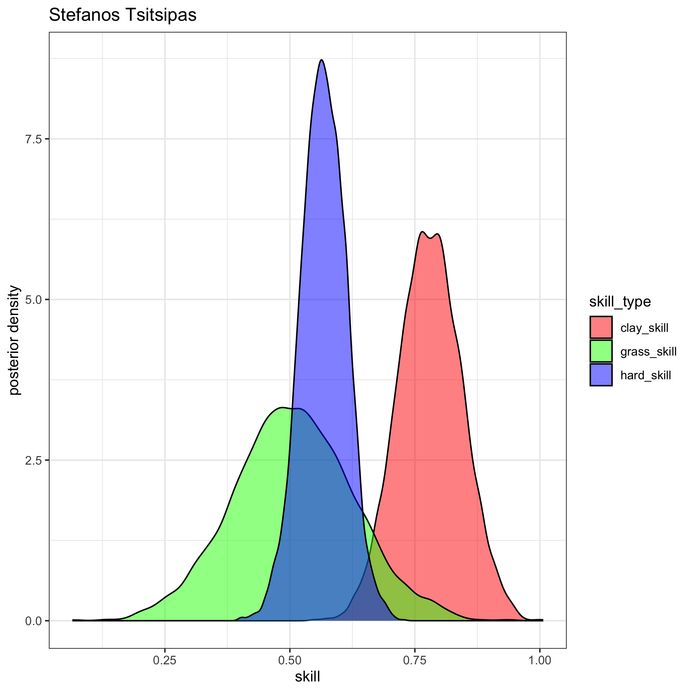
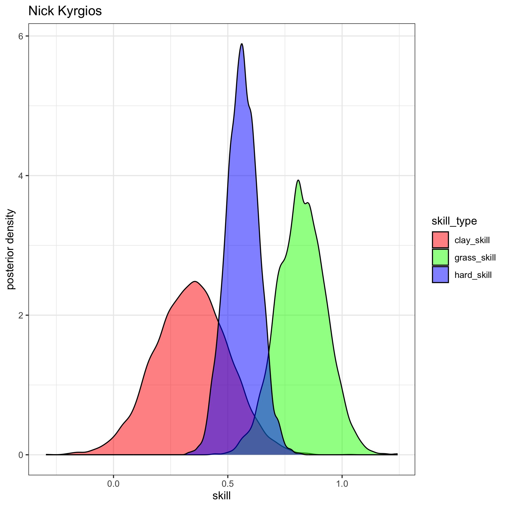
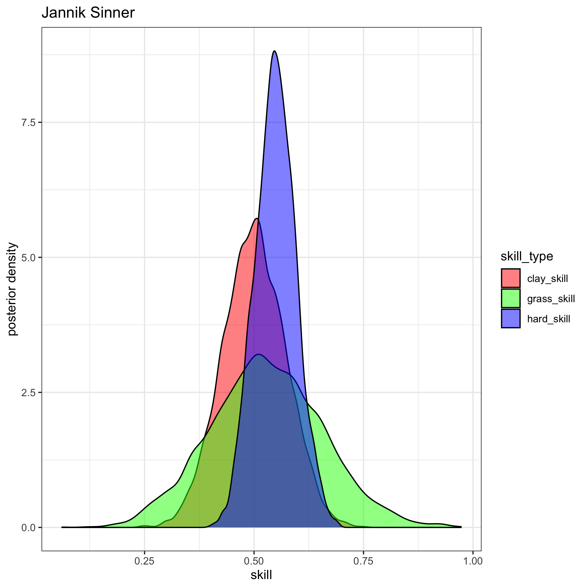
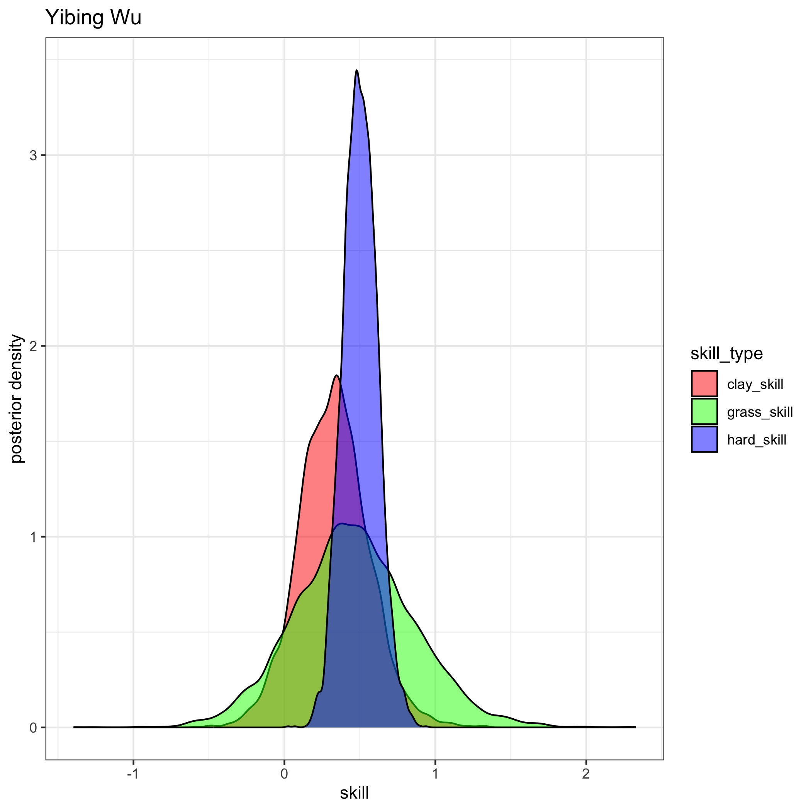
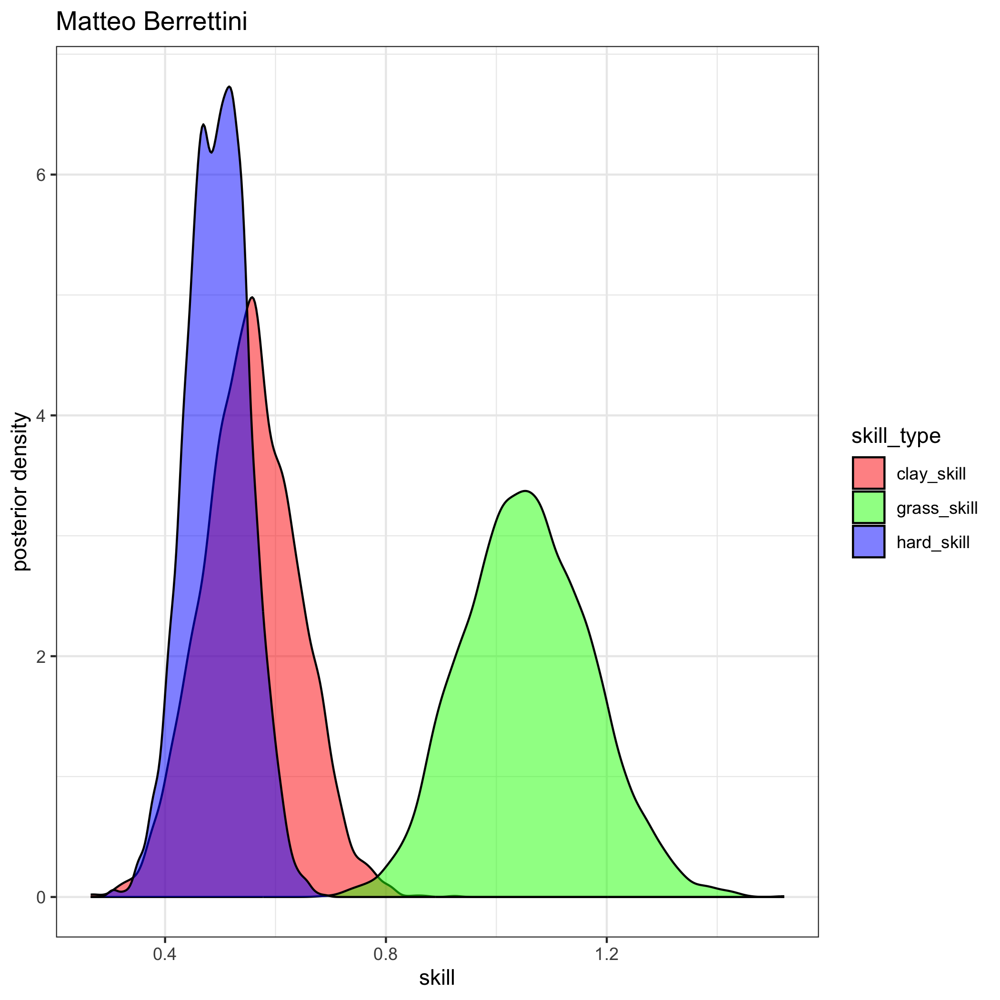

# Tennis Ratings
#### Author: [Jake Singleton](https://twitter.com/jakesingi)

## Version 2: June 2023 ATP Men's Singles Ratings and Rankings
* The ratings below are based on a fully-[Bayesian](https://en.wikipedia.org/wiki/Bayesian_statistics) [Bradley-Terry model](https://en.wikipedia.org/wiki/Bradley%E2%80%93Terry_model). They are similar to [Elo ratings](https://en.wikipedia.org/wiki/Elo_rating_system), but I'd argue they resemble [Glicko ratings](https://en.wikipedia.org/wiki/Glicko_rating_system) even more closely. I show in my work that these ratings outperform Glicko (more to come on this later). 
* The ratings are derived from matches played in the last 2 years, though only players with 5 or more ATP-level matches played in the last 365 days are listed.
* **Interpretation**: There are 3 "skill" columns, one for each surface. Unfortunately they are not sortable at the moment, but as a first step, I've sorted the table by "hard_skill" (players' skills on hard court), as this is the most popular surface.

### Updated through the end of Queen's and Halle 2023, i.e. before Wimbledon. Updated monthly.

|player_id|rank|full_name                  |hard_skill  |clay_skill  |grass_skill |
|---------|----|---------------------------|------------|------------|------------|
|104925   |1   |Novak Djokovic             |0.652651849 |0.484748561 |0.568185846 |
|106421   |2   |Daniil Medvedev            |0.52752987  |0.330476805 |0.420562093 |
|207989   |3   |Carlos Alcaraz             |0.425008177 |0.470637302 |0.333999256 |
|104745   |4   |Rafael Nadal               |0.42105294  |0.489636808 |0.346133399 |
|100644   |5   |Alexander Zverev           |0.396716974 |0.323155031 |0.339926756 |
|206173   |6   |Jannik Sinner              |0.372069344 |0.347701621 |0.307299566 |
|106401   |7   |Nick Kyrgios               |0.33343311  |0.193007849 |0.291274621 |
|207733   |8   |Jack Draper                |0.317106438 |0.275591017 |0.254006918 |
|126774   |9   |Stefanos Tsitsipas         |0.315467029 |0.360631518 |0.226596177 |
|111815   |10  |Cameron Norrie             |0.288759543 |0.208068733 |0.247700211 |
|126094   |11  |Andrey Rublev              |0.285659055 |0.285315501 |0.231254753 |
|134770   |12  |Casper Ruud                |0.285089807 |0.342387398 |0.210714695 |
|126203   |13  |Taylor Fritz               |0.272868244 |0.17803119  |0.235426253 |
|126610   |14  |Matteo Berrettini          |0.264033831 |0.215384284 |0.247304583 |
|200000   |15  |Felix Auger Aliassime      |0.257426855 |0.183393169 |0.217397392 |
|128034   |16  |Hubert Hurkacz             |0.252921075 |0.164838709 |0.227714923 |
|200624   |17  |Sebastian Korda            |0.249672229 |0.149705406 |0.220373202 |
|105227   |18  |Marin Cilic                |0.2391624   |0.28399182  |0.188793309 |
|104792   |19  |Gael Monfils               |0.238967544 |0.134459324 |0.190711606 |
|208029   |20  |Holger Rune                |0.233382833 |0.225119248 |0.176709854 |
|105138   |21  |Roberto Bautista Agut      |0.229412099 |0.147379095 |0.203660657 |
|200282   |22  |Alex De Minaur             |0.226962633 |0.14012278  |0.207966272 |
|111575   |23  |Karen Khachanov            |0.224548761 |0.151993051 |0.189584674 |
|105777   |24  |Grigor Dimitrov            |0.214582121 |0.221342818 |0.176822133 |
|105807   |25  |Pablo Carreno Busta        |0.214246579 |0.194175325 |0.167965005 |
|126205   |26  |Tommy Paul                 |0.195567547 |-0.019568192|0.187790296 |
|106220   |27  |Dimitar Kuzmanov           |0.192787236 |0.178784591 |0.157647958 |
|202385   |28  |Jenson Brooksby            |0.188408131 |0.00498333  |0.15977993  |
|125802   |29  |Ilya Ivashka               |0.18306065  |-0.025056304|0.171974573 |
|126207   |30  |Frances Tiafoe             |0.178892085 |0.114460785 |0.153119809 |
|133430   |31  |Denis Shapovalov           |0.166876637 |0.063087311 |0.150816285 |
|104918   |32  |Andy Murray                |0.138906956 |0.062237702 |0.128641935 |
|209950   |33  |Arthur Fils                |0.135749406 |0.085541331 |0.111789568 |
|200325   |34  |Emil Ruusuvuori            |0.135277597 |0.060422078 |0.114715369 |
|202195   |35  |Maxime Cressy              |0.128887905 |-0.111234665|0.141397285 |
|122298   |36  |Botic Van De Zandschulp    |0.124738883 |0.091766003 |0.10713613  |
|106310   |37  |Alexander Ritschard        |0.123145838 |0.069167529 |0.109202554 |
|132283   |38  |Lorenzo Sonego             |0.120525713 |0.093392693 |0.113778207 |
|144750   |39  |Lloyd Harris               |0.109738217 |-0.014772383|0.09090902  |
|207830   |40  |Tomas Machac               |0.106480788 |0.0587276   |0.090799872 |
|200670   |41  |J J Wolf                   |0.105325807 |0.075104424 |0.087157476 |
|106043   |42  |Diego Schwartzman          |0.104725414 |0.077633486 |0.088423327 |
|126127   |43  |Benjamin Bonzi             |0.102841373 |0.02536856  |0.096148505 |
|106432   |44  |Borna Coric                |0.101433708 |0.071403369 |0.079735803 |
|106423   |45  |Thanasi Kokkinakis         |0.100153577 |0.05892683  |0.087775867 |
|104527   |46  |Stan Wawrinka              |0.099114531 |0.03145318  |0.082192404 |
|144707   |47  |Mikael Ymer                |0.098007869 |0.040364844 |0.078044841 |
|111797   |48  |Nicolas Jarry              |0.097251792 |0.164451481 |0.077621203 |
|208103   |49  |Jiri Lehecka               |0.097081936 |0.047144543 |0.078383041 |
|208502   |50  |Dominic Stricker           |0.095602487 |0.004603217 |0.086794765 |
|206909   |51  |Brandon Nakashima          |0.093514658 |0.032275858 |0.091133052 |
|122330   |52  |Alexander Bublik           |0.09219738  |-0.086247169|0.137002001 |
|111460   |53  |Quentin Halys              |0.092126643 |0.124689618 |0.071229753 |
|133297   |54  |Yosuke Watanuki            |0.091826637 |0.09318573  |0.077319002 |
|111456   |55  |Mackenzie Mcdonald         |0.089746427 |-0.003386669|0.070139075 |
|126555   |56  |Tung Lin Wu                |0.089482008 |0.058369792 |0.076763644 |
|122669   |57  |Juan Pablo Varillas        |0.088403127 |0.09744726  |0.072078667 |
|105554   |58  |Daniel Evans               |0.085592838 |0.011800451 |0.072295811 |
|206681   |59  |Fabian Marozsan            |0.084229397 |0.14289396  |0.062197916 |
|105916   |60  |Marton Fucsovics           |0.080845526 |0.060200034 |0.080966192 |
|202103   |61  |Francisco Cerundolo        |0.071523608 |0.176642196 |0.047619161 |
|126128   |62  |Roman Safiullin            |0.069994424 |0.091891194 |0.051622703 |
|200221   |63  |Alejandro Davidovich Fokina|0.066549261 |0.151452256 |0.041652439 |
|126952   |64  |Soon Woo Kwon              |0.066042114 |0.01446647  |0.055670157 |
|106331   |65  |Christopher Oconnell       |0.065340375 |-0.009074706|0.062951239 |
|200175   |66  |Miomir Kecmanovic          |0.063771904 |0.159697988 |0.032394379 |
|200059   |67  |Yibing Wu                  |0.06294268  |-0.0295704  |0.059369995 |
|105526   |68  |Jan Lennard Struff         |0.062671891 |0.119298516 |0.060834413 |
|106058   |69  |Jack Sock                  |0.062016203 |-0.00306901 |0.062155774 |
|104545   |70  |John Isner                 |0.061075322 |0.041812976 |0.049248432 |
|111794   |71  |Kamil Majchrzak            |0.058744374 |0.038793403 |0.048736023 |
|207518   |72  |Lorenzo Musetti            |0.057978861 |0.203631622 |0.027697608 |
|105173   |73  |Adrian Mannarino           |0.055835802 |-0.088065686|0.058047411 |
|126239   |74  |Arthur Rinderknech         |0.055230409 |0.087938998 |0.035685505 |
|124186   |75  |Alexandre Muller           |0.054434868 |0.023880224 |0.047920265 |
|133835   |76  |Gijs Brouwer               |0.049865625 |0.079478389 |0.033916236 |
|126646   |77  |Tim Van Rijthoven          |0.047354551 |0.018926924 |0.059730934 |
|210097   |78  |Ben Shelton                |0.04608336  |-0.009964077|0.04408661  |
|106234   |79  |Aslan Karatsev             |0.042436234 |0.027744018 |0.030910585 |
|126214   |80  |Alejandro Tabilo           |0.039793209 |0.070647886 |0.024657985 |
|208286   |81  |Matteo Arnaldi             |0.038288771 |0.039349139 |0.030685975 |
|134868   |82  |Tallon Griekspoor          |0.037761579 |-0.024679859|0.049311701 |
|127339   |83  |Borna Gojo                 |0.036849286 |-0.010149032|0.033193681 |
|144895   |84  |Corentin Moutet            |0.035447403 |-0.055256622|0.027990039 |
|104755   |85  |Richard Gasquet            |0.034905775 |0.004012074 |0.031022254 |
|111153   |86  |Christopher Eubanks        |0.032819402 |0.022733863 |0.02767983  |
|200587   |87  |Brandon Holt               |0.031390091 |0.019955336 |0.026597487 |
|200005   |88  |Ugo Humbert                |0.029870454 |0.004314072 |0.017827748 |
|111581   |89  |Michael Mmoh               |0.029377083 |-0.009720485|0.026958414 |
|106186   |90  |Jason Kubler               |0.029057149 |-0.017165136|0.037487069 |
|144817   |91  |Marc Andrea Huesler        |0.027108113 |-0.049021811|0.030681561 |
|106218   |92  |Marcos Giron               |0.02675017  |0.010725987 |0.021102771 |
|106296   |93  |Gregoire Barrere           |0.026100992 |-0.010146585|0.020885295 |
|111200   |94  |Elias Ymer                 |0.025093109 |-0.013247817|0.021555606 |
|105575   |95  |Ricardas Berankis          |0.023414465 |-0.021565156|0.02017204  |
|105577   |96  |Vasek Pospisil             |0.022512093 |0.016092511 |0.015233106 |
|124116   |97  |Sebastian Ofner            |0.022357305 |0.040270251 |0.016383964 |
|106233   |98  |Dominic Thiem              |0.021643938 |-0.013055242|0.02025529  |
|106281   |99  |Liam Broady                |0.021114635 |-0.022402461|0.018320972 |
|104468   |100 |Gilles Simon               |0.018892941 |0.000326052 |0.017000633 |
|206499   |101 |Aleksandar Kovacevic       |0.017856042 |-0.001740627|0.016605518 |
|106426   |102 |Cristian Garin             |0.007579432 |0.020632012 |0.015989306 |
|105902   |103 |James Duckworth            |0.007466263 |-0.036836116|0.012405645 |
|206748   |104 |Giulio Zeppieri            |0.005348066 |0.043015253 |0.000273955 |
|105449   |105 |Steve Johnson              |0.00527929  |-0.012246011|0.011683731 |
|109739   |106 |Maximilian Marterer        |0.004967724 |0.015081964 |0.005464902 |
|105870   |107 |Yannick Hanfmann           |0.004495534 |0.104983379 |-0.014116039|
|200514   |108 |Jurij Rodionov             |0.004238642 |-0.028809791|0.004151935 |
|111513   |109 |Laslo Djere                |-0.001173655|0.099469642 |-0.004131156|
|209209   |110 |Filip Misolic              |-0.0013645  |0.034500424 |-0.004418814|
|207686   |111 |Alexander Shevchenko       |-0.001503564|0.012391236 |-0.002755878|
|106121   |112 |Taro Daniel                |-0.001537608|0.024733601 |-0.009450757|
|106005   |113 |Constant Lestienne         |-0.002585107|-0.011881222|-0.000469681|
|126846   |114 |Aleksandar Vukic           |-0.002993144|-0.019155279|-0.001306287|
|126409   |115 |Hugo Grenier               |-0.003013386|-0.059750624|-0.001498364|
|131934   |116 |Andrea Vavassori           |-0.003528153|0.013484296 |-0.005037993|
|105676   |117 |David Goffin               |-0.004269917|0.052035025 |0.007785892 |
|144684   |118 |Alex Molcan                |-0.009241507|0.072621332 |-0.007841329|
|105550   |119 |Guido Pella                |-0.011588777|-0.028400171|-0.012092896|
|200384   |120 |Hugo Gaston                |-0.012957767|-0.036231574|-0.005438554|
|106214   |121 |Oscar Otte                 |-0.013707498|0.022068696 |-0.008770626|
|105583   |122 |Dusan Lajovic              |-0.014459606|0.057328645 |-0.026490119|
|111442   |123 |Jordan Thompson            |-0.016242446|-0.088685237|0.005532214 |
|105357   |124 |John Millman               |-0.017736181|-0.098702178|-0.009339733|
|106415   |125 |Yoshihito Nishioka         |-0.019774237|-0.027670192|-0.03169102 |
|111190   |126 |Zhizhen Zhang              |-0.022585963|0.010068993 |-0.028811244|
|104926   |127 |Fabio Fognini              |-0.023556702|0.043881419 |-0.023428672|
|208014   |128 |Rinky Hijikata             |-0.024555463|-0.022427827|-0.011557323|
|207925   |129 |Flavio Cobolli             |-0.028219416|-0.003426096|-0.025090747|
|209414   |130 |Luca Van Assche            |-0.028365935|-0.004362377|-0.024663904|
|106398   |131 |Pedro Cachin               |-0.034466656|0.019232812 |-0.0329611  |
|144869   |132 |Tomas Martin Etcheverry    |-0.039857182|0.062009684 |-0.041548259|
|105936   |133 |Filip Krajinovic           |-0.039857723|0.024306776 |-0.036582416|
|123755   |134 |Daniel Elahi Galan         |-0.041610292|-0.061789358|-0.034254399|
|200267   |135 |Zizou Bergs                |-0.046112674|-0.040089667|-0.035107761|
|200615   |136 |Alexei Popyrin             |-0.048851757|-0.005190259|-0.046029889|
|105430   |137 |Radu Albot                 |-0.050117191|-0.094058445|-0.046120256|
|208134   |138 |Luca Nardi                 |-0.052752102|-0.116300467|-0.036931411|
|132686   |139 |Nuno Borges                |-0.056054721|-0.047411331|-0.047599846|
|208859   |140 |Francesco Passaro          |-0.060543539|-0.056419596|-0.050663584|
|104665   |141 |Pablo Andujar              |-0.063256461|-0.076590902|-0.052619368|
|105077   |142 |Albert Ramos               |-0.06490606 |0.032912122 |-0.070258625|
|126845   |143 |Max Purcell                |-0.065035785|-0.08914954 |-0.043892561|
|106045   |144 |Denis Kudla                |-0.0705997  |-0.108620982|-0.034507487|
|124079   |145 |Pedro Martinez             |-0.082357215|-0.002210263|-0.076406462|
|105932   |146 |Nikoloz Basilashvili       |-0.082662732|-0.132014669|-0.063620325|
|106329   |147 |Thiago Monteiro            |-0.083525223|0.004691371 |-0.08163521 |
|106000   |148 |Damir Dzumhur              |-0.087420924|0.002267217 |-0.080193285|
|144719   |149 |Jaume Munar                |-0.08941063 |0.004227673 |-0.082812199|
|105487   |150 |Facundo Bagnis             |-0.090899959|-0.075719103|-0.079088788|
|106148   |151 |Roberto Carballes Baena    |-0.099064102|-0.001154927|-0.104457277|
|105332   |152 |Benoit Paire               |-0.103852217|-0.093062212|-0.098620303|
|122548   |153 |Edan Leshem                |-0.10718243 |-0.067561061|-0.09070813 |
|106065   |154 |Marco Cecchinato           |-0.11062385 |-0.028311756|-0.104354615|
|200303   |155 |Pavel Kotov                |-0.111893508|-0.046743324|-0.096367463|
|105311   |156 |Joao Sousa                 |-0.112300527|-0.074806146|-0.106391561|
|105877   |157 |Emilio Gomez               |-0.112780674|-0.130544909|-0.090572431|
|127157   |158 |Daniel Altmaier            |-0.117063739|-0.01653337 |-0.111840115|
|106075   |159 |Jozef Kovalik              |-0.117906646|-0.087165484|-0.099348308|
|207678   |160 |Juan Manuel Cerundolo      |-0.122725842|-0.086513088|-0.102742517|
|105967   |161 |Henri Laaksonen            |-0.135698306|-0.063066127|-0.12041432 |
|106198   |162 |Hugo Dellien               |-0.137693163|-0.091322167|-0.119341311|
|105376   |163 |Peter Gojowczyk            |-0.143113567|-0.133514344|-0.118040001|
|111805   |164 |Seong Chan Hong            |-0.148261739|-0.097310711|-0.123863768|
|202104   |165 |Sebastian Baez             |-0.156525589|0.145202338 |-0.151679912|
|207182   |166 |Emilio Nava                |-0.161062556|-0.123957881|-0.135780661|
|126523   |167 |Bernabe Zapata Miralles    |-0.163836649|0.04633276  |-0.163415843|
|104269   |168 |Fernando Verdasco          |-0.17195201 |-0.0955513  |-0.149255459|
|106378   |169 |Kyle Edmund                |-0.177030399|-0.182894993|-0.144627974|
|103852   |170 |Feliciano Lopez            |-0.187824368|-0.184135736|-0.155362019|
|105948   |171 |Federico Coria             |-0.241092556|0.035766507 |-0.228286186|
|105643   |172 |Federico Delbonis          |-0.249298523|-0.063894732|-0.227731585|
|202358   |173 |Chun Hsin Tseng            |-0.282485084|-0.18293106 |-0.247433393|

## Images
* For brevity, here are visuals of the posterior distributions for each of the top 10 players listed
* **Interpretation**: Higher values of skill are good. The tighter the colorful blobs (aka distributions) are, the more confident we are about that player's skill on that particular surface. Note the blue blobs will tend to be tighter, since more matches are played on hard courts than clay and grass. 
* For example, we know Nadal is incredibly dominant on clay, and you can see his red blob is quite far to the right, reaffirming our belief he is uniquely good on clay courts.

 

## Future additions
* Add master's paper with mathematical details and performance of ratings
* Add women's ratings and rankings later, and potentially doubles
* Move the site away from markdown and toward something cleaner and more aesthetically-pleasing
