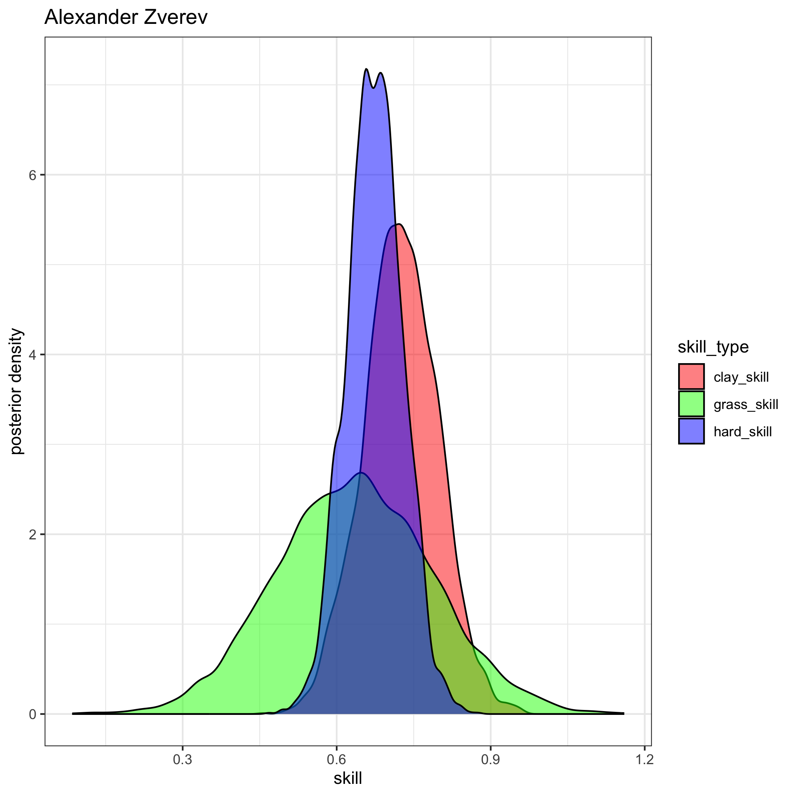
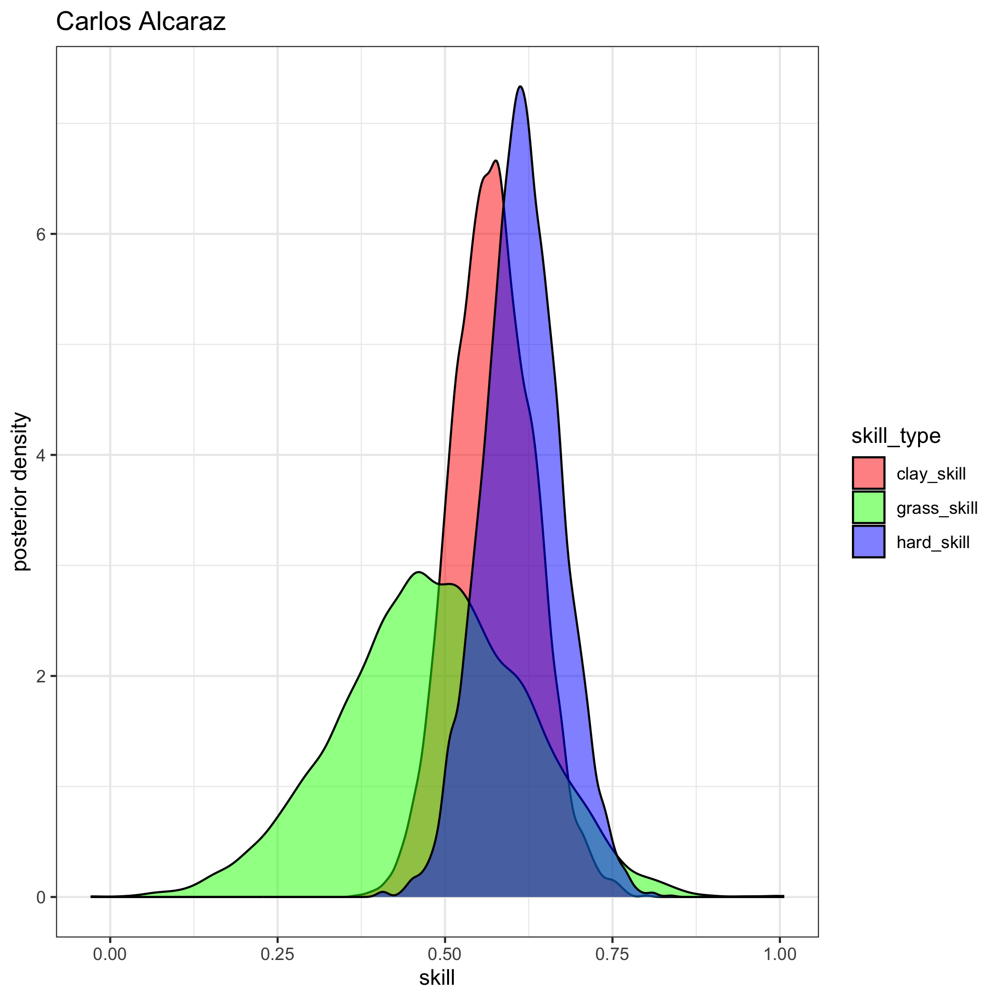
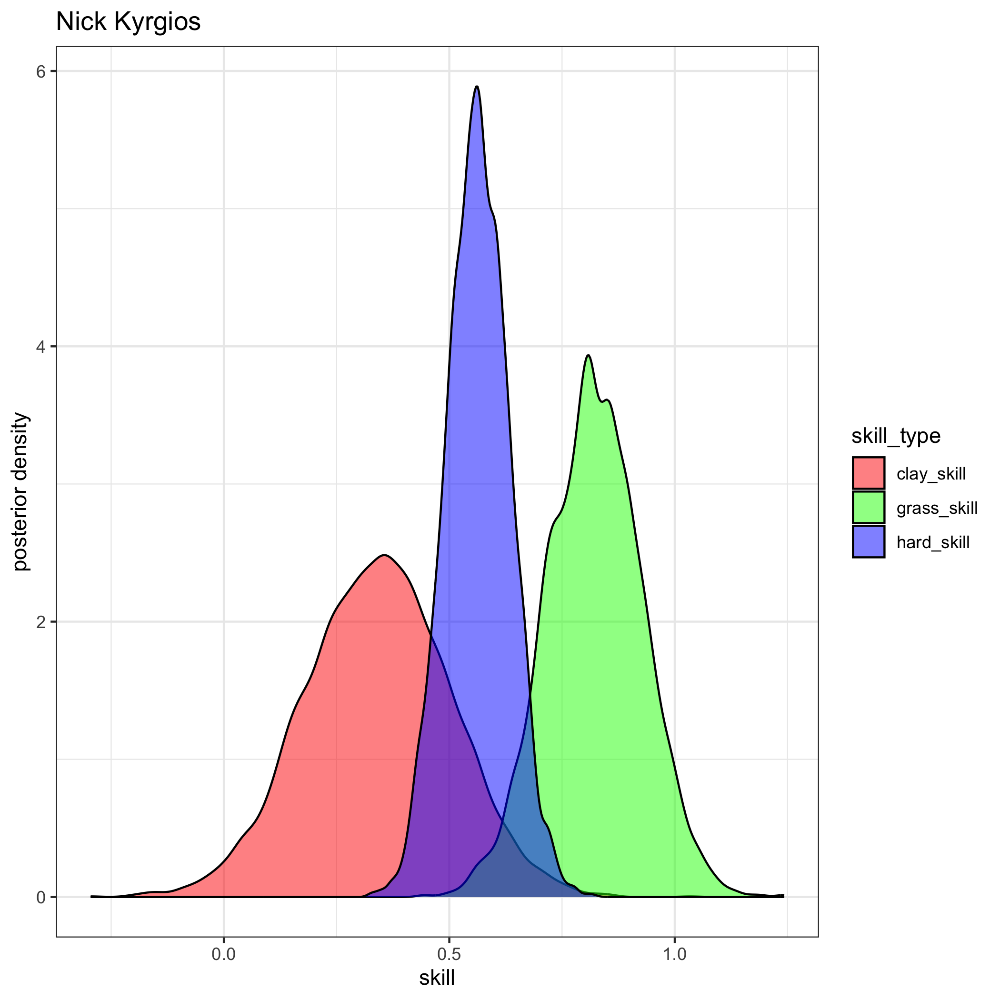
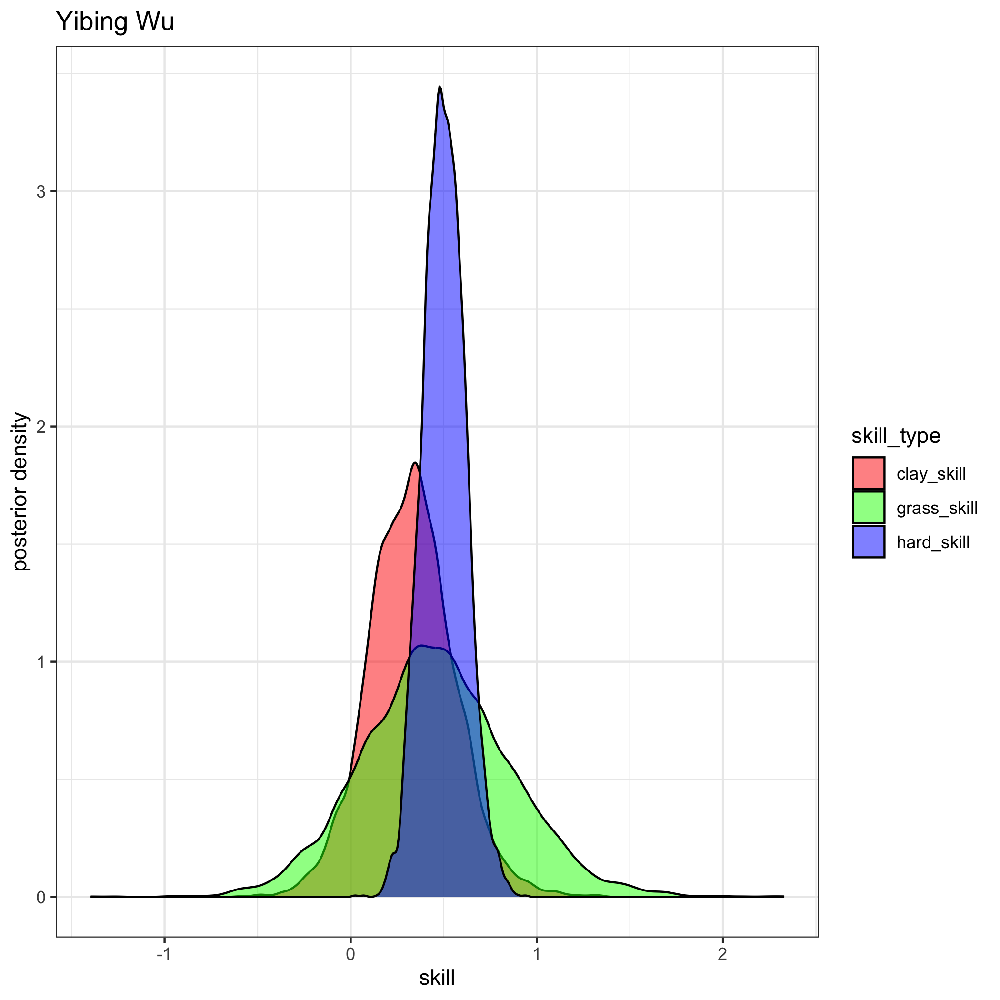
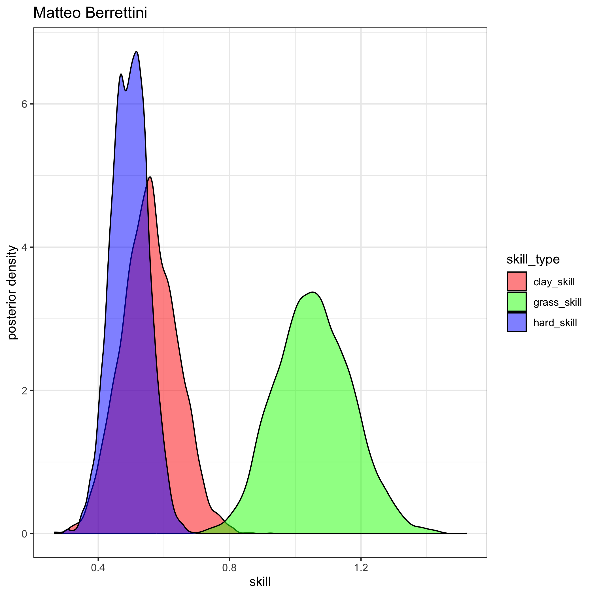

# Tennis Ratings
#### Author: [Jake Singleton](https://twitter.com/jakesingi)

## Version 3: March 2023 ATP Men's Singles Ratings and Rankings
* These are now "Version 3" since I've made some improvements to the model.
* The ratings below are based on a fully-[Bayesian](https://en.wikipedia.org/wiki/Bayesian_statistics) [Bradley-Terry model](https://en.wikipedia.org/wiki/Bradley%E2%80%93Terry_model). They are similar to [Elo ratings](https://en.wikipedia.org/wiki/Elo_rating_system), but I'd argue they resemble [Glicko ratings](https://en.wikipedia.org/wiki/Glicko_rating_system) even more closely. I show in my work that these ratings outperform Glicko (more to come on this later). 
* The ratings are derived from matches played in the last 2 years, though only players with 5 or more ATP-level matches played in the last 365 days are listed.
* **Interpretation**: There are 3 "skill" columns, one for each surface. Unfortunately they are not sortable at the moment, but as a first step, I've sorted the table by "hard_skill" (players' skills on hard court), as this is the most popular surface.

### Updated through the end of Dubai, Acapulco, and Santiago 2023, i.e. pre-Indian Wells. Updated monthly.

|rank|full_name                  |hard_skill  |clay_skill  |grass_skill |
|----|---------------------------|------------|------------|------------|
|1   |Novak Djokovic             |0.948521443 |0.811448912 |1.328215488 |
|2   |Daniil Medvedev            |0.794489166 |0.450827764 |0.667627879 |
|3   |Alexander Zverev           |0.673896967 |0.725001833 |0.634455502 |
|4   |Rafael Nadal               |0.64730709  |0.886176277 |1.034603003 |
|5   |Carlos Alcaraz             |0.614773882 |0.571931189 |0.482579887 |
|6   |Stefanos Tsitsipas         |0.566976814 |0.780253354 |0.507237892 |
|7   |Nick Kyrgios               |0.562930193 |0.341219847 |0.822077796 |
|8   |Jannik Sinner              |0.548786795 |0.499881137 |0.528686127 |
|9   |Yibing Wu                  |0.501405928 |0.325810162 |0.460926756 |
|10  |Matteo Berrettini          |0.495591664 |0.555247122 |1.056070206 |
|11  |Andrey Rublev              |0.4899787   |0.415979266 |0.446422869 |
|12  |Felix Auger Aliassime      |0.485882432 |0.299189674 |0.647290845 |
|13  |Jack Draper                |0.467002378 |0.386057476 |0.636591978 |
|14  |Gael Monfils               |0.457663529 |0.088310634 |-0.184066286|
|15  |Cameron Norrie             |0.451848718 |0.442614278 |0.693779878 |
|16  |Casper Ruud                |0.449876894 |0.566406286 |0.085220272 |
|17  |Taylor Fritz               |0.446909084 |0.149270423 |0.736259012 |
|18  |Borna Coric                |0.433720638 |0.13855403  |0.358693077 |
|19  |Holger Rune                |0.424397812 |0.239384615 |-0.255219046|
|20  |Sebastian Korda            |0.422575721 |0.255471714 |0.453184128 |
|21  |Hubert Hurkacz             |0.417644831 |0.272160464 |0.755606769 |
|22  |Frances Tiafoe             |0.39898178  |0.134350943 |0.389618611 |
|23  |Arthur Fils                |0.396063948 |0.259077492 |0.363584673 |
|24  |Jenson Brooksby            |0.393163375 |-0.054796999|0.318518754 |
|25  |Roberto Bautista Agut      |0.373554574 |0.240797025 |0.3998374   |
|26  |Karen Khachanov            |0.370759917 |0.270661347 |0.361526285 |
|27  |Pablo Carreno Busta        |0.367049962 |0.398416437 |0.315541615 |
|28  |Alex De Minaur             |0.366297636 |0.15249392  |0.519878942 |
|29  |Dominic Stricker           |0.353829142 |0.257763636 |0.543689931 |
|30  |Gijs Brouwer               |0.329918691 |0.313932784 |0.332994634 |
|31  |Denis Shapovalov           |0.329859485 |0.244203453 |0.427576176 |
|32  |Marin Cilic                |0.322983497 |0.328047078 |0.589667504 |
|33  |Tommy Paul                 |0.320540934 |0.023713431 |0.539856689 |
|34  |Grigor Dimitrov            |0.31973171  |0.35254258  |0.235408253 |
|35  |Reilly Opelka              |0.314425454 |0.216780853 |-0.21309491 |
|36  |Ilya Ivashka               |0.31245182  |0.219949875 |0.285323102 |
|37  |Jiri Lehecka               |0.308700649 |0.104450355 |-0.002264637|
|38  |J J Wolf                   |0.27574205  |0.16459399  |0.2413398   |
|39  |John Isner                 |0.274760902 |0.333125792 |0.272777428 |
|40  |Botic Van De Zandschulp    |0.273797362 |0.340076598 |0.371418006 |
|41  |Lloyd Harris               |0.268589014 |0.010879587 |0.143398664 |
|42  |Andy Murray                |0.257325269 |0.363502938 |0.515536386 |
|43  |Aleksandar Kovacevic       |0.246446583 |0.160726854 |0.225319321 |
|44  |Corentin Moutet            |0.229550708 |0.090969973 |-0.140968896|
|45  |Diego Schwartzman          |0.229387695 |0.234685387 |0.037309737 |
|46  |Emil Ruusuvuori            |0.227852307 |-0.027727396|0.082321488 |
|47  |Maxime Cressy              |0.220273968 |-0.106899947|0.596113627 |
|48  |Tomas Machac               |0.215097685 |0.103283225 |0.186323827 |
|49  |Daniel Evans               |0.209506583 |0.059401459 |0.27074086  |
|50  |Brandon Nakashima          |0.207449717 |0.137650298 |0.474514562 |
|51  |Mikael Ymer                |0.20693886  |0.1231453   |0.094849019 |
|52  |Borna Gojo                 |0.201831039 |0.063205252 |0.164283153 |
|53  |Ben Shelton                |0.199003288 |0.128362023 |0.180985385 |
|54  |Mackenzie Mcdonald         |0.195338505 |0.13331079  |-0.069860245|
|55  |Juan Pablo Varillas        |0.19338172  |0.255383196 |0.213359379 |
|56  |Stan Wawrinka              |0.188448938 |0.033134131 |0.172148072 |
|57  |Alexander Bublik           |0.185738275 |-0.034840351|0.487300836 |
|58  |Franco Agamenone           |0.185175746 |0.260788785 |0.208360324 |
|59  |Alexander Ritschard        |0.182291901 |0.080329812 |0.275099476 |
|60  |Dominic Thiem              |0.181641187 |0.039751452 |0.14988401  |
|61  |Brandon Holt               |0.177732986 |0.11790871  |0.166717649 |
|62  |Thanasi Kokkinakis         |0.177098723 |0.132564781 |0.448399016 |
|63  |Lorenzo Sonego             |0.17033365  |0.193883303 |0.455625661 |
|64  |Adrian Mannarino           |0.165734576 |-0.446837693|0.143474935 |
|65  |Soon Woo Kwon              |0.164368303 |0.140343755 |0.135345368 |
|66  |Jack Sock                  |0.164269104 |0.067373831 |0.584514335 |
|67  |Marc Andrea Huesler        |0.163978793 |0.016342139 |-0.322298588|
|68  |Marcos Giron               |0.162432421 |-0.119923685|0.186361676 |
|69  |Arthur Rinderknech         |0.159317869 |0.122015942 |0.127180997 |
|70  |Lorenzo Musetti            |0.159194275 |0.290863781 |-0.24414228 |
|71  |Miomir Kecmanovic          |0.156854265 |0.189231018 |0.092602549 |
|72  |Richard Gasquet            |0.15565465  |0.15306947  |0.079970984 |
|73  |Yosuke Watanuki            |0.151746377 |0.342729809 |0.410199132 |
|74  |Constant Lestienne         |0.145819501 |0.091528701 |0.134704957 |
|75  |Aslan Karatsev             |0.143150641 |0.09769577  |-0.06234272 |
|76  |Michael Mmoh               |0.141079014 |0.006547397 |0.108382618 |
|77  |Roman Safiullin            |0.135193815 |0.270546446 |0.174157106 |
|78  |Jason Kubler               |0.134328102 |0.191238296 |0.64358537  |
|79  |Liam Broady                |0.128612144 |0.036485974 |0.016723943 |
|80  |Elias Ymer                 |0.127451242 |0.076095033 |-0.086115918|
|81  |Yoshihito Nishioka         |0.125481673 |0.011903463 |-0.129279255|
|82  |Stefan Kozlov              |0.123709279 |0.040875695 |-0.304975655|
|83  |Benjamin Bonzi             |0.123527325 |-0.202800301|0.241094877 |
|84  |Francisco Cerundolo        |0.12077409  |0.081374553 |0.183322307 |
|85  |Nikoloz Basilashvili       |0.118077024 |0.007764843 |0.266124181 |
|86  |Tallon Griekspoor          |0.112025386 |0.070646974 |0.257886287 |
|87  |Daniel Elahi Galan         |0.107959203 |-0.033799063|0.13341238  |
|88  |Ugo Humbert                |0.107667219 |-0.207474766|0.326048896 |
|89  |Antoine Bellier            |0.106758476 |0.102763087 |0.479389896 |
|90  |Alejandro Davidovich Fokina|0.096183634 |0.341005351 |0.348793314 |
|91  |Jan Lennard Struff         |0.090902824 |0.17428679  |0.121060961 |
|92  |Camilo Ugo Carabelli       |0.086927128 |0.121867861 |0.098993862 |
|93  |Marton Fucsovics           |0.084855938 |0.048724583 |0.317902685 |
|94  |Aleksandar Vukic           |0.082622609 |0.039522409 |-0.032815629|
|95  |Nuno Borges                |0.079768979 |0.078450939 |-0.334280922|
|96  |James Duckworth            |0.075804305 |-0.183376415|0.065033687 |
|97  |Nicolas Jarry              |0.073789049 |0.223783757 |0.114244264 |
|98  |Kamil Majchrzak            |0.073509656 |-0.000938412|-0.060869175|
|99  |Ricardas Berankis          |0.065510877 |-0.084944196|0.12555904  |
|100 |Jurij Rodionov             |0.060921528 |0.12484813  |0.146980723 |
|101 |Christopher Oconnell       |0.054870716 |-0.118344409|-0.325713976|
|102 |Hugo Grenier               |0.05007861  |0.012300464 |-0.015382427|
|103 |Fabio Fognini              |0.048142065 |0.119888339 |0.103419992 |
|104 |Gregoire Barrere           |0.045846274 |-0.108094523|-0.089100026|
|105 |Zhizhen Zhang              |0.045323469 |0.051492679 |-0.247947951|
|106 |Dominik Koepfer            |0.03860002  |0.021962201 |-0.145533288|
|107 |Gilles Simon               |0.037789911 |-0.11927122 |-0.288721824|
|108 |Filip Misolic              |0.035724182 |0.251258673 |0.091781027 |
|109 |Hugo Gaston                |0.032615374 |0.061149767 |0.102088932 |
|110 |Cristian Garin             |0.032084475 |0.181144906 |0.405490687 |
|111 |Taro Daniel                |0.025040252 |0.014750793 |-0.446362647|
|112 |Yannick Hanfmann           |0.021824852 |0.127094654 |-0.171574402|
|113 |Steve Johnson              |0.019658559 |-0.031209572|0.338767089 |
|114 |Roberto Carballes Baena    |0.018373165 |0.043723416 |-0.46502611 |
|115 |Radu Albot                 |0.017777464 |-0.178016087|-0.173053088|
|116 |John Millman               |0.014541826 |-0.083054813|-0.033659645|
|117 |Alexei Popyrin             |0.01153942  |-0.008343837|-0.364955234|
|118 |Max Purcell                |0.010479683 |-0.066960399|0.242496057 |
|119 |Manuel Guinard             |0.009562954 |-0.017898317|-0.000521675|
|120 |Laslo Djere                |0.003575794 |0.181330857 |-0.16687965 |
|121 |Pablo Andujar              |0.001715485 |-0.023198129|-0.01421579 |
|122 |Christopher Eubanks        |-0.004739575|0.008532883 |0.09394012  |
|123 |Albert Ramos               |-0.011321012|0.147848956 |-0.466267306|
|124 |Rinky Hijikata             |-0.011750826|-0.004564565|-0.009316325|
|125 |Vasek Pospisil             |-0.015999482|-0.025839827|-0.171533997|
|126 |Jordan Thompson            |-0.018270938|-0.235436094|0.162058746 |
|127 |Tim Van Rijthoven          |-0.025080654|0.063713925 |0.794886436 |
|128 |Dusan Lajovic              |-0.035050306|0.039636809 |-0.383455222|
|129 |Alex Molcan                |-0.036691584|0.331910495 |0.258480851 |
|130 |Pedro Cachin               |-0.039859835|-0.069805262|-0.047883782|
|131 |David Goffin               |-0.039961768|0.285489345 |0.547273971 |
|132 |Oscar Otte                 |-0.042395892|0.077750731 |0.390007888 |
|133 |Quentin Halys              |-0.043180177|-0.016602691|-0.112577048|
|134 |Ryan Peniston              |-0.04512615 |-0.008653112|0.178518329 |
|135 |Giulio Zeppieri            |-0.050587657|0.052535612 |-0.031325032|
|136 |Emilio Gomez               |-0.051786675|-0.034754935|-0.04634409 |
|137 |Filip Krajinovic           |-0.056194926|0.175377676 |0.194219673 |
|138 |Jiri Vesely                |-0.059103167|-0.302785323|0.299397579 |
|139 |Pedro Martinez             |-0.062741597|0.09929161  |-0.056720739|
|140 |Peter Gojowczyk            |-0.063058302|-0.125693575|0.180251857 |
|141 |Flavio Cobolli             |-0.06325237 |0.031300568 |-0.040576312|
|142 |Denis Kudla                |-0.065531045|-0.314887779|0.430590183 |
|143 |Carlos Taberner            |-0.066413182|-0.076796954|-0.487640179|
|144 |Alejandro Tabilo           |-0.072773196|0.155872136 |-0.185529855|
|145 |Mitchell Krueger           |-0.076600281|-0.053199318|0.24035764  |
|146 |Facundo Bagnis             |-0.0797455  |0.003999866 |-0.487099144|
|147 |Francesco Passaro          |-0.081430626|-0.091249718|-0.086658539|
|148 |Benoit Paire               |-0.084215892|-0.233274132|-0.605171797|
|149 |Bernabe Zapata Miralles    |-0.09389472 |0.12425172  |-0.214803553|
|150 |Maximilian Marterer        |-0.094603037|-0.20625745 |0.16060587  |
|151 |Juan Manuel Cerundolo      |-0.095660276|-0.092678606|-0.092148405|
|152 |Joao Sousa                 |-0.096548198|-0.172035085|-0.498917547|
|153 |Luca Nardi                 |-0.09679824 |-0.11541513 |-0.099848518|
|154 |Damir Dzumhur              |-0.10720648 |-0.022210271|-0.085853738|
|155 |Henri Laaksonen            |-0.116451044|0.092446534 |-0.319794714|
|156 |Edan Leshem                |-0.119495755|-0.076811911|-0.113349804|
|157 |Aljaz Bedene               |-0.119514657|-0.044016088|-0.029303844|
|158 |Tomas Martin Etcheverry    |-0.121655414|-0.076885734|0.015175238 |
|159 |Emilio Nava                |-0.129288856|-0.084746176|-0.124537145|
|160 |Pavel Kotov                |-0.13819645 |0.018912081 |-0.100480976|
|161 |Jaume Munar                |-0.140291026|0.119879117 |-0.095105507|
|162 |Thiago Monteiro            |-0.159550883|0.030872745 |-0.191590652|
|163 |Zizou Bergs                |-0.18505691 |-0.065953355|-0.234180671|
|164 |Norbert Gombos             |-0.191635115|-0.113148264|-0.528932974|
|165 |Hugo Dellien               |-0.191703145|-0.042376744|-0.283958815|
|166 |Daniel Altmaier            |-0.193447776|-0.099460269|-0.286698008|
|167 |Sebastian Baez             |-0.200733124|0.297861882 |0.011436949 |
|168 |Geoffrey Blancaneaux       |-0.203776469|-0.224496486|-0.216755739|
|169 |Federico Coria             |-0.208818338|0.121481377 |-0.393165939|
|170 |Kyle Edmund                |-0.222475547|-0.147844406|-0.207572722|
|171 |Mikhail Kukushkin          |-0.238161994|-0.351683815|-0.540775338|
|172 |Seong Chan Hong            |-0.242619722|-0.156913041|-0.222719645|
|173 |Feliciano Lopez            |-0.253868809|-0.236545362|-0.14304541 |
|174 |Fernando Verdasco          |-0.267451623|-0.116039593|-0.38521098 |
|175 |Marco Cecchinato           |-0.361351426|0.028399773 |-0.598757995|
|176 |Pablo Cuevas               |-0.420981188|-0.011210693|-0.539062077|
|177 |Chun Hsin Tseng            |-0.436881455|-0.271407106|-0.836507862|
|178 |Federico Delbonis          |-0.44776577 |0.109242763 |-0.341355482|
|179 |Sam Querrey                |-0.461474572|-0.31343451 |0.18240013  |

## Images
* For brevity, here are visuals of the posterior distributions for each of the top 10 players listed
* **Interpretation**: Higher values of skill are good. The tighter the colorful blobs (aka distributions) are, the more confident we are about that player's skill on that particular surface. Note the blue blobs will tend to be tighter, since more matches are played on hard courts than clay and grass. 
* For example, we know Nadal is incredibly dominant on clay, and you can see his red blob is quite far to the right, reaffirming our belief he is uniquely good on clay courts.

 

## Future additions
* Add master's paper with mathematical details and performance of ratings
* Add women's ratings and rankings later, and potentially doubles
* Move the site away from markdown and toward something cleaner and more aesthetically-pleasing
