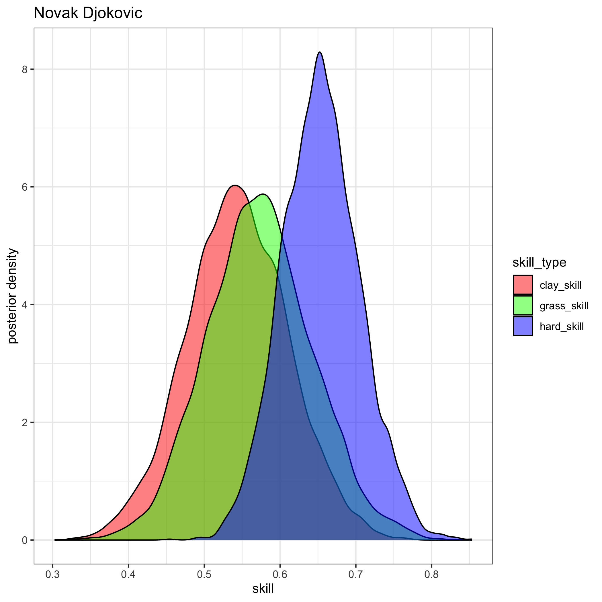

# Tennis Ratings
#### Author: [Jake Singleton](https://twitter.com/jakesingi)

## Version 2: May 2023 ATP Men's Singles Ratings and Rankings
* The ratings below are based on a fully-[Bayesian](https://en.wikipedia.org/wiki/Bayesian_statistics) [Bradley-Terry model](https://en.wikipedia.org/wiki/Bradley%E2%80%93Terry_model). They are similar to [Elo ratings](https://en.wikipedia.org/wiki/Elo_rating_system), but I'd argue they resemble [Glicko ratings](https://en.wikipedia.org/wiki/Glicko_rating_system) even more closely. I show in my work that these ratings outperform Glicko (more to come on this later). 
* The ratings are derived from matches played in the last 2 years, though only players with 5 or more ATP-level matches played in the last 365 days are listed.
* **Interpretation**: There are 3 "skill" columns, one for each surface. Unfortunately they are not sortable at the moment, but as a first step, I've sorted the table by "hard_skill" (players' skills on hard court), as this is the most popular surface.

### Updated through the end of Madrid 2023. Updated approximately monthly.

|rank|full_name                  |hard_skill  |clay_skill  |grass_skill |
|----|---------------------------|------------|------------|------------|
|1   |Novak Djokovic             |0.653901625 |0.543372989 |0.573085113 |
|2   |Daniil Medvedev            |0.53069109  |0.333367224 |0.436173557 |
|3   |Rafael Nadal               |0.422412483 |0.56435462  |0.35526399  |
|4   |Carlos Alcaraz             |0.409272861 |0.443373935 |0.323966296 |
|5   |Alexander Zverev           |0.391233026 |0.380801617 |0.329485216 |
|6   |Jannik Sinner              |0.365888928 |0.33076965  |0.304824315 |
|7   |Nick Kyrgios               |0.339840321 |0.212898231 |0.30055327  |
|8   |Stefanos Tsitsipas         |0.32492546  |0.441196972 |0.244686143 |
|9   |Jack Draper                |0.308268329 |0.252339921 |0.257030684 |
|10  |Cameron Norrie             |0.295654291 |0.22505275  |0.262012921 |
|11  |Andrey Rublev              |0.284699632 |0.289194619 |0.236987548 |
|12  |Matteo Berrettini          |0.283753712 |0.256758702 |0.274527487 |
|13  |Casper Ruud                |0.280565979 |0.332623514 |0.218066684 |
|14  |Taylor Fritz               |0.27695253  |0.166806739 |0.247239317 |
|15  |Felix Auger Aliassime      |0.265214036 |0.20925875  |0.231254324 |
|16  |Hubert Hurkacz             |0.254355691 |0.177947858 |0.229856926 |
|17  |Sebastian Korda            |0.249553252 |0.203701447 |0.214479493 |
|18  |Marin Cilic                |0.236021577 |0.241882157 |0.199712684 |
|19  |Holger Rune                |0.230822295 |0.209549641 |0.17892199  |
|20  |Roberto Bautista Agut      |0.223092266 |0.16905405  |0.193955579 |
|21  |Karen Khachanov            |0.22145747  |0.138204043 |0.189169111 |
|22  |Alex De Minaur             |0.218065991 |0.129431526 |0.196014148 |
|23  |Pablo Carreno Busta        |0.21763126  |0.219625018 |0.173980594 |
|24  |Grigor Dimitrov            |0.203145804 |0.203976019 |0.169404053 |
|25  |Tommy Paul                 |0.200738951 |0.014984953 |0.188594145 |
|26  |Dimitar Kuzmanov           |0.190675137 |0.188582488 |0.160491308 |
|27  |Jenson Brooksby            |0.188361058 |0.001467165 |0.16061481  |
|28  |Ilya Ivashka               |0.182454485 |0.01481949  |0.162675094 |
|29  |Denis Shapovalov           |0.177891671 |0.127901605 |0.159555326 |
|30  |Frances Tiafoe             |0.171125442 |0.077258347 |0.146284893 |
|31  |Arthur Fils                |0.167844085 |0.112699629 |0.144647926 |
|32  |Andy Murray                |0.148900251 |0.076175945 |0.140437764 |
|33  |Maxime Cressy              |0.141716265 |-0.066688152|0.147434268 |
|34  |Botic Van De Zandschulp    |0.138794743 |0.171169691 |0.118257998 |
|35  |Emil Ruusuvuori            |0.132003609 |0.033594974 |0.112918889 |
|36  |Borna Coric                |0.124328329 |0.079806083 |0.10799784  |
|37  |Dominic Stricker           |0.122392956 |0.090046435 |0.104064258 |
|38  |Alexander Ritschard        |0.121063826 |0.069565247 |0.108422683 |
|39  |Reilly Opelka              |0.119003399 |0.114365355 |0.08653379  |
|40  |Diego Schwartzman          |0.109603338 |0.106407199 |0.092338136 |
|41  |Jiri Lehecka               |0.10686361  |0.075158502 |0.087485734 |
|42  |Lorenzo Sonego             |0.105175518 |0.055164119 |0.097668556 |
|43  |Mikael Ymer                |0.102736231 |0.031265452 |0.085249841 |
|44  |Tomas Machac               |0.102574304 |0.055641357 |0.088583942 |
|45  |Thanasi Kokkinakis         |0.102155797 |0.06440963  |0.089331801 |
|46  |Benjamin Bonzi             |0.101661554 |-0.007693793|0.096810893 |
|47  |J J Wolf                   |0.101490928 |0.045545663 |0.089257766 |
|48  |Stan Wawrinka              |0.099358454 |0.033805522 |0.08422613  |
|49  |Brandon Nakashima          |0.098490148 |0.042564093 |0.094527809 |
|50  |Mackenzie Mcdonald         |0.098292291 |0.040968894 |0.076611553 |
|51  |Tung Lin Wu                |0.091549184 |0.0598206   |0.078306327 |
|52  |Quentin Halys              |0.090731166 |0.13522281  |0.073618793 |
|53  |Daniel Evans               |0.090327713 |0.011741562 |0.079119182 |
|54  |Alexandre Muller           |0.088840903 |0.085982758 |0.073592405 |
|55  |Roman Safiullin            |0.082797108 |0.110940887 |0.067215741 |
|56  |Antoine Bellier            |0.080757608 |0.05210699  |0.074955934 |
|57  |Alexander Bublik           |0.077964496 |-0.088904828|0.102364607 |
|58  |Juan Pablo Varillas        |0.077214647 |0.089913376 |0.063432063 |
|59  |Yibing Wu                  |0.075829422 |-0.019734426|0.069576095 |
|60  |Franco Agamenone           |0.069636965 |0.100351336 |0.055877052 |
|61  |Alejandro Davidovich Fokina|0.068301632 |0.133861937 |0.051488161 |
|62  |John Isner                 |0.067136207 |0.071506876 |0.054352141 |
|63  |Gijs Brouwer               |0.065089765 |0.092680914 |0.052596459 |
|64  |Yosuke Watanuki            |0.064922243 |0.082333064 |0.053134216 |
|65  |Marton Fucsovics           |0.064518308 |0.039204473 |0.061846542 |
|66  |Miomir Kecmanovic          |0.063582266 |0.149018026 |0.041912597 |
|67  |Jack Sock                  |0.062686126 |-0.003598666|0.061126023 |
|68  |Christopher Oconnell       |0.062416827 |0.04018527  |0.051567671 |
|69  |Soon Woo Kwon              |0.062241145 |-0.010910399|0.053419645 |
|70  |Ugo Humbert                |0.06181164  |-0.029222102|0.062890427 |
|71  |Francisco Cerundolo        |0.055925739 |0.103115504 |0.043973398 |
|72  |Tim Van Rijthoven          |0.054956737 |0.027495172 |0.063185659 |
|73  |Arthur Rinderknech         |0.052921436 |0.073300091 |0.037313885 |
|74  |Ben Shelton                |0.052354938 |0.016859957 |0.045693697 |
|75  |Kamil Majchrzak            |0.049680256 |0.008132975 |0.0433232   |
|76  |Corentin Moutet            |0.049546025 |-0.025207129|0.039756151 |
|77  |Jason Kubler               |0.048157632 |0.015186016 |0.053342468 |
|78  |Michael Mmoh               |0.048053875 |0.036418591 |0.041244698 |
|79  |Lorenzo Musetti            |0.046894005 |0.17697271  |0.021029143 |
|80  |Jan Lennard Struff         |0.046814301 |0.149148115 |0.0368366   |
|81  |Jurij Rodionov             |0.043753558 |0.039390275 |0.034891116 |
|82  |Richard Gasquet            |0.04311792  |0.027614667 |0.036346934 |
|83  |Borna Gojo                 |0.04273546  |-0.002194045|0.038851627 |
|84  |Alejandro Tabilo           |0.042409739 |0.083183589 |0.028256867 |
|85  |Aslan Karatsev             |0.040560782 |0.02702791  |0.029505511 |
|86  |Ryan Peniston              |0.039715882 |0.02427105  |0.037637153 |
|87  |Adrian Mannarino           |0.038555696 |-0.167747379|0.034524851 |
|88  |Christopher Eubanks        |0.036537592 |0.023065931 |0.033975647 |
|89  |Brandon Holt               |0.03619961  |0.025364602 |0.031334706 |
|90  |Nicolas Jarry              |0.035321685 |0.099352158 |0.0244795   |
|91  |Marc Andrea Huesler        |0.033963632 |-0.003264284|0.028343317 |
|92  |Dominic Thiem              |0.026872091 |-0.008390005|0.024872536 |
|93  |Ricardas Berankis          |0.024683641 |-0.036408829|0.023114172 |
|94  |Elias Ymer                 |0.023165084 |-0.014697854|0.019457103 |
|95  |Matteo Arnaldi             |0.020701049 |0.020204297 |0.017269575 |
|96  |Marcos Giron               |0.020671186 |-0.039575744|0.02026915  |
|97  |Vasek Pospisil             |0.019804436 |0.015294841 |0.014287071 |
|98  |Aleksandar Kovacevic       |0.016943973 |-0.005804725|0.015307028 |
|99  |Liam Broady                |0.013106706 |-0.033620559|0.009315667 |
|100 |Gregoire Barrere           |0.012615979 |-0.050437256|0.010566931 |
|101 |Hugo Grenier               |0.011282401 |-0.013644724|0.005959042 |
|102 |Cristian Garin             |0.009463654 |0.030882986 |0.015226943 |
|103 |James Duckworth            |0.009278414 |-0.053341122|0.015577408 |
|104 |Tallon Griekspoor          |0.008880313 |-0.028034789|0.008980102 |
|105 |Giulio Zeppieri            |0.004674905 |0.051665556 |0.000184101 |
|106 |Andrea Vavassori           |0.004606675 |0.003753277 |0.004334216 |
|107 |Alexander Shevchenko       |0.004441081 |0.027633816 |0.001964003 |
|108 |Steve Johnson              |0.002383618 |-0.021056008|0.008700693 |
|109 |Flavio Cobolli             |0.001566354 |0.072714425 |-0.002568273|
|110 |Aleksandar Vukic           |-0.000219672|-0.020271439|0.002947095 |
|111 |Zhizhen Zhang              |-0.000276595|0.032249382 |-0.005451086|
|112 |Oscar Otte                 |-0.000942416|0.052682394 |0.005213785 |
|113 |Alex Molcan                |-0.001408146|0.144495743 |-0.002268735|
|114 |Jiri Vesely                |-0.001435711|-0.09086226 |0.011091637 |
|115 |Filip Misolic              |-0.002066745|0.039021645 |-0.004800249|
|116 |Constant Lestienne         |-0.002588532|-0.02011345 |-0.000814936|
|117 |Laslo Djere                |-0.005838286|0.116870835 |-0.008325222|
|118 |Taro Daniel                |-0.008338097|-0.009022976|-0.011387192|
|119 |David Goffin               |-0.008791859|0.022723875 |0.005966623 |
|120 |Maximilian Marterer        |-0.012300975|-0.014933265|-0.009248222|
|121 |Aljaz Bedene               |-0.01561557 |-0.064687426|-0.004037544|
|122 |Hugo Gaston                |-0.015815794|-0.041386458|-0.008817787|
|123 |Dusan Lajovic              |-0.016018842|0.068470803 |-0.026399966|
|124 |Yoshihito Nishioka         |-0.019971732|-0.032800482|-0.031123708|
|125 |John Millman               |-0.020123957|-0.089187303|-0.017121768|
|126 |Jordan Thompson            |-0.02679004 |-0.148275392|-0.002681108|
|127 |Camilo Ugo Carabelli       |-0.027186192|-0.037930015|-0.021799789|
|128 |Pedro Cachin               |-0.030780218|0.026462407 |-0.031059251|
|129 |Yannick Hanfmann           |-0.031242294|0.056016258 |-0.03841109 |
|130 |Filip Krajinovic           |-0.032054395|0.067819395 |-0.030886722|
|131 |Fabio Fognini              |-0.032372665|0.026372544 |-0.029474392|
|132 |Gilles Simon               |-0.033101879|-0.105774838|-0.025333869|
|133 |Daniel Elahi Galan         |-0.040664702|-0.056506267|-0.035201338|
|134 |Luca Van Assche            |-0.04178488 |-0.03508389 |-0.035442044|
|135 |Manuel Guinard             |-0.042729508|-0.033381227|-0.036792761|
|136 |Luca Nardi                 |-0.043488437|-0.113988497|-0.032060524|
|137 |Carlos Taberner            |-0.048663811|-0.047163772|-0.041561136|
|138 |Francesco Passaro          |-0.049592682|-0.035933352|-0.042915892|
|139 |Zizou Bergs                |-0.051696402|-0.043775963|-0.042110613|
|140 |Alexei Popyrin             |-0.051881746|-0.017279256|-0.048722583|
|141 |Pablo Andujar              |-0.054259534|-0.050120754|-0.04797336 |
|142 |Max Purcell                |-0.054390175|-0.053706321|-0.042159291|
|143 |Sam Querrey                |-0.054999308|-0.09485333 |-0.030371716|
|144 |Guido Pella                |-0.056587574|-0.058637026|-0.058480479|
|145 |Geoffrey Blancaneaux       |-0.056710193|-0.05727258 |-0.048380508|
|146 |Stefan Kozlov              |-0.05782721 |-0.034940537|-0.057223608|
|147 |Nuno Borges                |-0.060577008|-0.057275732|-0.051584726|
|148 |Dominik Koepfer            |-0.0617692  |0.004906321 |-0.058402975|
|149 |Tomas Martin Etcheverry    |-0.065308969|-0.004348255|-0.058141301|
|150 |Radu Albot                 |-0.066172956|-0.186764566|-0.057632043|
|151 |Albert Ramos               |-0.066479138|0.02500869  |-0.066592202|
|152 |Nikoloz Basilashvili       |-0.069328278|-0.113415067|-0.052826079|
|153 |Denis Kudla                |-0.071198514|-0.115695578|-0.039969051|
|154 |Pedro Martinez             |-0.076823764|0.023856413 |-0.071441655|
|155 |Norbert Gombos             |-0.079268259|-0.102713104|-0.073064178|
|156 |Facundo Bagnis             |-0.081098355|-0.050533414|-0.072956943|
|157 |Jaume Munar                |-0.084726541|0.028437518 |-0.079616871|
|158 |Rinky Hijikata             |-0.084905884|-0.052840927|-0.073043092|
|159 |Thiago Monteiro            |-0.085699399|0.008689637 |-0.081352263|
|160 |Roberto Carballes Baena    |-0.086706703|0.02208651  |-0.088563231|
|161 |Damir Dzumhur              |-0.086829298|-0.006325947|-0.07826619 |
|162 |Marco Cecchinato           |-0.090311702|0.018315398 |-0.08794225 |
|163 |Pavel Kotov                |-0.111845141|-0.034478492|-0.098326323|
|164 |Edan Leshem                |-0.112723065|-0.088448408|-0.094974901|
|165 |Hugo Dellien               |-0.115187769|-0.059870406|-0.103651004|
|166 |Emilio Gomez               |-0.116494402|-0.147828015|-0.096499822|
|167 |Benoit Paire               |-0.117842972|-0.112297858|-0.114798566|
|168 |Joao Sousa                 |-0.118926965|-0.089842015|-0.110922225|
|169 |Henri Laaksonen            |-0.120560787|-0.001101332|-0.11217775 |
|170 |Daniel Altmaier            |-0.12418567 |-0.055100762|-0.11220066 |
|171 |Jozef Kovalik              |-0.124979201|-0.094487959|-0.107039647|
|172 |Peter Gojowczyk            |-0.125716725|-0.138812142|-0.101109623|
|173 |Juan Manuel Cerundolo      |-0.125761316|-0.100371108|-0.106511653|
|174 |Seong Chan Hong            |-0.147637026|-0.096946459|-0.127649474|
|175 |Kyle Edmund                |-0.149275583|-0.131941839|-0.126909204|
|176 |Sebastian Baez             |-0.156037175|0.154464774 |-0.146800418|
|177 |Emilio Nava                |-0.166877084|-0.14103289 |-0.141232906|
|178 |Bernabe Zapata Miralles    |-0.168172658|0.061759559 |-0.165959606|
|179 |Fernando Verdasco          |-0.173330593|-0.104491337|-0.151748124|
|180 |Feliciano Lopez            |-0.185274286|-0.204678612|-0.153700647|
|181 |Federico Delbonis          |-0.238882551|0.024075764 |-0.22444281 |
|182 |Federico Coria             |-0.249476924|0.044170242 |-0.232229215|
|183 |Chun Hsin Tseng            |-0.272244727|-0.190708915|-0.240443083|

## Images
* For brevity, here are visuals of the posterior distributions for each of the top 10 players listed
* **Interpretation**: Higher values of skill are good. The tighter the colorful blobs (aka distributions) are, the more confident we are about that player's skill on that particular surface. Note the blue blobs will tend to be tighter, since more matches are played on hard courts than clay and grass. 
* For example, we know Nadal is incredibly dominant on clay, and you can see his red blob is quite far to the right, reaffirming our belief he is uniquely good on clay courts.

 

## Future additions
* Add paper with mathematical details and performance of ratings
* Add women's ratings and rankings later, and potentially doubles
* Move the site away from markdown and toward something cleaner and more aesthetically-pleasing
